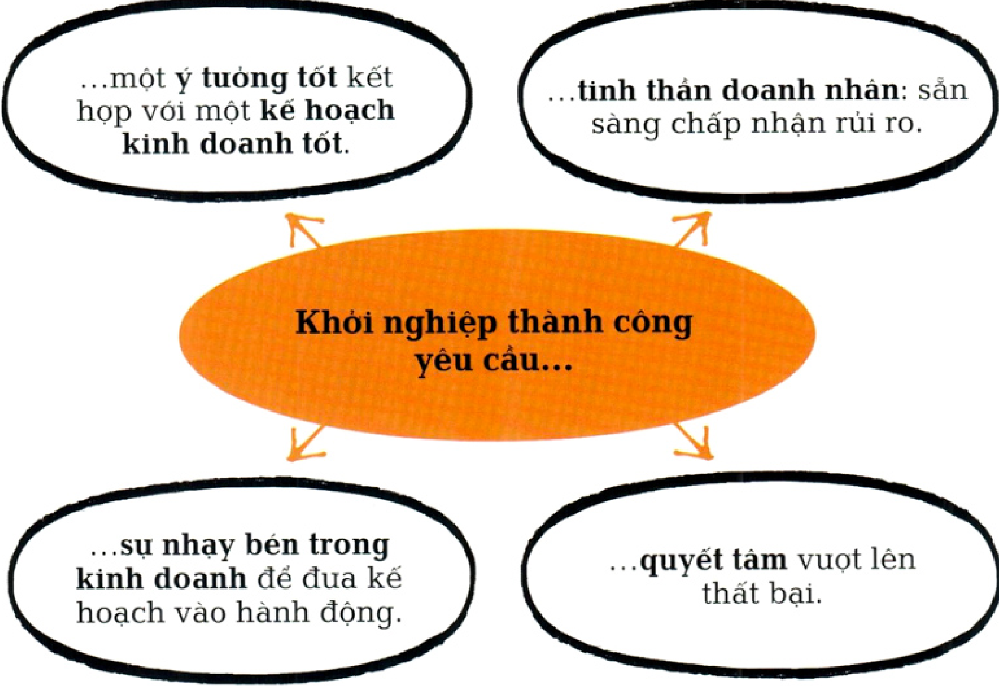
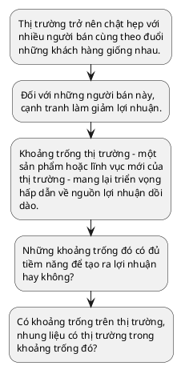

# KHỚI ĐẦU NHỎ, TƯ DUY LỚN KHỞI NGHIỆP VÀ PHÁT TRIỂN KINH DOANH

## Dẫn nhập

Tất cả các doanh nghiệp đều có cùng một xuất phát điểm: ý tưởng kinh doanh. Những gì xảy ra cho ý tưởng đó sẽ quyết định thành công của doanh nghiệp. Theo tạp chí Entrepreneur, gần một nủa số công ty khởi nghiệp thất bại trong ba năm đầu. Khởi nghiệp thành công không phải là việc dễ dàng. Đầu tiên, một ý tưởng dù có tốt đến mấy cũng phải đuợc kết họp với tinh thần doanh nhân, tức là sản sàng chấp nhận rủi ro. Nếu không có tinh thần doanh nhân thì một ý tưởng tuyệt vời cũng không thể trở thành hiện thục. Thật ngu ngốc nếu một doanh nhân cứ ráo riết đua sản phẩm ra thị trường mà không nghiên cứu và lập kế hoạch chi tiết một cách cẩn thận. Rúi ro có thể là một yếu tố cố hữu trong hoạt động của doanh nghiệp, và doanh nhân thành công là những người không chỉ sẵn sàng chấp nhận rủi ro mà còn có khả năng quản lí rủi ro.

!!! quote "Quote"
    Điều duy nhất còn tệ hơn việc bắt đầu và thất bại ... đó là không bắt đầu làm gì cả. __Seth Godin__ _Doanh nhân người Mỹ (1960-)_

### Vấn đề thục tế

Nếu bước đầu tiên là đua ra ý tưởng thì trở ngại tiếp theo là thu xếp tài chính. Một số công ty khởi nghiệp cần rất ít vốn và đôi khi thậm chí không cần vốn. Tuy nhiên, nhiều công ty cần được sụ hậu thuản tài chính đáng kể và phần lớn sẽ cần huy động vốn vào một giai đoạn nào đó trong quá trình phát triển. Doanh nhân phải có khả năng thuyết phục các bên hậu thuẫn tài chính rằng ý tưởng của họ rất có giá trị và họ có những kĩ năng và kiến thức để biến ý tưởng ban đầu thành một thương vụ thành công.

Tiếp đến, ý tưởng đó phải có khả năng tạo ra lợi nhuận. Đôi khi một ý tưởng có thể là rất tốt khi còn trên giấy nhung lại không hiệu quả trong thục tiễn. Để xác định một ý tưởng có tiềm năng hay không đòi hỏi phải nghiên cứu về cạnh tranh và thị trường liên quan. Ai đang cạnh tranh để giành thời gian và tiền bạc của khách hàng? Có đối thủ nào bán sản phẩm cạnh tranh trục tiếp hoặc sản phẩm có khả năng thay thế không? Đối thủ được nhận định ra sao trên thị trường? Thị trường có quy mô lớn đến đâu?

Hầu hết các thị trường ngày càng được toàn cầu hóa, đông đúc hơn và có mức độ cạnh tranh khốc liệt hơn. Rất ít công ty có đủ may mắn để tìm ra một thị trường ngách có lợi nhuận - để thành công, doanh nghiệp cần phải làm gì đó khác biệt để nổi bật trên thị trường. Chiến lược dành cho họ là phải khác biệt hóa, túc là phải chúng minh cho khách hàng thấy rằng họ cung cấp một thứ mà các đối thủ cạnh tranh khác không có - một lợi điểm bán hàng độc nhất (USP) hoặc điểm nhấn bán hàng cảm xúc (ESP).

Nỗ lực để trở nên khác biệt hiện diện ở khắp nơi. Mỗi doanh nghiệp, và tại mỗi giai đoạn sản xuất từ xử lí nguyên vật liệu cho đến dịch vụ hậu mãi, đều cố gắng làm cho sản phẩm và dịch vụ của mình khác biệt với những sản phẩm và dịch vụ khác. Ví dụ, khi bước vào một tiệm sách, bạn sẽ thấy những quyển sách sử dụng thiết kế, kiểu dáng và thậm chí là kích thước (lớn hoặc nhỏ) để nổi bật hơn đối thủ cạnh tranh. Việc đạt đuợc lợi thế thuờng phụ thuộc vào một trong hai điều sau: là nhà cung cấp đầu tiên trong thị trường ngách mới hoặc trở nên khác biệt so với đối thủ cạnh tranh. Ví dụ, vào năm 1995, eBay là công ty đầu tiên bước vào thị trường đấu giá trục tuyến và đã thống trị thị trường này kể tù đó. Tương tụ, Volvo là công ty đầu tiên nhận thấy cơ hội bán ô tô hạng sang tại Ấn Độ và đã đạt được doanh số đáng kể. Ngược lại, Facebook không phải là mạng xã hội đầu tiên, nhung là mạng xã hội thành công nhất; lợi thế của họ là có được sản phẩm tốt hơn. Sau khi một công ty được thành lập, thách thúc đối với họ cũng thay đổi: mục tiêu lúc này là duy trì doanh số và phát triển trong ngắn hạn và dài hạn.

### Thích úng đề tồn tại

Khả năng tồn tại của doanh nghiệp trong dài hạn phụ thuộc vào khả năng không ngùng tụ đổi mới và tự thích úng để duy trì vị thế dẫn đầu trong cạnh tranh. Trên những thị trường năng động liên tục phát triển và thay đổi, ý tưởng ban đầu có thể trở nên không còn phù hợp, và các công ty đối thủ gần nhu chắc chắn sẽ sao chép ý tưởng đó. Hệ sinh thái trong đó doanh nghiệp hoạt động kinh doanh rất hiếm khi ở trạng thái tĩnh. Các công ty tồn tại trong hệ sinh thái này như những tổ chúc sống cần phải thích úng để tồn tại. Trong cuốn sách Quá trình tự đổi mới của các tập đoàn lớn (2013), Bill Fischer, Umberto Lago và Fang Liu nhận thấy Haier, một công ty thiết bị gia dụng của Trung Quốc, đã tụ đổi mới ít nhất ba lần trong 30 năm qua. Trái lại, Kodak, một tập đoàn lớn của Mỹ trong thế kỉ 20, đã phản úng chậm với sự phát triển của nhiếp ảnh ki thuật số và bị phá sản.

Hơn nũa, nếu doanh nghiệp phải thích úng thì chủ doanh nghiệp cũng vậy. Phần lớn doanh nghiệp bắt đầu hoạt động với quy mô nhỏ và duy trì quy mô đó. Một số ít doanh nhân sản sàng hoặc biết cách chuyển sang giai đoạn thú hai là tuyển dụng nguời không phải là thành viên gia đình hay bạn bè. Đây là bước khởi đầu để doanh nhân trở thành lãnh đạo, và nó đòi hỏi phải có một tập hợp kĩ năng mới khi những yêu cầu mới được đặt ra cho người sáng lập. Nếu trước đây chỉ cần năng luợng, ý tưởng và đam mê thì giờ đây, doanh nghiệp muốn phát triển còn cần phải xây dụng các hệ thống, thủ tục và quy trình chính thúc. Tóm lại, doanh nghiệp cần được quản lí. Người sáng lập doanh nghiệp phải phát triển ki năng trao quyền, giao tiếp và điều phối, nếu không thì phải tuyển dụng người có các kĩ năng này.

Nhu được Larry Greiner mô tả trong bài báo Tiến trình và cách mạng trong quá trình phát triển của tổ chức (1972), khi một doanh nghiệp phát triển, nhu cầu đối với doanh nghiệp cũng thay đổi. Đường cong Greiner cho thấy giai đoạn phát triển ban đầu phụ thuộc vào sáng kiến cá nhân, và để chuyển từ thục tiễn kinh doanh sự vụ sang giai đoạn tăng trưởng thành công và bền vũng cần những người có kinh nghiệm và những hệ thống nghiêm ngặt. Quản trị chuyên nghiệp trở nên cần thiết cho sụ phát triển của doanh nghiệp.

Một số nhà lãnh đạo nhu Bill Gates và Steve Jobs có thể chuyển đổi từ vị trí sáng lập sang lãnh đạo. Tuy nhiên, nhiều người khác lại gặp khó khăn khi thục hiện những thay đổi cần thiết; một số đã thủ và thất bại, và một số khác quyết định giữ nguyên quy mô doanh nghiệp.

### Tìm điểm cân bằng

Vì những lí do trên, yếu tố quyết định tốc độ phát triển là sụ cân bằng giữa kĩ năng và mong muốn của người sáng lập. Nhung để tồn tại đuợc thì ý tưởng phải đủ độc đáo để định ra một thị trường ngách riêng và người đúng sau ý tưởng đó phải thể hiện được tinh thần doanh nhân. Họ cần sụ linh hoạt để điều chỉnh ý tưởng - và điều chỉnh chính bản thân họ - theo nhu cầu kinh doanh và áp lục của thị trường. Vận may sẽ đóng một vai trò nào đó, nhung chính sự cân bằng của các yếu tố này sẽ quyết định một công ty khởi nghiệp với quy mô nhỏ có thể trở thành một tập đoàn lớn hay không.

Khi phải chúng minh giá trị của ý tưởng và thuyết phục người khác trả tiền cho ý tưởng đó, bạn sẽ loại trù được rất nhiều suy nghĩ không rõ ràng. __Tim O'Reilly__ _Doanh nhân nguời Ireland (1954-)_

## MƠ ĐƯỢC, LÀM ĐƯỢC

!!! info "BỐI CANH"
    __TRỌNG TÂM__

    Khởi nghiệp kinh doanh

    __CÁC MỐC QUAN TRỌNG__

    Thế ki 18 Thuật ngũ "doanh nhân" được dùng để mô tả người sẵn sàng chấp nhận rủi ro khi mua tại những mức giá nhất định và bán tại những mức giá không chắc chắn.

    - __1946__ Giáo su Arthur Cole viết bài báo Cách tiếp cận với tinh thần doanh nhân, khơi mào mối quan tâm về vấn đề này.
    - __2005__ Trang web vi tài chính phi lợi nhuận Kiva.com ra đời, cung cấp các khoản vay nhỏ cho những doanh nghiệp có quy mô rất nhỏ.
    - __2009__ Các trang web gọi vốn cộng đồng nhu Kickstarter. com cho phép cá nhân góp vốn vào doanh nghiệp.
    - __2013__ Một nghiên cứu của Ross Levine và Yona Rubinstein phát hiện rằng khi ở độ tuổi thanh thiếu niên, nhiều doanh nhân thành công thường quyết đoán, phá vỡ quy tắc và hay gặp rắc rối.

<figure markdown="span">
    
    <figcaption></figcaption>
</figure>

Có nhieu lí do để bắt đầu sự nghiệp kinh doanh. Một vài người mơ uớc đuợc tụ mình làm chủ - biến sở thích của mình thành một doanh nghiệp có lợi nhuận, thể hiện sức sáng tạo của bản thân, hoặc được giàu có. Mặc dù châm ngôn “mơ được, làm được" của Walt Disney có thể đúng với một số người nhung việc theo đuổi ước mơ cũng có nhiều rủi ro. Nhng người muốn thực hiện ước mơ phải có tinh thần doanh nhân để dũng cảm từ bỏ công việc được trả lương hậu hĩnh, tụ thân vận động và đối mặt với một tuong lai đầy bấp bênh. Một số người khác có thể cần một cú huých; thông thường, bị sa thải (và nhận khoản thanh toán một lần) có thể là bước đệm cho việc này. Doanh nhân trẻ tham gia ngày càng nhiều vào hoạ động khỏi nghiệp. Họ có thể đã đạ được những kĩ năng cần thiết để kinh doanh vào những năm đầu của tuổi hai muơi và yêu thích sụ sôi nổi và tụ do khi điều hành dự án kinh doanh của chính mình.

### Giữ vũng niềm tin

Dù có nhiều lí do khác nhau để khỏi nghiệp, tất cả các doanh nhân đều có một điểm chung là sản sàng chấp nhận rủi ro. Rất ít người thành công từ lần đầu tiên - khởi nghiệp đòi hỏi khả năng úng phó và lì lợm để tiếp tục vũng bước trước thất bại và lòng kiên trì để giữ vũng tinh thần lạc quan khi khách hàng, ngân hàng và các bên hỗ trợ tài chính đều liên tục từ chối. Người khởi nghiệp cần có niềm tin vào ý tưởng của mình. Dù một số thương vụ khởi nghiệp yêu cầu rất ít vốn, song phần lớn vẫn cần huy động vốn trong những giai đoạn phát triển ban đầu. Chủ doanh nghiệp phải có khả năng thuyết phục ngân hàng hoặc các bên hỗ trợ tài chính rằng ý tưởng của họ rất đáng giá và họ có ki năng để biến ý tưởng đó thành một thương vụ có lợi nhuận, mặc dù sẽ mất một thời gian để làm được điều đó. Amazon đã mất sáu năm mới bắt đầu thu đuợc lợi nhuận. Trong những năm gần đây, việc đảm bảo tài chính cho các công ty khởi nghiệp đã dễ dàng hơn đôi chút. Nhiều chính phủ đua ra các kế hoạch cho vay hoặc các khoản trợ cấp. Doanh nhân với những ý tưởng lớn có thể tiếp cận được với những nguồn vốn lớn và sụ hỗ trợ về mặt quản trị từ các nhà đầu tu chuyên nghiệp, những người có mục đích duy nhất là giúp súc cho các công ty khởi nghiệp. Đối với những công ty khởi nghiệp có quy mô nhỏ hơn, và đối với những người mà bản thân không có nhiều vốn, tín dụng vi mô và gọi vốn tù cộng đồng - chắng hạn như những gì được cung cấp bởi _Kickstarter.com_ - ngày càng trở nên phổ biến.

!!! quote "Quote"
    Để duy trì một doanh nghiệ cần rất nhiều nỗ lc, và quai trọng nhất là đùng bao giờ t bỏ khát khao thành công.
    
    __Wendy Tan White__
    
    _Giám đốc kinh doanh người Anh (197-)_

### Kế hoạch kinh doanh

Vấn đề mấu chốt để đảm bảo tài chính là kế hoạch kinh doanh. Một kế hoạch tốt sẽ làm rõ ý tưởng, nêu chi tiết kết quả nghiên cứu thị trường, mô tả hoạt động điều hành và tiếp thị, và đưa ra dự báo tài chính. Kế hoạch này cũng nên trình bày vắn tắt chiến lược phát triển dài hạn và xác định các phuơng án phòng ngùa (ý tưởng hoặc thị trường thay thế) nếu mọi thứ không diễn ra như kế hoạch. Quan trọng nhất, một kế hoạch kinh doanh tốt sẽ công nhận nguyên nhân thất bại lớn nhất là thiếu tiền mat. Mặc dù vốn vay có thể hữu ích trong thời gian ngắn nhung rốt cuộc doanh nghiệp cũn vẫn phải dụa vào doanh thu để trang trải cho hoạt động. Kế hoạc kinh doanh tốt sẽ phân tích dòng tiền tuong lai và xác định mọi thi hụt có tiềm năng xảy ra. Thành công khi khởi nghiệp đuợc quyết định bởi s kiên trì kh đua ý tuong ra thị truờng, khả năn đảm bảo đủ tài chính, và sụ nhạy bén trong kinh doanh để biến một kế hoạch tốt thành một doanh nghiệp có lợi nhuận trong dài hạn.

!!! info "Tony" Fernandes"
    Tan Sri Anthony "Tony" Fernandes sinh năm 1964 tại Kuala Lumpur, có cha là người Ấn Độ và mẹ là người Malaysia. Ông học tại Anh và tốt nghiệp Trường Kinh tế London (LSE) năm 1987. Ông làm chuyên viên kiểm soát tài chính của Richard Branson tại Virgin Records trong thời gian ngắn trước khi trở thành Phó Chủ tịch Khu vục Đông Nam Á của Warner Music Group (1992). Năm 2001, ông thôi việc tại Warner để kinh doanh. Ông thế chấp nhà, huy động tài chính cần thiết để mua hãng hàng không non trẻ đang gặp khó khăn lúc bấy giờ là AirAsia. Chiến lược chi phí thấp của ông được nêu rõ trong khẩu hiệu “Giờ đây ai cũng có thể bay".
    
    Một năm sau khi ông tiếp quản, hãng này giải quyết được khoản nợ $11 triệu và hòa vốn. Ông ước tính khoảng 50% hành khách của hãng là người lần đầu tiên đi máy bay. Công ty hiện đuợc xem là hãng hàng không giá rẻ tốt nhất thế giới. Năm 2007, Fernandes thành lập Tune Hotels, một chuỗi khách sạn giá rẻ với cam kết "Giường năm sao với giá một sao". Ông khuyên các doanh nhân tiềm năng “hãy mơ những điều không thể. Đùng nói không với điều gì."

## CÓ KHOẢNG TRỐNG TRÊN THỊ TRUONG, NHƯNG LIỆU CÓ THỊ TRƯỜNG TRONG NHỮNG KHOẢNG TRỐNG ĐÓ?

> TÌM MỘT PHÂN KHÚC RIÊNG CÓ LỢI NHUẬN

!!! info "BỐI CẢNH"
    __TRỌNG TÂM__
    
    Chiến luợc định vị

    __CÁC MỐC QUAN TRỌNG__

    - __Tn. 1950__ và 1960 Thị trường được thống trị bởi những công ty lớn cung cấp những mặt hàng được sản xuất hàng loạt nhu Coca-Cola. Lụa chọn thì có hạn nhung co hội cho sản phẩm nhắm đến các lĩnh vục khác của thị truờng lại lớn.
    - __Tn. 1970__ và 1980 Thị trường đuợc phân khúc nhiều hơn khi các công ty tạo ra sản phẩm và tiếp thị đến các nhóm nhỏ hơn.
    - __Tn. 1990__ và 2000 Các công ty và thương hiệu tụ định vị bản thân một cách quyết liệt và rõ ràng hơn trên thị trường đông đúc.
    - __Tn. 2010__ Việc tìm kiếm và duy trì các phân khúc thị trường riêng được hỗ trợ bởi năng lục quảng cáo của Internet, cho phép tiếp thị “một đối một" và tùy biến sản phẩm.

Tìm đuợc khoảng trống trên thị trường mà không bị cạnh tranh là "Chén thánh" của chiến lược định vị. Không may là những khoảng trống này - gọi là khoảng trống thị trường - thường là viền vông, và lợi ích của việc tìm ra một khoảng trống nhu vậy cũng hão huyền không kém.

Mặc dù là một phần tất yếu của cuộc sống nhung cạnh tranh gây khó khăn cho hoạt động kinh doanh, góp phần tạo áp lục giảm giá, liên tục làm tăng chi phí (chắng hạn nhu ngân sách phát triển và tiếp thị sản phẩm mới) và sụ cần thiết phải vuợt trội và thông minh hơn đối thú. Trái lại, lợi ích của việc tìm ra một khoảng trống thị trường - một phân khúc ngách nhỏ trên thị trường không bị ràng buộc bởi cạnh tranh - lại rất rõ ràng: tăng khả năng kiểm soát giá cả, giảm chi phí và tăng lợi nhuận.

Xác định khoảng trống thị trường, kết hợp với tinh thần doanh nhân, thường là tất cả những gì cần thiết để khởi sụ kinh doanh. Năm 2006, nhà sáng lập Twitter, Jack Dorsey, đã kết hợp cách giao tiếp rút gọn với truyền thông xã hội để cung cấp dịch vụ chua từng có. Dịch vụ được cung cấp miễn phí, doanh thu đến từ các công ty trả tiền cho các mầu tin nhỏ (tweet) và quảng cáo: Twitter đạt doanh thu $582 triệu tù quảng