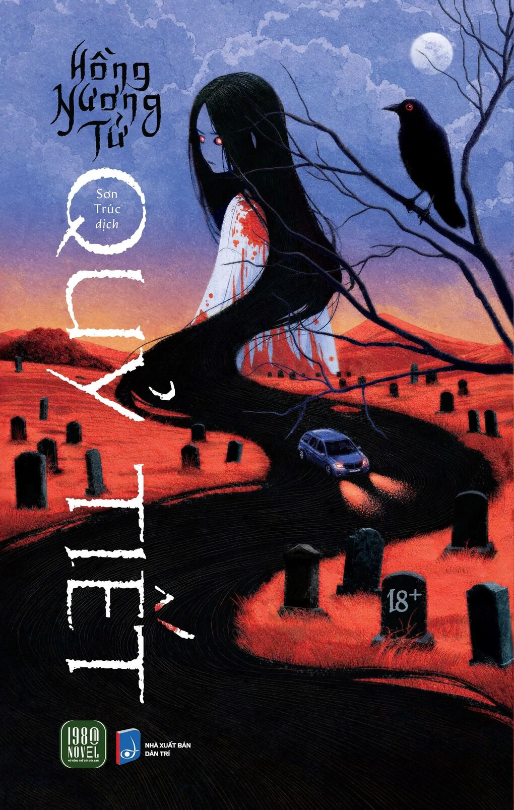

# \[Văn Học\] Quỷ Tiết

> Tác giả __*Hồng Nương Tử*__

<figure markdown="span">
    
    <figcaption></figcaption>
</figure>

## Review Sách

"Quỷ Tiết" của Hồng Nương Tử, được dịch bởi Sơn Trúc, là một tiểu thuyết kinh dị Trung Quốc đưa độc giả vào một hành trình ám ảnh với không gian xoắn vặn, thời gian đảo ngược và luân hồi lặp lại. Được mệnh danh là Nữ hoàng kinh dị Trung Quốc, Hồng Nương Tử mang đến một câu chuyện rùng rợn, kết hợp yếu tố huyền bí và giả tưởng, khiến người đọc không thể rời mắt.

Cuốn sách xoay quanh hành trình đầy ám ảnh của Thẩm Ngạo và những người trên một chiếc xe chạy qua khe núi, nơi hai bên sườn đồi là những ngôi mộ đứng sừng sững. Khi chiếc xe tiến vào một trạm dừng chân kỳ dị, không một bóng người, mọi thứ bắt đầu trở nên bất thường. Không gian dường như bị bóp méo, thời gian đảo lộn, và những sự kiện kinh hoàng liên tục tái diễn, khiến Thẩm Ngạo và những người đồng hành rơi vào trạng thái hoảng loạn. Tác phẩm dẫn dắt độc giả qua những vòng lặp luân hồi, nơi nỗi sợ và sự bí ẩn len lỏi trong từng chi tiết, từ những ngôi mộ báo hiệu điềm xấu đến trạm dừng chân cô độc.

