# Danh sách

```puml
@startwbs
skinparam backgroundcolor transparent
skinparam DefaultFontName Monospaced

* Novel

' -------------------------------------------------------------------------------------------------------------------------------- '
** Châu Á
---:= Nhật
====
=== Haruki Murakamis
├─ Rừng Nauy
├─ 1Q84
│  ├─ 1Q84 (I)
│  ├─ 1Q84 (II)
│  └─ 1Q84 (III)
├─ Giết chết chỉ huy đội Kỵ Sĩ (Tập 1)
├─ Giết chết chỉ huy đội Kỵ Sĩ (Tập 2)
├─ Lắng nghe gió hát
├─ Ngầm
├─ Người tình Sputnik
├─ Những người đàn ông không có đàn bà
├─ Phía nam biên giới, phía tây mặt trời
├─ 💾 Tôi nói gì khi nói về chạy bộ
└─ 💾 Kafka Bên Bờ Biển
====
=== Ichikawa Takuji
├─ Anh sẽ đến tìm em trên chiếc xe đạp hỏng
├─ Em sẽ đến cùng cơn mưa
├─ MM - Chuyện về cô gái ấy
├─ Nếu gặp người ấy cho tôi gửi lời chào
├─ Nơi em quay về có tôi đứng đợi
├─ Tấm ảnh tình yêu và một câu chuyện khác
├─ Thế giới kết thúc dịu dàng đến thế
└─ 💾 Bàn tay cho em
====
=== Shinkai Makoto
├─ 5 centimet trên giây
├─ Khu Vườn ngôn từ
├─ Tiếng gọi từ vì sao xa
├─ Your Name
└─ Your Name Another
====
=== Kazumi Yumoto
├─ Organ mùa xuân
├─ Khu vườn mùa hạ
└─ Mùa thu của cây dương
└─ [?]
====
=== Higashino Keigo
├─ Bí mật của Naoko
├─ Điều kỳ diệu của tiệm tạp hoá Namiya
└─ Phía sau nghi can X
====
=== Nomura Mizuki
├─ Cô gái văn chương (8 tập)
└─ Cô gái văn chương (khổ nhỏ) (2 tập)
====
=== Yonezawa Honobu
├─ 📚 Kem Đá
└─ 📚 Thằng Khờ
====
=== Nagaru Tanigawa
└─ Suzumiya Harumi //(thanh lý)//
====
=== Banana Yoshimoto
└─ Vĩnh biệt Tugumi
=== Ekuni Kaori
└─ Tháp Tokyo
=== Hiroshi Sakurazaka
└─ ❌ All you need is kill
=== Minato Kanae
└─ 📚 Thú tội
=== Miyuki Miyabe
└─ Kasha
=== Natsuki Mamiya
└─ Ánh Trăng
=== Otsuichi
└─ Zoo
=== Takafumi Nanatsuki
└─ Cuộc hẹn từ tương lai
=== Yamada Amy
└─ Sống lưng của Jesse
=== Yoshinori Noguchi
└─ Quy luật của tấm gương
=== Yukito Ayatsuji
└─ 📚 Thập Giác Quán
=== Kawabata Yasunari
└─ 📚 Hồ
=== Kotaro Isaka
└─ 📚 Bảy ngày phán quyết
=== Edogawa Ranpo
└─ 📚 Tuyển tập Edogawa Ranpo
=== Hideo Yokoyama
└─ 📚 Két Xác
=== Mitsuda Shinzo
└─ 📚 Tằm Tang;

' -------------------------------------------------------------------------------------------------------------------------------- '
***:= Trung
====
=== Vĩ Ngư
└─ 💾 Chuông Gió
====
=== Bát Nguyệt Trường An
├─ 📚 Tuổi trẻ là một chuyến tàu mang thương nhớ
├─ 📚 Điều tuyệt vời nhất của thanh xuân 1
└─ 📚 Điều tuyệt vời nhất của thanh xuân 2
====
=== Mặc Thư Bạch
├─ Trường Phong Độ 1
└─ 📚 Trường Phong Độ 2
====
=== Thủy Tước
└─ 📚 Gia Tĩnh Linh Dị Lục
====
=== Đường Phúc Duệ
└─ 📚 Bóng đêm bát xích môn
====
=== Thanh Tử
└─ 💾 Mao Sơn Tróc Quỷ Nhân;

' -------------------------------------------------------------------------------------------------------------------------------- '
***:= Hàn
====
=== ????
└─ 💾 Bố Con Cá Gai;

' -------------------------------------------------------------------------------------------------------------------------------- '
***:= Việt Nam
====
=== Nhiều Tác Giả
└─ 📚 365 Truyện Cổ Tích Việt nam;

' ================================================================================================================================ '
** Châu Âu
---:= Pháp
====
=== Mark Levy
├─ Bảy ngày cho mãi mãi
├─ Chuyện chàng nàng
├─ Cô gái như em
│  ├─ Gặp lại
│  └─ Kiếp sau
├─ .
│  ├─ Đêm đầu tiên
│  └─ Ngày đầu tiên
├─ Em ở đâu
├─ Ghost in love
├─ ✴️ Mạnh hơn sợ hãi
├─ Mọi điều ta chưa nói
├─ Một ý niệm khác về hạnh phúc
├─ Nếu như được làm lại
├─ ✴️ Người trộm bóng 
└─ Chuyến du hành kỳ lại của ngài Daldry
====
=== Valérie Perrin
└─ Hoa vẫn nở mỗi ngày;
' -------------------------------------------------------------------------------------------------------------------------------- '
---:= Mỹ
====
=== Chris Bradford
├─ Samurai trẻ tuổi I - Võ sĩ đạo
├─ Samurai trẻ tuổi II - Kiếm đạo
├─ Samurai trẻ tuổi III - Long đạo
├─ Samurai trẻ tuổi IV - Ngũ đại Địa
├─ Samurai trẻ tuổi V - Ngũ đại Thuỷ
├─ Samurai trẻ tuổi VI - Ngũ đại Hoả
├─ Samurai trẻ tuổi VII - Ngũ đại Phong
└─ Samurai trẻ tuổi VIII - Ngũ đại Không
====
=== Ayn Rand
└─ Suối Nguồn
====
=== Madeline Miller
├─ Gót chân Achilles
└─ Circle
====
=== ???
├─ Giết chết con chim nhạn (Harper Lee)
├─ Gastsby Vĩ Đại
├─ Khi hơi thở hóa thinh không
└─ Khởi Sinh Của Cô Độc;
' -------------------------------------------------------------------------------------------------------------------------------- '
***:= Bồ Đào Nha
=== Jose Saramago
├─ Mù loà
└─ Sáng Mắt
=== Jose Mauro + Vasconcelos
└─ Cây cam ngọt của tôi;
' -------------------------------------------------------------------------------------------------------------------------------- '
***:= Nga
=== Lyudmila Ulitskaya
└─ Sonechka;
' -------------------------------------------------------------------------------------------------------------------------------- '
***:= Đức
=== Markus Zusa
└─ Kẻ trộm sách;
' -------------------------------------------------------------------------------------------------------------------------------- '
***:= Anh
=== Arthur Conan Doyle
├─ Sherlock Home (Cũ)
└─ Sherlock Home (Mới)
   ├─ Sherlock Home (Tập 1)
   ├─ Sherlock Home (Tập 2)
   ├─ Sherlock Home (Tập 3)
   ├─ Sherlock Home (Tập 4)
   ├─ Sherlock Home (Tập 5)
   └─ Sherlock Home (Tập 6);

@endwbs
```



<!-- 
```markmap
---
markmap:
    zoom: false
    pan: false
    duration: 0
---
- Nhật
    - Novel
        - Haruki Murakami
            - 📗 Rừng Nauy 👍
            - 📗 1Q84 (I) 👍
            - 📗 1Q84 (II) 👍
            - 📗 1Q84 (III) 👍
            - 📗 Giết chết chỉ huy đội Kỵ Sĩ (Tập 1) 👍
            - 📗 Giết chết chỉ huy đội Kỵ Sĩ (Tập 2) 👍
            - 📗 Lắng nghe gió hát
            - 📗 Ngầm
            - 📗 Người tình Sputnik
            - 📗 Những người đàn ông không có đàn bà
            - 📗 Phía nam biên giới, phía tây mặt trời 👍
            - 📚 _Tôi nói gì khi nói về chạy bộ_
            - 📚 _Kafka Bên Bờ Biển_
        - Ichikawa Takuji
            - 📗 Anh sẽ đến tìm em trên chiếc xe đạp hỏng
            - 📗 Em sẽ đến cùng cơn mưa
            - 📗 MM - Chuyện về cô gái ấy
            - 📗 Nếu gặp người ấy cho tôi gửi lời chào
            - 📗 Nơi em quay về có tôi đứng đợi
            - 📚 Tấm ảnh tình yêu và một câu chuyện khác
            - 📚 Thế giới kết thúc dịu dàng đến thế
            - 📚 _Bàn tay cho em_
        - Shinkai Makoto
            - 📗 5 centimet trên giây
            - 📗 Khu Vườn ngôn từ
            - 📚 _Tiếng gọi từ vì sao xa_
            - 📗 Your Name
            - 📗 Your Name Another
        - Kazumi Yumoto
            - 📗 Khu vườn mùa hạ 👍
            - 📗 Mùa thu của cây dương 👍
            - 📗 Organ mùa xuân
        - Higashino Keigo
            - 📗 Bí mật của Naoko
            - 📗 Điều kỳ diệu của tiệm tạp hoá Namiya
            - 📚 Phía sau nghi can X
        - Nomura Mizuki
            - 📗 Cô gái văn chương (8 tập) ⁉️
            - 📗 Cô gái văn chương (khổ nhỏ) (2 tập) ⁉️
        - Yonezawa Honobu
            - 📗 Kem Đá ⁉️
            - 📗 Thằng Khờ ⁉️
        - Nagaru Tanigawa
            - 📚 Suzumiya Harumi _(? Tập)_ -> __*(chắc là nên thanh lý)*__
        - Misc
            - 📗 Vĩnh biệt Tugumi - _(Banana Yoshimoto)_
            - 📗 Tháp Tokyo - _(Ekuni Kaori)_
            - 💰 All you need is kill - _(Hiroshi Sakurazaka)_
            - 📗 Thú tội - _(Minato Kanae)_
            - 📗 Kasha - _(Miyuki Miyabe)_
            - 📗 Ánh Trăng - _(Natsuki Mamiya)_
            - 📗 Zoo - _(Otsuichi)_
            - 📗 Cuộc hẹn từ tương lai - _(Takafumi Nanatsuki)_
            - 📗 Sống lưng của Jesse - _(Yamada Amy)_
            - 📗 Quy luật của tấm gương - _(Yoshinori Noguchi)_
            - 📗 Thập Giác Quán - _(Yukito Ayatsuji)_
            - 📚 Hồ - _(Kawabata Yasunari)_
            - 📚 Bảy ngày phán quyết - _(Kotaro Isaka)_
            - 📚 Tuyển tập Edogawa Ranpo - _(Edogawa Ranpo)_
            - 📚 Két Xác - _(Hideo Yokoyama)_
            - 📚 Tằm Tang - _(Mitsuda Shinzo)_
    - Light Novel
        - 📗 Mimizuku và Vua bóng đêm (Arikawa Hiro)
        - Hasekura Isuna
            - 📗 Sói và gia vị (Tập 1)
            - 📗 Sói và gia vị (Tập 2)
            - 📗 Sói và gia vị (Tập 3)
            - 📗 Sói và gia vị (Tập 4)
            - 📗 Sói và gia vị (Tập 5)
            - 📗 Sói và gia vị (Tập 6)
            - 📗 Sói và gia vị (Tập 7)
            - 📗 Sói và gia vị (Tập 8)
            - 📗 Sói và gia vị (Tập 9)
            - 📗 Sói và gia vị (Tập 10)
        - Mikami En
            - 📗 Tiệm sách cũ Biblia (Tập 1)
            - 📗 Tiệm sách cũ Biblia (Tập 2)
            - 📗 Tiệm sách cũ Biblia (Tập 3)
            - 📗 Tiệm sách cũ Biblia (Tập 4)
            - 📚 Tiệm sách cũ Biblia (Tập 5)
            - 📚 Tiệm sách cũ Biblia (Tập 6)
            - 📚 Tiệm sách cũ Biblia (Tập 7)
            - 📚 Tiệm sách cũ Biblia (Tập Đặc Biệt)
        - Yukito Ayatsuji
            - 📚 Another I,II
            - 📚 Another S/O
- Pháp
    - Valérie Perrin
        - 📚 Hoa vẫn nở mỗi ngày
    - Mark Levy
        - 📗 Bảy ngày cho mãi mãi
        - 📗 Chuyện chàng nàng
        - 📗 Cô gái như em
        - 📗 Đêm đầu tiên
        - 📗 Em ở đâu
        - 📗 Gặp lại _(Cô gái như em)_
        - 📗 Ghost in love
        - 📗 Kiếp sau _(Gặp lại)_
        - 📗 Mạnh hơn sợ hãi
        - 📗 Mọi điều ta chưa nói
        - 📗 Một ý niệm khác về hạnh phúc
        - 📗 Nếu như được làm lại
        - 📗 Ngày đầu tiên
        - 📗 Người trộm bóng
        - 📗 Chuyến du hành kỳ lại của ngài Daldry
- Trung Quốc
    - Vĩ Ngư
        - 📗 Chuông Gió
    - Thanh Tử
        - 📗 _Mao Sơn Tróc Quỷ Nhân_
    - Bát Nguyệt Trường An
        - 📚 Tuổi trẻ là một chuyến tàu mang thương nhớ
        - 📚 Điều tuyệt vời nhất của thanh xuân 1
        - 📚 Điều tuyệt vời nhất của thanh xuân 2
    - Mặc Thư Bạch
        - 🔖 Trường Phong Độ 1
        - 🔖 Trường Phong Độ 2
    - Thủy Tước
        - 📚 Gia Tĩnh Linh Dị Lục
    - Đường Phúc Duệ
        - 📚 Bóng đêm bát xích môn
- Mỹ
    - Chris Bradford
        - 📗 Samurai trẻ tuổi I - Võ sĩ đạo
        - 📗 Samurai trẻ tuổi II - Kiếm đạo
        - 📗 Samurai trẻ tuổi III - Long đạo
        - 📗 Samurai trẻ tuổi IV - Ngũ đại Địa
        - 📗 Samurai trẻ tuổi V - Ngũ đại Thuỷ
        - 📗 Samurai trẻ tuổi VI - Ngũ đại Hoả
        - 📗 Samurai trẻ tuổi VII - Ngũ đại Phong
        - 📗 Samurai trẻ tuổi VIII - Ngũ đại Không
    - Ayn Rand
        - 📗 Suối Nguồn
    - Madeline Miller
        - 📚 _Gót chân Achilles_
        - 📚 Circle
    - ???
        - 📚 Giết chết con chim nhạn (Harper Lee)
        - 📚 Gastsby Vĩ Đại
        - 📚 Khi hơi thở hóa thinh không
        - 📚 Khởi Sinh Của Cô Độc
- Bồ Đào Nha
    - Jose Saramago
        - 📚 Mù loà
        - 📚 Sáng Mắt
    - Jose Mauro + Vasconcelos
        - 📚 Cây cam ngọt của tôi
- Nga
    - Lyudmila Ulitskaya
        - 📚 Sonechka
- Đức
    - Markus Zusa
        - 📚 Kẻ trộm sách
- Anh
    - Arthur Conan Doyle
        - 📚 Sherlock Home (Cũ)
        - Sherlock Home (Toàn Tập)
            - 📚 Sherlock Home (Tập 1)
            - 📚 Sherlock Home (Tập 2)
            - 📚 Sherlock Home (Tập 3)
            - 📚 Sherlock Home (Tập 4)
            - 📚 Sherlock Home (Tập 5)
            - 📚 Sherlock Home (Tập 6)
- Việt
    - Nhiều Tác Giả
        - 📚 365 Truyện Cổ Tích Việt nam
```
 -->