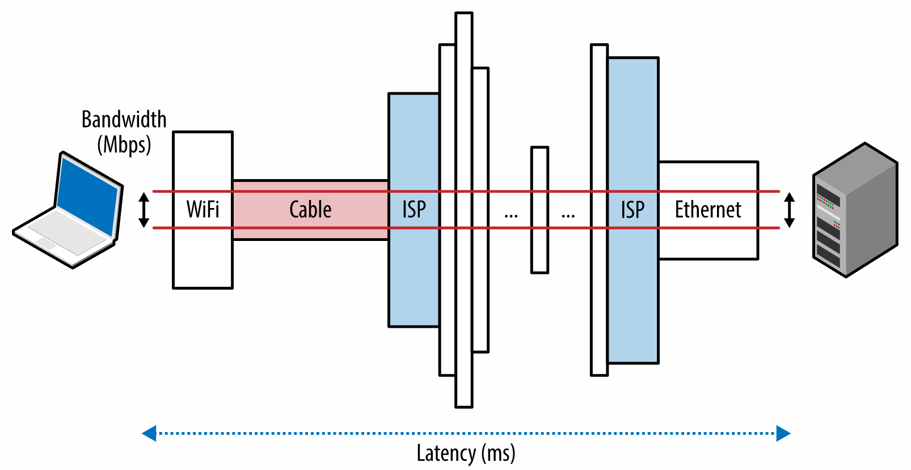
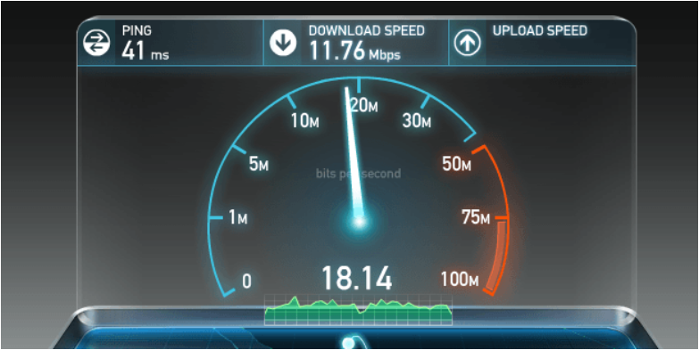

# Primer on Latency and Bandwidth

<div style="text-align: center; font-style: italic; font-color: gray;">(Sơ lược về độ trễ và băng thông)</div>

> [Primer on Latency and Bandwidth](https://hpbn.co/primer-on-latency-and-bandwidth/)

## Speed Is a Feature
> Tốc độ là một tính năng

Sự xuất hiện và tăng trưởng nhanh chóng của ngành tối ưu hóa hiệu suất web (WPO) trong vài năm qua là dấu hiệu nhận biết về tầm quan trọng ngày càng tăng cũng như nhu cầu về tốc độ và trải nghiệm người dùng nhanh hơn của người dùng. Và đây không chỉ đơn giản là nhu cầu tâm lý về tốc độ trong thế giới ngày càng tăng tốc và kết nối của chúng ta, mà là một yêu cầu được thúc đẩy bởi các kết quả thực nghiệm, được đo lường dựa trên hiệu quả kinh doanh cuối cùng của nhiều doanh nghiệp trực tuyến:

- Các trang web nhanh hơn dẫn đến sự tham gia của người dùng tốt hơn.
- Các trang web nhanh hơn sẽ giữ chân người dùng tốt hơn.
- Các trang web nhanh hơn sẽ dẫn đến tỷ lệ chuyển đổi cao hơn.

Nói một cách đơn giản, tốc độ là một tính năng. Và để cung cấp nó, chúng ta cần hiểu nhiều yếu tố và hạn chế cơ bản đang diễn ra. Trong chương này, chúng ta sẽ tập trung vào hai thành phần quan trọng quyết định hiệu suất của tất cả lưu lượng mạng: độ trễ và băng thông ( Hình 1-1 ).

___Độ trễ___<br>
&emsp;Thời gian từ nguồn gửi một gói tin đến đích nhận được nó


___Băng thông___<br>
&emsp;Thông lượng tối đa của đường truyền thông logic hoặc vật lý

<figure markdown="span">
    
    <figcaption>Hình 1-1. Độ trễ và băng thông</figcaption>
</figure>

Khi hiểu rõ hơn về cách băng thông và độ trễ phối hợp với nhau, chúng ta sẽ có các công cụ để tìm hiểu sâu hơn về các đặc tính bên trong và hiệu suất của TCP, UDP cũng như tất cả các giao thức ứng dụng ở trên chúng.

!!! note "Note"

    __Giảm độ trễ xuyên Đại Tây Dương với Hibernia Express__

    Độ trễ là một tiêu chí quan trọng đối với nhiều thuật toán giao dịch tần suất cao trên thị trường tài chính, nơi mà chỉ cần một chút chênh lệch vài mili giây cũng có thể dẫn đến hàng triệu khoản lỗ hoặc lợi nhuận.

    Vào tháng 9 năm 2015, Hibernia Networks đã ra mắt một tuyến cáp quang mới ("Hibernia Express") được thiết kế riêng để đảm bảo độ trễ thấp nhất giữa New York và London bằng cách đi theo tuyến đường vòng lớn giữa các thành phố. Tổng chi phí của dự án ước tính là 300 triệu đô la trở lên và tuyến đường mới tự hào có độ trễ 58,95 ms giữa các thành phố, giúp nó có lợi thế ~5 mili giây so với tất cả các tuyến xuyên Đại Tây Dương hiện có khác. Điều này tương đương với 60 triệu đô la trở lên cho mỗi mili giây được tiết kiệm!

    Độ trễ rất đắt - theo nghĩa đen và nghĩa bóng.

## The Many Components of Latency
> Nhiều thành phần của độ trễ

Độ trễ là thời gian cần thiết để một tin nhắn hoặc một gói di chuyển từ điểm xuất phát đến điểm đích. Đó là một định nghĩa đơn giản và hữu ích, nhưng nó thường ẩn chứa nhiều thông tin hữu ích - mọi hệ thống đều chứa nhiều nguồn hoặc thành phần, góp phần tạo nên tổng thời gian cần thiết để gửi một tin nhắn và điều quan trọng là phải hiểu những thành phần này là gì. là gì và điều gì quyết định hiệu suất của họ.

Hãy cùng xem xét kỹ hơn một số thành phần chung góp phần tạo nên một bộ định tuyến thông thường trên Internet, có chức năng chuyển tiếp tin nhắn giữa máy khách và máy chủ:

- Độ trễ lan truyền _(Propagation delay)_
    - Lượng thời gian cần thiết để một tin nhắn truyền từ người gửi đến người nhận, là hàm của khoảng cách theo tốc độ mà tín hiệu truyền đi.
- Độ trễ truyền tải _(Transmission delay)_
    - Lượng thời gian cần thiết để đẩy tất cả các bit của gói vào liên kết, đây là hàm số của độ dài gói và tốc độ dữ liệu của liên kết.
- Sự chậm trễ trong xử lý _(Processing delay)_
    - Lượng thời gian cần thiết để xử lý tiêu đề gói, kiểm tra lỗi cấp độ bit và xác định đích đến của gói.
- Độ trễ xếp hàng _(Queuing delay)_
    - Khoảng thời gian gói tin phải chờ trong hàng đợi cho đến khi có thể được xử lý.

Độ trễ tổng thể giữa máy khách và máy chủ là tổng của tất cả các độ trễ vừa được liệt kê. Thời gian lan truyền được quyết định bởi khoảng cách và môi trường mà tín hiệu đi qua — như chúng ta sẽ thấy, tốc độ lan truyền thường nằm trong một hệ số hằng số nhỏ của tốc độ ánh sáng. Mặt khác, độ trễ truyền được quyết định bởi tốc độ dữ liệu khả dụng của liên kết truyền và không liên quan gì đến khoảng cách giữa máy khách và máy chủ. Ví dụ, giả sử chúng ta muốn truyền một tệp 10 Mb qua hai liên kết: 1 Mbps và 100 Mbps. Sẽ mất 10 giây để đưa toàn bộ tệp "lên dây" qua liên kết 1 Mbps và chỉ mất 0,1 giây qua liên kết 100 Mbps.

!!! note "Note"
    Tốc độ dữ liệu mạng thường được đo bằng bit trên giây (bps), trong khi tốc độ dữ liệu cho thiết bị không thuộc mạng thường được hiển thị bằng byte trên giây (Bps). Đây là nguyên nhân gây nhầm lẫn phổ biến, hãy chú ý đến các đơn vị.

    Ví dụ: để đặt một tệp 10 megabyte (MB) "trên dây" qua liên kết 1Mbps, chúng ta sẽ cần 80 giây. 10MB bằng 80Mb vì mỗi byte có 8 bit!

Tiếp theo, khi gói tin đến bộ định tuyến, bộ định tuyến phải kiểm tra tiêu đề gói tin để xác định tuyến đi và có thể chạy các kiểm tra khác trên dữ liệu — điều này cũng mất thời gian. Phần lớn logic này hiện nay thường được thực hiện trong phần cứng, do đó độ trễ rất nhỏ, nhưng chúng vẫn tồn tại. Và cuối cùng, nếu các gói tin đến với tốc độ nhanh hơn tốc độ mà bộ định tuyến có thể xử lý, thì các gói tin sẽ được xếp hàng bên trong bộ đệm đến. Không có gì ngạc nhiên khi thời gian dữ liệu được xếp hàng bên trong bộ đệm được gọi là độ trễ xếp hàng.

Mỗi gói truyền qua mạng sẽ phát sinh nhiều trường hợp của từng độ trễ này. Khoảng cách giữa nguồn và đích càng xa thì thời gian lan truyền càng lâu. Chúng ta càng gặp nhiều bộ định tuyến trung gian trong quá trình thực hiện thì độ trễ xử lý và truyền cho mỗi gói càng cao. Cuối cùng, lưu lượng truy cập dọc theo đường dẫn càng cao thì khả năng gói của chúng ta bị xếp hàng và bị trì hoãn bên trong một hoặc nhiều bộ đệm càng cao.

!!! info "Info"
    __Bufferbloat trong bộ định tuyến cục bộ của bạn__

    `Bufferbloat` là thuật ngữ được Jim Gettys đặt ra và phổ biến vào năm 2010 và là một ví dụ điển hình về độ trễ hàng đợi ảnh hưởng đến hiệu suất chung của mạng.

    Vấn đề cơ bản là nhiều bộ định tuyến hiện đang vận chuyển với bộ đệm đến lớn với giả định rằng việc loại bỏ các gói tin phải được tránh bằng mọi giá. Tuy nhiên, điều này phá vỡ các cơ chế tránh tắc nghẽn của TCP (mà chúng ta sẽ đề cập trong chương tiếp theo) và đưa độ trễ cao và thay đổi vào mạng.

    Tin vui là thuật toán quản lý hàng đợi hoạt động CoDel mới đã được đề xuất để giải quyết vấn đề này và hiện được triển khai trong nhân Linux 3.5+. Để tìm hiểu thêm, hãy tham khảo "[Kiểm soát độ trễ hàng đợi](https://queue.acm.org/detail.cfm?id=2209336)" trong Hàng đợi ACM.

## Speed of Light and Propagation Latency

> Tốc độ ánh sáng và độ trễ lan truyền

Như Einstein đã nêu trong lý thuyết tương đối đặc biệt của mình, tốc độ ánh sáng là tốc độ tối đa mà mọi năng lượng, vật chất và thông tin có thể truyền đi. Quan sát này đặt ra một giới hạn cứng và một bộ điều chỉnh về thời gian truyền của bất kỳ gói mạng nào.

Tin tốt là tốc độ ánh sáng rất cao: 299.792.458 mét mỗi giây, hay 186.282 dặm mỗi giây. Tuy nhiên, và luôn có một điều, đó là tốc độ ánh sáng trong chân không. Thay vào đó, các gói của chúng ta truyền qua một phương tiện như dây đồng hoặc cáp quang, điều này sẽ làm chậm tín hiệu (`Bảng 1-1`). Tỷ lệ giữa tốc độ ánh sáng và tốc độ truyền gói tin trong vật liệu được gọi là chiết suất của vật liệu. Giá trị càng lớn thì ánh sáng truyền đi trong môi trường đó càng chậm.

Giá trị chiết suất điển hình của sợi quang, qua đó hầu hết các gói của chúng tôi truyền đi trong khoảng cách xa, có thể thay đổi trong khoảng từ 1,4 đến 1,6 - chậm nhưng chắc chắn, chúng tôi đang thực hiện những cải tiến về chất lượng vật liệu và có thể hạ thấp hệ số khúc xạ mục lục. Nhưng để đơn giản, nguyên tắc chung là giả sử tốc độ ánh sáng trong sợi quang là khoảng 200.000.000 mét mỗi giây, tương ứng với chiết suất ~ 1,5. Phần đáng chú ý về điều này là chúng ta đã ở trong một hệ số không đổi nhỏ của tốc độ tối đa! Một thành tựu kỹ thuật đáng kinh ngạc theo đúng nghĩa của nó.

<div class="center-table" markdown>
| Tuyến đường | Khoảng cách | Thời gian, ánh sáng<br>trong chân không | Thời gian, ánh sáng<br>trong sợi vải | Thời gian khứ hồi<br>(RTT) trong sợi quang |
|:-|:-:|:-:|:-:|:-:|
| New York đến San Francisco | 4.148 km  | 14 giây         | 21 giây       | 42 giây       |
| New York tới London        | 5.585 km  | 19 giây         | 28 mili giây  | 42 giây       |
| New York đến Sydney        | 15.993 km | 53 giây         | 80 giây       | 160 giây      |
| Chu vi xích đạo            | 40.075 km | 133,7 mili giây | 200 mili giây | 200 mili giây |
</div>
<div style="text-align: center; font-style: italic;">Bảng 1-1. Độ trễ tín hiệu trong chân không và sợi quang.</div>

Tốc độ ánh sáng rất nhanh nhưng vẫn phải mất 160 mili giây để thực hiện hành trình khứ hồi (RTT) từ New York đến Sydney. Trên thực tế, những con số trong Bảng 1-1 cũng lạc quan một cách phi thực tế ở chỗ chúng cho rằng gói tin truyền qua cáp quang dọc theo đường vòng lớn (khoảng cách ngắn nhất giữa hai điểm trên địa cầu) giữa các thành phố. Trong thực tế, điều đó hiếm khi xảy ra và gói tin sẽ đi một chặng đường dài hơn nhiều giữa New York và Sydney. Mỗi bước nhảy dọc theo tuyến đường này sẽ đưa ra các độ trễ định tuyến, xử lý, xếp hàng và truyền bổ sung. Kết quả là RTT thực tế giữa New York và Sydney, qua các mạng hiện có của chúng tôi, hoạt động trong phạm vi 200–300 mili giây. Sau tất cả, điều đó có vẻ vẫn khá nhanh, phải không?

Chúng ta không quen đo lường những cuộc gặp gỡ hàng ngày của mình bằng mili giây, nhưng các nghiên cứu đã chỉ ra rằng hầu hết chúng ta sẽ báo cáo một cách đáng tin cậy về "độ trễ" có thể cảm nhận được khi độ trễ trên 100–200 mili giây được đưa vào hệ thống. Khi vượt quá ngưỡng độ trễ 300 mili giây, tương tác thường được báo cáo là "chậm" và ở ngưỡng 1.000 mili giây (1 giây), nhiều người dùng đã thực hiện chuyển đổi ngữ cảnh trong đầu trong khi chờ phản hồi - xem `Tốc độ, Hiệu suất, và Nhận thức của Con người`.

Vấn đề rất đơn giản, để mang lại trải nghiệm tốt nhất và giữ cho người dùng của chúng tôi tham gia vào nhiệm vụ trong tầm tay, chúng tôi cần các ứng dụng của mình phản hồi trong vòng hàng trăm mili giây. Điều đó không để lại cho chúng tôi, và đặc biệt là mạng, nhiều chỗ cho lỗi. __Để thành công, độ trễ mạng phải được quản lý cẩn thận và là tiêu chí thiết kế rõ ràng ở mọi giai đoạn phát triển.__

!!! note "Note"
    Các dịch vụ mạng phân phối nội dung (CDN) mang lại nhiều lợi ích, nhưng lợi ích quan trọng nhất trong số đó là việc phân phối nội dung trên toàn cầu và cung cấp nội dung đó từ vị trí gần đó đến máy khách giúp chúng ta giảm đáng kể thời gian truyền tải của tất cả các gói dữ liệu.

    Chúng ta có thể không thể khiến các gói tin di chuyển nhanh hơn, nhưng chúng ta có thể giảm khoảng cách bằng cách định vị máy chủ của mình gần người dùng hơn một cách chiến lược! Tận dụng CDN để phục vụ dữ liệu của bạn có thể mang lại lợi ích hiệu suất đáng kể.

## Last-Mile Latency
> Độ trễ ở chặng cuối

Trớ trêu thay, đó thường là ở những dặm cuối cùng, chứ không phải đoạn băng qua đại dương hay lục địa, nơi xuất hiện độ trễ đáng kể: vấn đề khét tiếng ở dặm cuối. Để kết nối nhà hoặc văn phòng của bạn với Internet, ISP địa phương của bạn cần định tuyến cáp khắp vùng lân cận, tổng hợp tín hiệu và chuyển tiếp đến nút định tuyến cục bộ. Trong thực tế, tùy thuộc vào loại kết nối, phương pháp định tuyến và công nghệ được triển khai, chỉ riêng vài bước nhảy đầu tiên này có thể mất hàng chục mili giây.

Theo báo cáo "Đo lường băng thông rộng của Mỹ" hàng năm do Ủy ban Truyền thông Liên bang (FCC) thực hiện, độ trễ ở dặm cuối đối với băng thông rộng trên mặt đất (DSL, cáp, cáp quang) ở Hoa Kỳ vẫn tương đối ổn định theo thời gian: cáp quang có hiệu suất trung bình tốt nhất (10-20 ms), tiếp theo là cáp (15-40 ms) và DSL (30-65 ms).

Trên thực tế, điều này chuyển thành độ trễ 10-65 ms chỉ đến nút đo gần nhất trong mạng lõi của ISP, trước khi gói tin được định tuyến đến đích! Báo cáo của FCC tập trung vào Hoa Kỳ, nhưng độ trễ chặng cuối là một thách thức đối với tất cả các nhà cung cấp Internet, bất kể địa lý. Đối với những người tò mò, một thông tin đơn giản traceroutethường có thể cho bạn biết rất nhiều về cấu trúc và hiệu suất của nhà cung cấp Internet của bạn.

```bash
traceroute google.com
  traceroute to google.com (74.125.224.102), 64 hops max, 52 byte packets
   1  10.1.10.1 (10.1.10.1)  7.120 ms  8.925 ms  1.199 ms 
   2  96.157.100.1 (96.157.100.1)  20.894 ms  32.138 ms  28.928 ms
   3  x.santaclara.xxxx.com (68.85.191.29)  9.953 ms  11.359 ms  9.686 ms
   4  x.oakland.xxx.com (68.86.143.98)  24.013 ms 21.423 ms 19.594 ms
   5  68.86.91.205 (68.86.91.205)  16.578 ms  71.938 ms  36.496 ms
   6  x.sanjose.ca.xxx.com (68.86.85.78)  17.135 ms  17.978 ms  22.870 ms
   7  x.529bryant.xxx.com (68.86.87.142)  25.568 ms  22.865 ms  23.392 ms
   8  66.208.228.226 (66.208.228.226)  40.582 ms  16.058 ms  15.629 ms
   9  72.14.232.136 (72.14.232.136)  20.149 ms  20.210 ms  18.020 ms
  10  64.233.174.109 (64.233.174.109)  63.946 ms  18.995 ms  18.150 ms
  11  x.1e100.net (74.125.224.102)  18.467 ms  17.839 ms  17.958 ms
```

!!! info "Info"
    - 1st hop: local wireless router
    - 10st hop: Google server

Trong ví dụ trước, gói tin bắt đầu ở thành phố Sunnyvale, chuyển đến Santa Clara, sau đó là Oakland, quay trở lại San Jose, được định tuyến đến trung tâm dữ liệu "529 Bryant", tại thời điểm đó, nó được định tuyến đến Google và đến đích ở lần chuyển tiếp thứ 11. Toàn bộ quá trình này mất trung bình 18 mili giây. Không tệ, xét về mọi mặt, nhưng trong cùng thời gian đó, gói tin có thể đi qua hầu hết lục địa Hoa Kỳ!

Độ trễ chặng cuối có thể thay đổi rất nhiều giữa các ISP do công nghệ được triển khai, cấu trúc mạng và thậm chí là thời gian trong ngày. Là người dùng cuối và nếu bạn đang muốn cải thiện tốc độ duyệt web của mình, hãy đảm bảo đo lường và so sánh độ trễ chặng cuối của các nhà cung cấp khác nhau có sẵn trong khu vực của bạn.

!!! note "Note"
    Độ trễ chứ không phải băng thông mới là điểm nghẽn hiệu suất của hầu hết các trang web! Để hiểu lý do tại sao, chúng ta cần hiểu cơ chế của giao thức TCP và HTTP - những chủ đề chúng ta sẽ đề cập trong các chương tiếp theo. Tuy nhiên, nếu bạn tò mò, vui lòng bỏ qua phần [Thêm băng thông không quan trọng]() (nhiều) .

!!! info "Info"

    __Đo độ trễ bằng Traceroute__

    Traceroute là một công cụ chẩn đoán mạng đơn giản để xác định đường dẫn định tuyến của gói và độ trễ của mỗi bước nhảy mạng trong mạng IP. Để xác định các bước nhảy riêng lẻ, nó sẽ gửi một chuỗi các gói đến đích với "giới hạn bước nhảy" tăng dần (1, 2, 3, v.v.). Khi đạt đến giới hạn số bước nhảy, thiết bị trung gian sẽ trả về thông báo Đã vượt quá thời gian ICMP, cho phép công cụ đo độ trễ cho mỗi bước nhảy mạng.

    Trên nền tảng Unix, công cụ này có thể được chạy từ dòng lệnh thông qua traceroute, còn trên Windows, nó được gọi là `tracert`.

## Bandwidth in Core Networks
> Băng thông trong mạng lõi

Một sợi quang hoạt động như một "ống dẫn ánh sáng" đơn giản, dày hơn một chút so với sợi tóc người, được thiết kế để truyền ánh sáng giữa hai đầu của cáp. Dây kim loại cũng được sử dụng nhưng dễ bị mất tín hiệu, nhiễu điện từ và chi phí bảo trì trọn đời cao hơn. Rất có thể các gói tin của bạn sẽ đi qua cả hai loại cáp, nhưng đối với bất kỳ bước nhảy xa nào, chúng sẽ được truyền qua liên kết sợi quang.

Sợi quang có một lợi thế riêng biệt khi nói đến băng thông vì mỗi sợi có thể mang nhiều bước sóng (kênh) ánh sáng khác nhau thông qua một quá trình được gọi là ghép kênh phân chia bước sóng (WDM). Do đó, tổng băng thông của một liên kết sợi là bội số của tốc độ dữ liệu trên mỗi kênh và số kênh ghép kênh.

Tính đến đầu năm 2010, các nhà nghiên cứu đã có thể ghép kênh hơn 400 bước sóng với công suất đỉnh là 171 Gbit/giây trên mỗi kênh, tương đương với hơn 70 Tbit/giây tổng băng thông cho một liên kết sợi quang duy nhất! Chúng ta sẽ cần hàng nghìn liên kết dây đồng (điện) để phù hợp với thông lượng này. Không có gì ngạc nhiên khi hầu hết các bước nhảy đường dài, chẳng hạn như truyền dữ liệu dưới biển giữa các lục địa, hiện được thực hiện qua các liên kết sợi quang. Mỗi cáp mang một số sợi quang (bốn sợi là số lượng phổ biến), tương đương với dung lượng băng thông là hàng trăm terabit mỗi giây cho mỗi cáp.

## Bandwidth at the Network Edge
> Băng thông ở biên mạng

Các xương sống, hay các liên kết sợi quang, tạo thành các đường dẫn dữ liệu cốt lõi của Internet có khả năng di chuyển hàng trăm terabit mỗi giây. Tuy nhiên, dung lượng khả dụng tại các cạnh của mạng ít hơn rất nhiều và thay đổi rất nhiều tùy thuộc vào công nghệ được triển khai: quay số, DSL, cáp, nhiều công nghệ không dây, cáp quang đến tận nhà và thậm chí là hiệu suất của bộ định tuyến cục bộ. Băng thông khả dụng cho người dùng là một hàm của liên kết dung lượng thấp nhất giữa máy khách và máy chủ đích ( Hình 1-1 ).

Akamai Technologies vận hành một CDN toàn cầu, với các máy chủ được đặt trên toàn cầu và cung cấp báo cáo hàng quý miễn phí trên trang web của Akamai về tốc độ băng thông rộng trung bình, theo dõi từ máy chủ của họ. `Bảng 1-2` ghi lại các xu hướng vĩ mô tính đến cuối năm 2015.

<div class="center-table" markdown>

| Thứ hạng | Quốc gia  | Mbps trung bình | Thay đổi theo năm |
| :------: | :-------: | :-------------: | :---------------: |
|    -     | Toàn cầu  |       5.1       |        14%        |
|    1     | Hàn Quốc  |      20,5       |       -19%        |
|    2     | Thụy Điển |      17.4       |        23%        |
|    3     |   Na Uy   |      16,4       |        44%        |
|    4     |  Thụy sĩ  |      16.2       |        12%        |
|    5     | Hồng Kông |      15.8       |       -2,7%       |
|    …     |           |                 |                   |
|    21    |  Hoa Kỳ   |      12,6       |       9,4%        |

</div>
<div style="text-align: center; font-style: italic">Bảng 1-2. Tốc độ băng thông trung bình mà máy chủ Akamai nhìn thấy trong quý 3 năm 2015</div>

Dữ liệu trước đó không bao gồm lưu lượng truy cập từ các nhà mạng di động, một chủ đề mà chúng ta sẽ quay lại sau để xem xét chi tiết hơn. Hiện tại, có thể nói rằng tốc độ di động rất thay đổi và thường chậm hơn. Tuy nhiên, ngay cả khi tính đến điều đó, băng thông băng thông rộng toàn cầu trung bình vào cuối năm 2015 chỉ là 5,1 Mbps! Hàn Quốc dẫn đầu thế giới với thông lượng trung bình 20,5 Mbps và Hoa Kỳ đứng ở vị trí thứ 21 với 12,6 Mbps.

Là một điểm tham chiếu, việc phát trực tuyến video HD có thể yêu cầu tốc độ từ 2 đến 10 Mbps tùy thuộc vào độ phân giải và codec. Vì vậy, một người dùng trung bình ở Hoa Kỳ có thể truyền phát video có độ phân giải cao ở biên mạng, nhưng làm như vậy cũng sẽ tiêu tốn phần lớn dung lượng liên kết của họ - không phải là một câu chuyện hứa hẹn cho một hộ gia đình có nhiều người dùng.

Tìm ra điểm nghẽn băng thông ở đâu đối với bất kỳ người dùng cụ thể nào thường là một bài tập không hề đơn giản nhưng quan trọng. Một lần nữa, đối với những người tò mò, có một số dịch vụ trực tuyến, chẳng hạn như [speedtest.net](http://speedtest.net/) do Ookla vận hành ( Hình 1-2 ), cung cấp các thử nghiệm ngược dòng và xuôi dòng đối với máy chủ gần đó - chúng ta sẽ hiểu tại sao việc chọn máy chủ cục bộ lại quan trọng quan trọng trong cuộc thảo luận của chúng tôi về TCP. Chạy thử nghiệm một trong những dịch vụ này là cách tốt để kiểm tra xem kết nối của bạn có đáp ứng tốc độ được quảng cáo của ISP địa phương hay không.

<figure markdown="span">
    
    <figcaption>Hình 1-2. Kiểm tra ngược dòng và hạ lưu (speedtest.net)</figcaption>
</figure>

## Delivering Higher Bandwidth and Lower Latencies 
> Cung cấp băng thông cao hơn và độ trễ thấp hơn

Nhu cầu về băng thông rộng hơn của chúng ta đang tăng nhanh, phần lớn là do sự phổ biến ngày càng tăng của video phát trực tuyến, hiện chiếm hơn một nửa lưu lượng truy cập Internet. Tin tốt là, mặc dù có thể không rẻ, nhưng có nhiều chiến lược khả dụng để chúng ta tăng dung lượng khả dụng: chúng ta có thể thêm nhiều sợi quang hơn vào các liên kết cáp quang của mình, chúng ta có thể triển khai nhiều liên kết hơn trên các tuyến đường tắc nghẽn hoặc chúng ta có thể cải thiện các kỹ thuật WDM để truyền nhiều dữ liệu hơn qua các liên kết hiện có.

TeleGeography, một công ty tư vấn và nghiên cứu thị trường viễn thông, ước tính rằng tính đến năm 2011, chúng tôi đang sử dụng trung bình chỉ 20% công suất sẵn có của các tuyến cáp quang dưới biển được triển khai. Quan trọng hơn nữa, từ năm 2007 đến năm 2011, hơn một nửa công suất tăng thêm của các tuyến cáp xuyên Thái Bình Dương là do nâng cấp WDM: các liên kết sợi giống nhau, công nghệ tốt hơn ở cả hai đầu để ghép dữ liệu. Tất nhiên, chúng ta không thể mong đợi những tiến bộ này sẽ tiếp tục vô thời hạn, vì mọi phương tiện đều đạt đến điểm lợi nhuận giảm dần. Tuy nhiên, miễn là tính kinh tế của doanh nghiệp cho phép, không có lý do cơ bản nào khiến thông lượng băng thông không thể tăng theo thời gian - nếu vẫn thất bại, chúng ta có thể bổ sung thêm nhiều liên kết sợi quang.

Mặt khác, cải thiện độ trễ lại là một câu chuyện rất khác. Chất lượng của các liên kết sợi quang có thể được cải thiện để đưa chúng ta đến gần hơn một chút với tốc độ ánh sáng: vật liệu tốt hơn với chiết suất thấp hơn và bộ định tuyến nhanh hơn trên đường đi. Tuy nhiên, do tốc độ hiện tại của chúng ta đã ở khoảng ~2/3 tốc độ ánh sáng nên điều chúng ta có thể mong đợi nhiều nhất từ ​​chiến lược này chỉ là cải thiện khiêm tốn 30%. Thật không may, đơn giản là không có cách nào tránh được các định luật vật lý: tốc độ ánh sáng đặt ra một giới hạn cứng rắn cho độ trễ tối thiểu.

Ngoài ra, vì chúng ta không thể làm cho ánh sáng truyền đi nhanh hơn nên chúng ta có thể làm cho khoảng cách ngắn hơn - khoảng cách ngắn nhất giữa hai điểm bất kỳ trên địa cầu được xác định bởi đường đi vòng tròn lớn giữa chúng. Tuy nhiên, việc lắp đặt cáp mới không phải lúc nào cũng khả thi do những hạn chế do địa hình, lý do xã hội và chính trị, và tất nhiên, các chi phí liên quan.

Do đó, để cải thiện hiệu suất của các ứng dụng, chúng tôi cần kiến ​​trúc và tối ưu hóa các giao thức cũng như mã mạng với nhận thức rõ ràng về những hạn chế của băng thông sẵn có và tốc độ ánh sáng: chúng tôi cần giảm các chuyến đi khứ hồi, di chuyển dữ liệu đến gần hơn client và xây dựng các ứng dụng có thể ẩn độ trễ thông qua bộ nhớ đệm, tìm nạp trước và nhiều kỹ thuật tương tự, như được giải thích trong các chương tiếp theo.