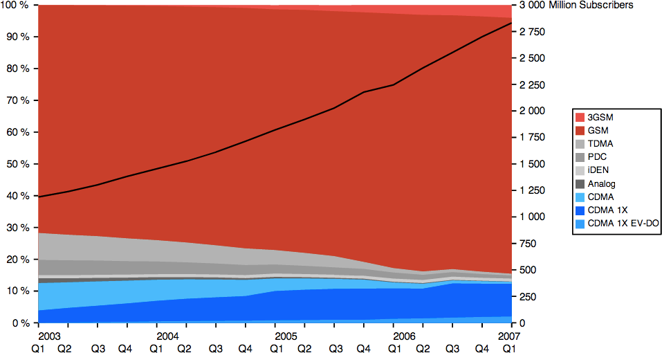

# Mobile Networks

Tính đến đầu năm 2013, ước tính có khoảng 6,4 tỷ kết nối di động trên toàn thế giới. Chỉ riêng năm 2012, báo cáo tình báo thị trường của IDC cho thấy ước tính có khoảng 1,1 tỷ lô hàng thiết bị kết nối thông minh—điện thoại thông minh, máy tính bảng, máy tính xách tay, PC, v.v. Tuy nhiên, điều đáng chú ý hơn nữa là những dự đoán về tốc độ tăng trưởng của gậy khúc côn cầu trong những năm tới: các báo cáo tương tự của IDC dự báo số lượng lô hàng thiết bị mới sẽ tăng lên hơn 1,8 tỷ vào năm 2016 và các dự báo tích lũy khác ước tính tổng cộng hơn 20 tỷ thiết bị được kết nối vào năm 2020.

Với dân số ước tính khoảng 7 tỷ người vào năm 2012 và tăng lên 7,5 tỷ người vào năm 2020, những xu hướng này cho thấy sự khao khát vô độ của chúng ta đối với các thiết bị kết nối thông minh: rõ ràng là hầu hết chúng ta không hài lòng với chỉ một thiết bị.

Tuy nhiên, số lượng thiết bị được kết nối tuyệt đối chỉ là một phần nhỏ trong toàn bộ câu chuyện. Ẩn ý trong sự tăng trưởng này còn là nhu cầu vô độ về kết nối tốc độ cao, truy cập băng thông rộng không dây khắp nơi và các dịch vụ được kết nối phải cung cấp năng lượng cho tất cả các thiết bị mới này! Đây là nơi và tại sao chúng ta phải chuyển cuộc trò chuyện của mình sang hiệu suất của các công nghệ di động khác nhau, chẳng hạn như GSM, CDMA, HSPA và LTE. Rất có thể, hầu hết người dùng của bạn sẽ sử dụng một trong những công nghệ này, một số công nghệ dành riêng, để truy cập trang web hoặc dịch vụ của bạn. Rủi ro rất cao, chúng ta phải làm đúng điều này và các mạng di động chắc chắn đặt ra những thách thức về hiệu suất của riêng chúng.

## Brief History of the G’s
> Tóm tắt lịch sử của G

Việc điều hướng trong rừng các tiêu chuẩn di động khác nhau, các phiên bản phát hành cũng như ưu và nhược điểm của từng tiêu chuẩn có thể chiếm không phải các chương mà là toàn bộ cuốn sách. Mục tiêu của chúng tôi ở đây khiêm tốn hơn nhiều: chúng tôi cần phát triển trực giác về các thông số vận hành và ý nghĩa của chúng về các cột mốc quan trọng trong quá khứ và tương lai (Bảng 7-1) của các công nghệ không dây thống trị trên thị trường.

| Thế hệ | Tốc độ dữ liệu cao nhất | Miêu tả                                                                              |
| :----: | :---------------------: | :----------------------------------------------------------------------------------- |
|   1G   |         no data         | Hệ thống tương tự                                                                    |
|   2G   |         Kbit/s          | Hệ thống kỹ thuật số đầu tiên dưới dạng lớp phủ hoặc song song với hệ thống tương tự |
|   3G   |         Mbit/s          | Mạng kỹ thuật số chuyên dụng được triển khai song song với các hệ thống analog       |
|   4G   |         Gbit/s          | Mạng kỹ thuật số và chỉ gói                                                          |

<figure markdown="span">
    <figcaption>Bảng 7-1. Các thế hệ mạng di động</figcaption>
</figure>

Nhận thức quan trọng đầu tiên là các tiêu chuẩn cơ bản cho từng thế hệ không dây được thể hiện dưới dạng hiệu suất phổ cao nhất (bps/Hz), sau đó được chuyển thành các con số ấn tượng như tốc độ dữ liệu cao nhất Gbit/s+ cho mạng 4G. Tuy nhiên, bây giờ bạn đã nhận ra từ khóa trong câu trước: đỉnh cao! Hãy nghĩ lại cuộc thảo luận trước đây của chúng ta về [Measuring Real-World Wireless Performance]()—peak data rates are achieved in ideal conditions.

Bất kể tiêu chuẩn nào, hiệu suất thực tế của mỗi mạng sẽ khác nhau tùy theo nhà cung cấp, cấu hình mạng của họ, số lượng người dùng hoạt động trong một ô nhất định, môi trường vô tuyến ở một vị trí cụ thể, thiết bị đang sử dụng, cùng với tất cả các yếu tố khác ảnh hưởng đến hiệu suất không dây. Với ý nghĩ đó, mặc dù không có sự đảm bảo nào về tốc độ dữ liệu trong môi trường thực tế, một chiến lược đơn giản nhưng hiệu quả để hiệu chỉnh kỳ vọng về hiệu suất của bạn (Bảng 7-2) là giả định gần hơn nhiều với giới hạn dưới của thông lượng dữ liệu và hướng tới giới hạn cao hơn về độ trễ gói cho mọi thế hệ.

| Thế hệ | Tốc độ dữ liệu |   Độ trễ    |
| :----: | :------------: | :---------: |
|   2G   | 100–400 Kbit/s | 300–1000 ms |
|   3G   |  0.5–5 Mbit/s  | 100–500 ms  |
|   4G   |  1–50 Mbit/s   |  < 100 ms   |

<figure markdown="span">
    <figcaption>Bảng 7-2. Tốc độ dữ liệu và độ trễ cho kết nối di động đang hoạt động</figcaption>
</figure>

Vấn đề còn phức tạp hơn nữa khi việc phân loại bất kỳ mạng cụ thể nào là 3G hoặc 4G chắc chắn là quá thô và tương ứng là thông lượng và độ trễ dự kiến ​​cũng vậy. Để hiểu lý do tại sao lại như vậy và ngành đang hướng tới đâu, trước tiên chúng ta cần thực hiện một cuộc khảo sát nhanh về lịch sử của các công nghệ khác nhau và những nhân tố chính đằng sau sự phát triển của chúng.

### First Data Services with 2G
> Dịch vụ dữ liệu đầu tiên với 2G

Mạng 1G thương mại đầu tiên được ra mắt tại Nhật Bản vào năm 1979. Đây là một hệ thống tương tự và không cung cấp khả năng dữ liệu. Năm 1991, mạng 2G đầu tiên được ra mắt ở Phần Lan dựa trên tiêu chuẩn GSM (Hệ thống thông tin di động toàn cầu, ban đầu là Groupe Spécial Mobile) mới nổi, đưa ra tín hiệu số trong mạng vô tuyến. Điều này cho phép các dịch vụ dữ liệu di động chuyển mạch kênh đầu tiên, chẳng hạn như nhắn tin văn bản (SMS) và phân phối gói với tốc độ dữ liệu cực đại là 9,6 Kbit/s!

Mãi cho đến giữa những năm 1990, khi dịch vụ vô tuyến gói chung (GPRS) lần đầu tiên được giới thiệu theo tiêu chuẩn GSM thì việc truy cập Internet không dây đã trở thành một khả năng thực tế, mặc dù vẫn rất chậm: với GPRS, giờ đây bạn có thể đạt tốc độ 172 Kbit/s, với độ trễ khứ hồi điển hình dao động ở mức cao hàng trăm mili giây. Sự kết hợp giữa GPRS và các công nghệ thoại 2G trước đây thường được mô tả là 2.5G. Vài năm sau, các mạng này được cải tiến nhờ EDGE (Tốc độ dữ liệu nâng cao cho GSM Evolution), giúp tăng tốc độ dữ liệu cao nhất lên 384 Kbit/s. Mạng EDGE đầu tiên (2,75G) được ra mắt tại Hoa Kỳ vào năm 2003.

Tại thời điểm này, cần phải tạm dừng và suy ngẫm một chút. Truyền thông không dây đã có từ nhiều thập kỷ trước, nhưng các dịch vụ dữ liệu thực tế, hướng tới người tiêu dùng qua mạng di động mới là một hiện tượng gần đây! Mạng 2.75G mới ra đời được chưa đầy một thập kỷ, đó là lịch sử gần đây và vẫn được sử dụng rộng rãi trên toàn thế giới. Tuy nhiên, hầu hết chúng ta hiện nay không thể tưởng tượng được việc sống mà không có truy cập không dây tốc độ cao. Tỷ lệ áp dụng và sự phát triển của công nghệ không dây thực sự đáng kinh ngạc.

### 3GPP and 3GPP2 Partnerships
> Quan hệ đối tác 3GPP và 3GPP2

Khi nhu cầu của người tiêu dùng về dịch vụ dữ liệu không dây bắt đầu tăng lên, câu hỏi về khả năng tương tác của mạng vô tuyến đã trở thành vấn đề nóng bỏng đối với tất cả những người liên quan. Thứ nhất, các nhà cung cấp dịch vụ viễn thông phải mua và triển khai phần cứng cho mạng truy cập vô tuyến (RAN), đòi hỏi đầu tư vốn đáng kể và bảo trì liên tục—phần cứng tiêu chuẩn có nghĩa là chi phí thấp hơn. Tương tự, nếu không có các tiêu chuẩn toàn ngành, người dùng sẽ bị hạn chế trong mạng gia đình của họ, hạn chế các trường hợp sử dụng và sự thuận tiện của việc truy cập dữ liệu di động.

Để đáp lại, Viện Tiêu chuẩn Viễn thông Châu Âu (ETSI) đã phát triển tiêu chuẩn GSM vào đầu những năm 1990 và nhanh chóng được nhiều nước Châu Âu và trên toàn cầu áp dụng. Trên thực tế, GSM sẽ tiếp tục trở thành tiêu chuẩn không dây được triển khai rộng rãi nhất, theo một số ước tính, bao phủ 80%–85% thị trường (Hình 7-1). Nhưng đó không phải là người duy nhất. Song song đó, tiêu chuẩn IS-95 do Qualcomm phát triển cũng chiếm được 10%–15% thị trường, nổi bật nhất là với nhiều mạng được triển khai trên khắp Bắc Mỹ. Kết quả là, một thiết bị được thiết kế cho mạng vô tuyến IS-95 không thể hoạt động trên mạng GSM và ngược lại—một đặc điểm đáng tiếc lại quen thuộc với nhiều du khách quốc tế.

<figure markdown="span">
    
    <figcaption>Hình 7-1. Thị phần của các tiêu chuẩn di động dành cho 2003–2007 (Wikipedia)</figcaption>
</figure>

Năm 1998, nhận thấy sự cần thiết phải phát triển toàn cầu của các tiêu chuẩn được triển khai, cũng như xác định các yêu cầu đối với mạng thế hệ tiếp theo (3G), những người tham gia tổ chức tiêu chuẩn GSM và IS-95 đã thành lập hai dự án hợp tác toàn cầu:

__3rd Generation Partnership Project (3GPP)__

Chịu trách nhiệm phát triển Hệ thống Viễn thông Di động Toàn cầu (UMTS), là bản nâng cấp 3G lên mạng GSM. Sau đó, nó cũng đảm nhận việc duy trì tiêu chuẩn GSM và phát triển các tiêu chuẩn LTE mới.

__3rd Generation Partnership Project 2 (3GPP2)__

Chịu trách nhiệm phát triển các thông số kỹ thuật 3G dựa trên công nghệ CDMA2000, công nghệ kế thừa cho tiêu chuẩn __IS-95__ do __Qualcomm__ phát triển.

Do đó, việc phát triển cả hai loại tiêu chuẩn (Bảng 7-3) và cơ sở hạ tầng mạng liên quan đã được tiến hành song song. Có lẽ không trực tiếp theo từng bước, nhưng dù sao cũng tuân theo sự phát triển gần như tương tự của các công nghệ cơ bản.

|      Thế hệ       | Tổ chức | Phát hành                                          |
| :---------------: | :-----: | :------------------------------------------------- |
|        2G         |  3GPP   | GSM                                                |
|        2G         |  3GPP2  | IS-95 (cdmaOne)                                    |
|    2.5G, 2.75G    |  3GPP   | GPRS, EDGE (EGPRS)                                 |
|    2.5G, 2.75G    |  3GPP2  | CDMA2000                                           |
|        3G         |  3GPP   | UMTS                                               |
|        3G         |  3GPP2  | CDMA 2000 1x EV-DO Release 0                       |
| 3.5G, 3.75G, 3.9G |  3GPP   | HSPA, HSPA+, LTE                                   |
| 3.5G, 3.75G, 3.9G |  3GPP2  | EV-DO Revision A, EV-DO Revision B, EV-DO Advanced |
|        4G         |  3GPP   | LTE-Advanced, HSPA+ Revision 11+                   |

<figure markdown="span">
    <figcaption>Bảng 7-3. Các tiêu chuẩn mạng di động được phát triển bởi 3GPP và 3GPP2</figcaption>
</figure>

Rất có thể bạn sẽ thấy một số nhãn quen thuộc trong danh sách: EV-DO, HSPA, LTE. Nhiều nhà khai thác mạng đã đầu tư nguồn lực tiếp thị đáng kể và tiếp tục làm như vậy để quảng bá những công nghệ này là "mạng dữ liệu di động mới nhất và nhanh nhất" của họ. Tuy nhiên, mối quan tâm của chúng tôi và lý do của sự đi chệch hướng lịch sử này không phải vì mục đích tiếp thị mà vì những quan sát vĩ mô về sự phát triển của ngành công nghiệp không dây di động:

- Có hai loại mạng di động được triển khai phổ biến trên toàn thế giới.
- 3GPP và 3GPP2 quản lý sự phát triển của từng công nghệ.
- Các tiêu chuẩn 3GPP và 3GPP2 không tương thích với thiết bị.

Không có công nghệ 4G hay 3G nào cả. Liên minh Viễn thông Quốc tế (ITU) đặt ra các tiêu chuẩn quốc tế và đặc tính hiệu suất, chẳng hạn như tốc độ dữ liệu và độ trễ, cho từng thế hệ không dây, sau đó các tổ chức 3GPP và 3GPP2 xác định các tiêu chuẩn để đáp ứng và vượt quá những kỳ vọng này trong bối cảnh công nghệ tương ứng của họ.

!!! note "Note"
    Làm thế nào để bạn biết nhà mạng của bạn đang sử dụng loại mạng nào? Đơn giản. Điện thoại của bạn có thẻ SIM không? Nếu vậy thì đó là công nghệ 3GPP phát triển từ GSM. Để tìm hiểu thông tin chi tiết hơn về mạng, hãy kiểm tra Câu hỏi thường gặp của nhà cung cấp dịch vụ của bạn hoặc nếu điện thoại của bạn cho phép, hãy kiểm tra thông tin mạng trực tiếp trên điện thoại của bạn.

    Đối với người dùng Android, hãy mở màn hình quay số điện thoại của bạn và nhập: *#*#4636#*#*. Nếu điện thoại của bạn cho phép, nó sẽ mở màn hình chẩn đoán nơi bạn có thể kiểm tra trạng thái và loại kết nối di động, chẩn đoán pin, v.v.

### Evolution of 3G Technologies
> Sự phát triển của công nghệ 3G

In the context of 3G networks, we have two dominant and competing standards: UMTS and CDMA-based networks, which are developed by 3GPP and 3GPP2, respectively. However as the earlier table of cellular standards (Table 7-3) shows, each is also split into several transitional milestones: 3.5G, 3.75G, and 3.9G technologies.

Why couldn’t we simply jump to 4G instead? Well, standards take a long time to develop, but even more importantly, there are big financial costs for deploying new network infrastructure. As we will see, 4G requires an entirely different radio interface and parallel infrastructure to 3G. Because of this, and also for the benefit of the many users who have purchased 3G handsets, both 3GPP and 3GPP2 have continued to evolve the existing 3G standards, which also enables the operators to incrementally upgrade their existing networks to deliver better performance to their existing users.

Not surprisingly, the throughput, latency, and other performance characteristics of the various 3G networks have improved, sometimes dramatically, with every new release. In fact, technically, LTE is considered a 3.9G transitional standard! However, before we get to LTE, let’s take a closer look at the various 3GPP and 3GPP2 milestones.

### Evolution of 3GPP technologies
> Sự phát triển của công nghệ 3GPP

| Phát hành | Ngày | Tóm tắt |
| :-: | :-: | :- |
| 99 | 1999 | Bản phát hành đầu tiên của tiêu chuẩn UMTS |
| 4 | 2001 | Giới thiệu mạng lõi toàn IP |
| 5 | 2002 | Giới thiệu Truy cập đường xuống gói tốc độ cao (HSDPA) |
| 6 | 2004 | Giới thiệu Truy cập đường lên gói tốc độ cao (HSUPA) |
| 7 | 2007 | Giới thiệu Tiến hóa truy cập gói tốc độ cao (HSPA+) |
| 8 | 2008 | Giới thiệu Tiến hóa kiến ​​trúc hệ thống LTE (SAE) mới |
| 9 | 2009 | Những cải tiến về khả năng tương tác SAE và WiMAX |
| 10 | 2010 | Giới thiệu kiến ​​trúc 4G LTE-Advanced |

<figure markdown="span">
    <figcaption>Bảng 7-4. Lịch sử phát hành 3GPP</figcaption>
</figure>

Trong trường hợp các mạng tuân theo tiêu chuẩn 3GPP, sự kết hợp giữa các bản phát hành HSDPA và HSUPA thường được biết đến và tiếp thị dưới dạng mạng Truy cập gói tốc độ cao (HSPA). Sự kết hợp của hai bản phát hành này cho phép thông lượng Mbit/s ở mức một chữ số thấp khi triển khai trong thế giới thực, đây là một bước tiến đáng kể so với tốc độ 3G ban đầu. Mạng HSPA thường được gắn nhãn là 3,5G.

Từ đó, bản nâng cấp tiếp theo là HSPA+ (3,75G), có độ trễ thấp hơn đáng kể nhờ kiến ​​trúc mạng lõi được đơn giản hóa và tốc độ dữ liệu ở thông lượng Mbit/s một chữ số từ trung bình đến cao khi triển khai trong thế giới thực. Tuy nhiên, như chúng ta sẽ thấy, phiên bản 7, giới thiệu HSPA+, không phải là sự kết thúc của công nghệ này. Trên thực tế, các tiêu chuẩn HSPA+ đã liên tục được cải tiến kể từ đó và hiện đang cạnh tranh trực tiếp với LTE và LTE-Advanced!

### Evolution of 3GPP2 technologies
> Sự phát triển của công nghệ 3GPP2

| Phát hành | Ngày | Tóm tắt |
| :-----: | :--: | :------------------------------------------------ |
| Rel. 0  | 1999 | First release of the 1x EV-DO standard            |
| Rev. A  | 2001 | Upgrade to peak data-rate, lower latency, and QoS |
| Rev. B  | 2004 | Introduced multicarrier capabilities to Rev. A    |
| Rev. C  | 2007 | Improved core network efficiency and performance  |

<figure markdown="span">
    <figcaption>Bảng 7-5. Lịch sử phát hành 3GPP2 của chuẩn CDMA2000 1x EV-DO</figcaption>
</figure>

Tiêu chuẩn CDMA2000 EV-DO do 3GPP2 phát triển cũng đi theo lộ trình nâng cấp mạng tương tự. Bản phát hành đầu tiên (Rel. 0) cho phép thông lượng đường xuống Mbit/s có một chữ số thấp nhưng tốc độ đường lên rất thấp. Hiệu suất đường lên đã được giải quyết bằng Rev. A, đồng thời cả tốc độ đường lên và đường xuống đều được cải thiện hơn nữa trong Rev. B. Do đó, mạng Rev. B có thể mang lại hiệu suất Mbit/s một chữ số từ trung bình đến cao cho người dùng, khiến nó có thể so sánh với HSPA và các mạng HSPA+ đời đầu—hay còn gọi là 3,5–3,75G.

Bản phát hành Rev. C cũng thường được gọi là EV-DO Advanced và mang lại những cải tiến vận hành đáng kể về công suất và hiệu suất. Tuy nhiên, việc áp dụng EV-DO Advanced gần như không mạnh bằng HSPA+. Tại sao? Nếu bạn chú ý đến bảng tạo tiêu chuẩn (Bảng 7-3), bạn có thể nhận thấy rằng 3GPP2 không có tiêu chuẩn 4G chính thức và cạnh tranh!

Mặc dù 3GPP2 có thể tiếp tục phát triển các công nghệ CDMA của mình nhưng ở một thời điểm nào đó, cả nhà khai thác mạng và nhà cung cấp mạng đều đồng ý coi 3GPP LTE là giải pháp kế thừa 4G phổ biến cho tất cả các loại mạng. Vì lý do này, nhiều nhà khai thác mạng CDMA cũng là một trong số những nhà khai thác đầu tiên đầu tư vào cơ sở hạ tầng LTE sớm, một phần là để có thể cạnh tranh với những cải tiến HSPA+ đang diễn ra.

Nói cách khác, hầu hết các nhà khai thác di động trên toàn thế giới đang hội tụ HSPA+ và LTE như các tiêu chuẩn không dây di động trong tương lai—đó là tin tốt. Nói xong, đừng nín thở. Các công nghệ 2G và 3–3,75G hiện tại vẫn đang cung cấp năng lượng cho phần lớn các mạng vô tuyến di động được triển khai và quan trọng hơn là sẽ tiếp tục hoạt động trong ít nhất một thập kỷ nữa.

!!! note "Note"
    3G thường được mô tả là "băng thông rộng di động". Tuy nhiên, băng thông rộng là một thuật ngữ tương đối. Một số xác định nó là băng thông liên lạc ít nhất là 256 Kbit/s, một số khác cho rằng vượt quá 640 Kbit/s, nhưng sự thật là giá trị liên tục thay đổi dựa trên trải nghiệm mà chúng tôi đang cố gắng đạt được. Khi các dịch vụ phát triển và yêu cầu thông lượng cao hơn thì định nghĩa về băng thông rộng cũng vậy.

    Trong bối cảnh đó, có thể sẽ hữu ích hơn nếu coi các tiêu chuẩn 3G là những tiêu chuẩn nhắm mục tiêu và vượt quá ngưỡng băng thông Mbit/s. Vượt qua rào cản Mbit/s bao xa? Chà, điều đó phụ thuộc vào phiên bản phát hành của tiêu chuẩn (như chúng ta đã thấy trước đó), cấu hình sóng mang của mạng và khả năng của thiết bị đang sử dụng.

### IMT-Advanced 4G Requirements
> Yêu cầu 4G nâng cao của IMT

Trước khi mổ xẻ các công nghệ 4G khác nhau, điều quan trọng là phải hiểu điều gì đằng sau nhãn "4G". Cũng như 3G, không có công nghệ 4G nào cả. Đúng hơn, 4G là một bộ yêu cầu (IMT-Advanced) được ITU phát triển và công bố vào năm 2008. Bất kỳ công nghệ nào đáp ứng các yêu cầu này đều có thể được gắn nhãn là 4G.

Một số yêu cầu mẫu của IMT-Advanced bao gồm:

- Dựa trên mạng chuyển mạch gói IP
- Tương thích với các tiêu chuẩn không dây trước đó (3G và 2G)
- Tốc độ dữ liệu 100 Mbit/s cho máy khách di động và Gbit/s+ khi đứng yên
- Độ trễ mặt phẳng điều khiển dưới 100 ms và độ trễ mặt phẳng người dùng dưới 10 ms
- Phân bổ động và chia sẻ tài nguyên mạng giữa những người dùng
- Sử dụng phân bổ băng thông thay đổi, từ 5 đến 20 MHz

Danh sách thực tế còn dài hơn rất nhiều nhưng danh sách trước đó nắm bắt được những điểm nổi bật quan trọng cho cuộc thảo luận của chúng ta: thông lượng cao hơn nhiều và độ trễ thấp hơn đáng kể khi so sánh với các thế hệ trước. Được trang bị các tiêu chí này, giờ đây chúng ta đã biết cách phân loại mạng 4G—phải không? Không nhanh như vậy, điều đó sẽ quá dễ dàng! Bộ phận tiếp thị cũng phải có tiếng nói của mình.

LTE-Advanced là tiêu chuẩn được phát triển đặc biệt để đáp ứng tất cả các tiêu chí IMT-Advanced. Trên thực tế, đây cũng là tiêu chuẩn 3GPP đầu tiên làm như vậy. Tuy nhiên, nếu để ý kỹ, bạn sẽ nhận thấy rằng LTE (bản phát hành 8) và LTE-Advanced (bản phát hành 10) trên thực tế là các tiêu chuẩn khác nhau. Về mặt kỹ thuật, LTE thực sự nên được coi là tiêu chuẩn chuyển tiếp 3.9G, mặc dù nó đặt ra nhiều nền tảng cần thiết để đáp ứng các yêu cầu 4G—gần như đã đạt được nhưng chưa hoàn toàn!

Tuy nhiên, đây chính là lúc các bước tiếp thị cần đến. Các nhãn hiệu 3G và 4G do ITU nắm giữ và do đó việc sử dụng chúng phải tương ứng với các yêu cầu đã xác định cho từng thế hệ. Ngoại trừ việc các nhà mạng đã giành được chiến thắng trong hoạt động tiếp thị và có thể xác định lại nhãn hiệu "4G" để bao gồm một bộ công nghệ gần giống với yêu cầu 4G. Vì lý do này, LTE (bản phát hành 8) và hầu hết các mạng HSPA+, không đáp ứng các yêu cầu kỹ thuật thực tế 4G, vẫn được tiếp thị là "4G".

Còn việc triển khai 4G (LTE-Advanced) thực sự thì sao? Những điều đó đang đến, nhưng vẫn còn phải xem các mạng này sẽ được tiếp thị như thế nào so với những mạng tiền nhiệm trước đó của chúng. Bất chấp điều đó, vấn đề là nhãn "4G" mà nhiều nhà cung cấp dịch vụ sử dụng ngày nay rất mơ hồ và bạn nên đọc bản in đẹp để hiểu công nghệ đằng sau nó.

### Long Term Evolution (LTE)
> Tiến hóa dài hạn (LTE)

Bất chấp sự phát triển không ngừng của các tiêu chuẩn 3G, nhu cầu ngày càng tăng về tốc độ truyền dữ liệu cao và độ trễ thấp hơn đã bộc lộ một số hạn chế về thiết kế cố hữu trong các công nghệ UMTS trước đó. Để giải quyết vấn đề này, 3GPP đã đặt ra mục tiêu thiết kế lại cả mạng lõi và mạng vô tuyến, dẫn đến việc tạo ra tiêu chuẩn Tiến hóa dài hạn (LTE) được đặt tên phù hợp:

- Tất cả mạng lõi IP
- Kiến trúc mạng đơn giản hóa để giảm chi phí
- Độ trễ thấp ở người dùng (<10 ms) và mặt phẳng điều khiển (<100 ms)
- Giao diện và điều chế vô tuyến mới cho thông lượng cao (100 Mbps)
- Khả năng sử dụng phân bổ băng thông lớn hơn và tổng hợp sóng mang
- MIMO là yêu cầu cho tất cả các thiết bị

Không có gì đáng ngạc nhiên khi danh sách trước đó có nội dung tương tự như các yêu cầu IMT-Advanced mà chúng ta đã thấy trước đó. LTE (bản phát hành 8) đã đặt nền móng cho kiến ​​trúc mạng mới và LTE-Advanced (bản phát hành 10) đã cung cấp những cải tiến cần thiết để đáp ứng các yêu cầu 4G thực sự do IMT-Advanced đặt ra.

Tại thời điểm này, điều quan trọng cần lưu ý là do sự khác biệt trong triển khai mạng lõi và vô tuyến, mạng LTE không phải là bản nâng cấp đơn giản cho cơ sở hạ tầng 3G hiện có. Thay vào đó, mạng LTE phải được triển khai song song và trên phổ tần riêng biệt với cơ sở hạ tầng 3G hiện có. Tuy nhiên, vì LTE là chuẩn kế thừa chung cho cả hai tiêu chuẩn UMTS và CDMA nên nó cung cấp một cách để tương tác với cả hai tiêu chuẩn: thuê bao LTE có thể được chuyển tiếp liền mạch sang mạng 3G và được di chuyển trở lại nơi có cơ sở hạ tầng LTE.

Cuối cùng, đúng như tên gọi, LTE chắc chắn là kế hoạch phát triển dài hạn cho hầu hết các mạng di động trong tương lai. Câu hỏi duy nhất là, tương lai này còn bao xa? Một số nhà mạng đã bắt đầu đầu tư vào cơ sở hạ tầng LTE và nhiều nhà mạng khác đang bắt đầu tìm kiếm quang phổ, nguồn vốn hoặc cả hai để thực hiện điều đó. Tuy nhiên, các ước tính hiện tại của ngành cho thấy rằng sự di cư này thực sự sẽ là một quá trình lâu dài—có lẽ trong khoảng thập kỷ tới. Trong khi đó, HSPA+ sẽ chiếm vị trí trung tâm.

!!! note "Note"
    Mọi thiết bị hỗ trợ LTE đều phải có nhiều sóng radio để được hỗ trợ MIMO bắt buộc. Tuy nhiên, mỗi thiết bị cũng sẽ cần giao diện vô tuyến riêng cho mạng 3G và 2G trước đó. Nếu bạn đang đếm, điều đó có nghĩa là có ba hoặc bốn radio trong mỗi thiết bị cầm tay! Để có tốc độ dữ liệu cao hơn với LTE, bạn sẽ cần 4x MIMO, nâng tổng số sóng lên năm hoặc sáu sóng. Bạn đang thắc mắc tại sao pin của bạn lại cạn kiệt nhanh như vậy?kly?

### HSPA+ is Leading Worldwide 4G Adoption
> HSPA+ đang dẫn đầu về việc áp dụng 4G trên toàn thế giới

HSPA+ được giới thiệu lần đầu tiên trong phiên bản 3GPP 7 vào năm 2007. Tuy nhiên, trong khi sự chú ý của mọi người nhanh chóng chuyển sang LTE, được giới thiệu lần đầu tiên trong phiên bản 3GPP 8 vào năm 2008, điều thường bị bỏ qua là sự phát triển của HSPA+ không hề dừng lại và tiếp tục phát triển song song. Trên thực tế, HSPA+ phiên bản 10 đáp ứng nhiều tiêu chí IMT-Advanced. Tuy nhiên, bạn có thể hỏi, nếu chúng ta có LTE và mọi người đều đồng ý rằng đó là tiêu chuẩn cho mạng di động trong tương lai thì tại sao lại tiếp tục phát triển và đầu tư vào HSPA+? Như thường lệ, câu trả lời rất đơn giản: chi phí.

Công nghệ 3GPP 3G chiếm thị phần lớn trong thị trường không dây lâu đời trên toàn thế giới, điều này chuyển thành các khoản đầu tư cơ sở hạ tầng khổng lồ hiện có của các nhà mạng trên toàn cầu. Việc chuyển sang LTE đòi hỏi phải phát triển các mạng vô tuyến mới, điều này một lần nữa dẫn đến chi phí vốn đáng kể. Ngược lại, HSPA+ cung cấp một lộ trình hiệu quả hơn về vốn: các nhà mạng có thể triển khai nâng cấp dần dần cho các mạng hiện có của họ và đạt được hiệu suất tương đương.

Hiệu quả chi phí là tên của trò chơi và là lý do tại sao các dự báo hiện tại của ngành (Hình 7-2) cho thấy HSPA+ chịu trách nhiệm cho phần lớn việc nâng cấp 4G trên toàn thế giới trong những năm tới. Trong khi đó, các công nghệ CDMA do 3GPP2 phát triển sẽ tiếp tục cùng tồn tại, mặc dù số lượng thuê bao của chúng được dự đoán sẽ bắt đầu giảm dần, trong khi việc triển khai LTE mới sẽ tiến hành song song với các tốc độ khác nhau ở các khu vực khác nhau—một phần do hạn chế về chi phí và một phần do các quy định khác nhau và tính khả dụng của phổ tần vô tuyến cần thiết.

<figure markdown="span">
    
    <figcaption>Hình 7-2. Châu Mỹ 4G: Dự báo tăng trưởng băng rộng di động HSPA+ và LTE</figcaption>
</figure>

Vì nhiều lý do, Bắc Mỹ dường như là quốc gia dẫn đầu trong việc áp dụng LTE: các dự báo hiện tại của ngành cho thấy số lượng thuê bao LTE ở Hoa Kỳ và Canada sẽ vượt HSPA vào năm 2016 (Hình 7-3). Tuy nhiên, tỷ lệ áp dụng LTE ở Bắc Mỹ dường như mạnh mẽ hơn đáng kể so với hầu hết các quốc gia khác. Trong bối cảnh toàn cầu, HSPA+ được coi là công nghệ không dây di động chiếm ưu thế trong thập kỷ hiện tại.

<figure markdown="span">
    
    <figcaption>Hình 7-3. 4G Châu Mỹ: Dự báo tăng trưởng HSPA+ và LTE của Hoa Kỳ/Canada</figcaption>
</figure>

!!! note "Note"
    Mặc dù nhiều người ban đầu ngạc nhiên về xu hướng áp dụng HSPA+ so với LTE, nhưng đây không phải là một kết quả bất ngờ. Nếu không có gì khác, nó dùng để minh họa một điểm quan trọng: phải mất khoảng một thập kỷ từ thông số kỹ thuật đầu tiên của một tiêu chuẩn không dây mới cho đến khi nó có mặt phổ biến trong các mạng không dây trong thế giới thực.

    Nói cách khác, có thể chắc chắn rằng chúng ta sẽ nói về LTE-Advanced một cách nghiêm túc vào đầu những năm 2020! Thật không may, việc triển khai cơ sở hạ tầng vô tuyến mới là một đề xuất tốn kém và mất thời gian.

### Building for the Multigeneration Future
> Xây dựng cho tương lai đa thế hệ

Nhìn chằm chằm vào quả cầu pha lê là một hành vi nguy hiểm trong ngành của chúng tôi. Tuy nhiên, đến thời điểm này, chúng tôi đã có đủ thông tin để đưa ra một số dự đoán hợp lý về những gì chúng tôi có thể và nên mong đợi từ các mạng di động hiện đang được triển khai, cũng như vị trí của chúng tôi trong một vài năm tới.

Đầu tiên, các tiêu chuẩn không dây đang phát triển nhanh chóng, nhưng việc triển khai vật lý các mạng này vừa tốn kém vừa tốn thời gian. Hơn nữa, sau khi được triển khai, mạng phải được duy trì trong một khoảng thời gian đáng kể để bù đắp chi phí và giữ khách hàng hiện tại trực tuyến. Nói cách khác, mặc dù có rất nhiều sự cường điệu và tiếp thị xung quanh 4G nhưng các mạng thế hệ cũ sẽ tiếp tục hoạt động trong ít nhất một thập kỷ nữa. Khi xây dựng web dành cho thiết bị di động, hãy lập kế hoạch phù hợp.

!!! note "Note"
    Trớ trêu thay, trong khi mạng 4G cung cấp những cải tiến đáng kể cho việc phân phối dữ liệu IP thì mạng 3G vẫn hiệu quả hơn nhiều trong việc xử lý lưu lượng thoại kiểu cũ! Thoại qua LTE (VoLTE) hiện đang được phát triển tích cực và nhằm mục đích cho phép thoại hiệu quả và đáng tin cậy qua 4G, nhưng hầu hết việc triển khai 4G hiện tại vẫn dựa vào cơ sở hạ tầng chuyển mạch cũ hơn để truyền giọng nói.

