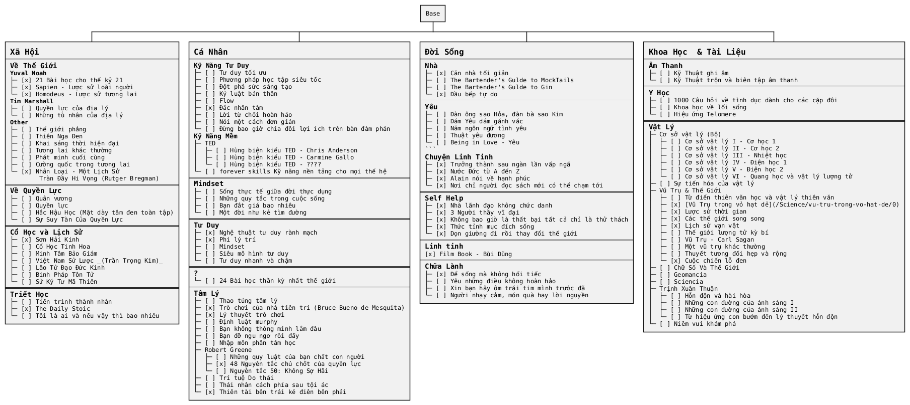

# Sách Khoa Học Mindmap

```puml
@startwbs
skinparam backgroundcolor transparent
skinparam DefaultFontName Monospaced

* Base

**:= Xã Hội
====
== Về Thế Giới
**Yuval Noah**
├─ [x] 21 Bài học cho thế kỷ 21
├─ [x] Sapien - Lược sử loài người
└─ [x] Homodeus - Lược sử tương lai
**Tim Marshall**
├─ [ ] Quyền lực của địa lý
└─ [ ] Những tù nhân của địa lý
**Other**
├─ [ ] Thế giới phẳng
├─ [ ] Thiên Nga Đen
├─ [ ] Khai sáng thời hiện đại
├─ [ ] Tương lai khác thường
├─ [ ] Phát minh cuối cùng
├─ [ ] Cường quốc trong tương lai
└─ [x] Nhân Loại - Một Lịch Sử 
        Tràn Đầy Hi Vọng (Rutger Bregman)
====
== Về Quyền Lực
├─ [ ] Quân vương
├─ [ ] Quyền lực
├─ [ ] Hắc Hậu Học (Mặt dày tâm đen toàn tập)
└─ [ ] Sự Suy Tàn Của Quyền Lực
====
== Cổ Học và Lịch Sử
├─ [x] Sơn Hải Kinh
├─ [ ] Cổ Học Tinh Hoa
├─ [ ] Minh Tâm Bảo Giám
├─ [ ] Việt Nam Sử Lược _(Trần Trọng Kim)_
├─ [ ] Lão Tử Đạo Đức Kinh
├─ [ ] Binh Pháp Tôn Tử
└─ [ ] Sử Ký Tư Mã Thiên
====
== Triết Học
├─ [ ] Tiến trình thành nhân
├─ [x] The Daily Stoic
└─ [ ] Tôi là ai và nếu vậy thì bao nhiêu;

**:= Cá Nhân
====
=== Kỹ Năng Tư Duy
├─ [ ] Tư duy tối ưu
├─ [ ] Phương pháp học tập siêu tốc
├─ [ ] Đột phá sức sáng tạo
├─ [ ] Kỷ luật bản thân
├─ [ ] Flow
├─ [x] Đắc nhân tâm
├─ [ ] Lời từ chối hoàn hảo
├─ [ ] Nói một cách đơn giản
└─ [ ] Đừng bao giờ chia đôi lợi ích trên bàn đàm phán
=== Kỹ Năng Mềm
├─ TED
│  ├─ [ ] Hùng biện kiểu TED - Chris Anderson
│  ├─ [ ] Hùng biện kiểu TED - Carmine Gallo
│  └─ [ ] Hùng biện kiểu TED - ????
└─ [ ] forever skills Kỹ năng nền tảng cho mọi thế hệ
====
== Mindset
├─ [ ] Sống thực tế giữa đời thực dụng
├─ [ ] Những quy tắc trong cuộc sống
├─ [ ] Bạn đắt giá bao nhiêu
└─ [ ] Một đời như kẻ tìm đường
====
== Tư Duy
├─ [x] Nghệ thuật tư duy rành mạch
├─ [x] Phi lý trí
├─ [ ] Mindset
├─ [ ] Siêu mô hình tư duy
└─ [ ] Tư duy nhanh và chậm
====
== ?
└─ [ ] 24 Bài học thần kỳ nhất thế giới
====
== Tâm Lý
├─ [ ] Thao túng tâm lý
├─ [x] Trò chơi của nhà tiên tri (Bruce Bueno de Mesquita)
├─ [x] Lý thuyết trò chơi
├─ [ ] Định luật murphy
├─ [ ] Bạn không thông minh lắm đâu
├─ [ ] Bạn đỡ ngu ngơ rồi đấy
├─ [ ] Nhập môn phân tâm học
├─ Robert Greene
│  ├─ [ ] Những quy luật của bạn chất con người
│  ├─ [x] 48 Nguyên tắc chủ chốt của quyền lực
│  └─ [ ] Nguyên tắc 50: Không Sợ Hãi
├─ [ ] Trí tuệ Do thái
├─ [ ] Thái nhân cách phía sau tội ác
└─ [x] Thiên tài bên trái kẻ điên bên phải;

**:= Đời Sống
====
== Nhà
├─ [x] Căn nhà tối giản
├─ [ ] The Bartender's Gulde to MockTails
├─ [ ] The Bartender's Gulde to Gin
└─ [x] Đầu bếp tự do
====
== Yêu
├─ [ ] Đàn ông sao Hỏa, đàn bà sao Kim
├─ [ ] Dám Yêu dám gánh vác
├─ [ ] Năm ngôn ngữ tình yêu
├─ [ ] Thuật yêu đương
└─ [ ] Being in Love - Yêu
====```
== Chuyện Linh Tinh
├─ [x] Trưởng thành sau ngàn lần vấp ngã
├─ [x] Nước Đức từ A đến Z
├─ [x] Alain nói về hạnh phúc   
└─ [x] Nơi chỉ người đọc sách mới có thể chạm tới
====
== Self Help
├─ [x] Nhà lãnh đạo không chức danh
├─ [x] 3 Người thầy vĩ đại
├─ [x] Không bao giờ là thất bại tất cả chỉ là thử thách
├─ [x] Thức tỉnh mục đích sống
└─ [x] Dọn giường đi rồi thay đổi thế giới
====
== Linh tinh
[x] Film Book - Bùi Dũng
====
== Chữa Lành
├─ [x] Để sống mà không hối tiếc
├─ [ ] Yêu những điều không hoàn hảo
├─ [ ] Xin bạn hãy ôm trái tim mình trước đã
└─ [ ] Người nhạy cảm, món quà hay lời nguyền;

**:= Khoa Học  & Tài Liệu
====
== Âm Thanh
├─ [ ] Kỹ Thuật ghi âm
└─ [ ] Kỹ Thuật trộn và biên tập âm thanh
====
== Y Học
├─ [ ] 1000 Câu hỏi về tình dục dành cho các cặp đôi
├─ [ ] Khoa học về lối sống
└─ [ ] Hiệu ứng Telomere
====
== Vật Lý
├─ Cơ sở vật lý (Bộ)
│  ├─ [ ] Cơ sở vật lý I - Cơ học 1
│  ├─ [ ] Cơ sở vật lý II - Cơ học 2
│  ├─ [ ] Cơ sở vật lý III - Nhiệt học
│  ├─ [ ] Cơ sở vật lý IV - Điện học 1
│  ├─ [ ] Cơ sở vật lý V - Điện học 2
│  └─ [ ] Cơ sở vật lý VI - Quang học và vật lý lượng tử
├─ [ ] Sự tiến hóa của vật lý
├─ Vũ Trụ & Thế Giới
│  ├─ [ ] Từ điển thiên văn học và vật lý thiên văn
│  ├─ [x] [Vũ Trụ trong vỏ hạt dẻ](/Science/vu-tru-trong-vo-hat-de/0)
│  ├─ [x] Lược sử thời gian
│  ├─ [x] Các thế giới song song
│  ├─ [x] Lịch sử vạn vật
│  ├─ [ ] Thế giới lượng tử kỳ bí
│  ├─ [ ] Vũ Trụ - Carl Sagan
│  ├─ [ ] Một vũ trụ khác thường
│  ├─ [ ] Thuyết tương đối hẹp và rộng
│  └─ [x] Cuộc chiến lỗ đen
├─ [ ] Chữ Số Và Thế Giới
├─ [ ] Geomancia
├─ [ ] Sciencia
├─ Trịnh Xuân Thuận
│  ├─ [ ] Hỗn độn và hài hòa
│  ├─ [ ] Những con đường của ánh sáng I
│  ├─ [ ] Những con đường của ánh sáng II
│  └─ [ ] Từ hiệu ứng con bướm đến lý thuyết hỗn độn
└─ [ ] Niềm vui khám phá;

@endwbs
```