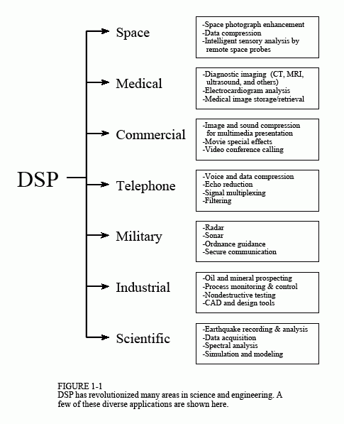

# Chapter 1: The Breadth and Depth of DSP

> [ch1](https://www.dspguide.com/ch1.htm)

__Digital Signal Processing__ - __Xử lý tín hiệu số__ là một trong những công nghệ mạnh mẽ nhất sẽ định hình khoa học và kỹ thuật trong thế kỷ XXI. Những thay đổi mang tính cách mạng đã được thực hiện trong nhiều lĩnh vực: thông tin liên lạc, hình ảnh y tế, radar và sóng siêu âm, tái tạo âm nhạc có độ trung thực cao và thăm dò dầu khí, chỉ kể tên một số lĩnh vực. Mỗi lĩnh vực này đã phát triển một công nghệ DSP sâu, với các thuật toán, toán học và kỹ thuật chuyên biệt riêng. Sự kết hợp giữa hơi thở và độ sâu này khiến cho bất kỳ cá nhân nào không thể thành thạo tất cả công nghệ DSP đã được phát triển. Giáo dục DSP bao gồm hai nhiệm vụ: học các khái niệm chung áp dụng cho toàn bộ lĩnh vực này và học các kỹ thuật chuyên biệt cho lĩnh vực bạn quan tâm cụ thể. Chương này bắt đầu hành trình của chúng ta vào thế giới __Xử lý tín hiệu số__ bằng cách mô tả hiệu ứng ấn tượng mà DSP đã tạo ra trong một số lĩnh vực khác nhau. Cuộc cách mạng đã bắt đầu.

## The Roots of DSP

> Nguồn gốc của DSP

Xử lý tín hiệu số được phân biệt với các lĩnh vực khác trong khoa học máy tính bởi loại dữ liệu duy nhất mà nó sử dụng: tín hiệu. Trong hầu hết các trường hợp, các tín hiệu này có nguồn gốc dưới dạng dữ liệu cảm giác từ thế giới thực: rung động địa chấn, hình ảnh trực quan, sóng âm thanh, v.v. DSP là toán học, thuật toán và kỹ thuật được sử dụng để xử lý các tín hiệu này sau khi chúng được chuyển đổi thành dạng kỹ thuật số. Điều này bao gồm nhiều mục tiêu khác nhau, chẳng hạn như: nâng cao hình ảnh trực quan, nhận dạng và tạo giọng nói, nén dữ liệu để lưu trữ và truyền tải, v.v. Giả sử chúng ta gắn bộ chuyển đổi tương tự sang kỹ thuật số vào máy tính và sử dụng nó để thu được một đoạn dữ liệu trong thế giới thực. DSP trả lời câu hỏi: Tiếp theo là gì?

Nguồn gốc của DSP bắt nguồn từ những năm 1960 và 1970 khi máy tính kỹ thuật số lần đầu tiên xuất hiện. Máy tính rất đắt tiền trong thời đại này và DSP chỉ giới hạn ở một số ứng dụng quan trọng. Những nỗ lực tiên phong đã được thực hiện trong bốn lĩnh vực chính: radar & sonar, nơi an ninh quốc gia bị đe dọa; thăm dò dầu mỏ, nơi có thể kiếm được số tiền lớn; thám hiểm không gian, nơi dữ liệu không thể thay thế được; và hình ảnh y tế, nơi có thể cứu sống nhiều mạng sống. Cuộc cách mạng máy tính cá nhân những năm 1980 và 1990 đã khiến DSP bùng nổ với những ứng dụng mới. Thay vì được thúc đẩy bởi nhu cầu của quân đội và chính phủ, DSP đột nhiên bị thúc đẩy bởi thị trường thương mại. Bất cứ ai nghĩ rằng họ có thể kiếm tiền trong lĩnh vực đang mở rộng nhanh chóng này bỗng nhiên trở thành nhà cung cấp DSP. DSP đến với công chúng qua các sản phẩm như: điện thoại di động, đầu đĩa compact và thư thoại điện tử. Hình 1-1 minh họa một số ứng dụng đa dạng này.

Cuộc cách mạng công nghệ này diễn ra từ trên xuống. Vào đầu những năm 1980, DSP được giảng dạy như một khóa học sau đại học về kỹ thuật điện. Một thập kỷ sau, DSP đã trở thành một phần tiêu chuẩn của chương trình giảng dạy đại học. Ngày nay, DSP là kỹ năng cơ bản cần thiết của các nhà khoa học và kỹ sư trong nhiều lĩnh vực. Tương tự, DSP có thể được so sánh với cuộc cách mạng công nghệ trước đó: điện tử. Mặc dù vẫn là lĩnh vực kỹ thuật điện nhưng gần như mọi nhà khoa học và kỹ sư đều có kiến ​​thức nền tảng về thiết kế mạch cơ bản. Không có nó, họ sẽ lạc lối trong thế giới công nghệ. DSP có cùng tương lai.

<figure markdown="span">
    
    <figcaption></figcaption>
</figure>

Lịch sử gần đây này không chỉ là sự tò mò; nó có tác động to lớn đến khả năng học hỏi và sử dụng DSP của bạn. Giả sử bạn gặp phải vấn đề về DSP và tìm đến sách giáo khoa hoặc các ấn phẩm khác để tìm giải pháp. Những gì bạn thường thấy là hết trang này đến trang khác của các phương trình, những ký hiệu toán học khó hiểu và những thuật ngữ xa lạ. Đó là một cơn ác mộng! Phần lớn tài liệu về DSP gây bối rối ngay cả với những người có kinh nghiệm trong lĩnh vực này. Không có gì sai với tài liệu này, nó chỉ dành cho một đối tượng rất chuyên biệt. Các nhà nghiên cứu tiên tiến cần loại toán học chi tiết này để hiểu được ý nghĩa lý thuyết của công trình.

Tiền đề cơ bản của cuốn sách này là hầu hết các kỹ thuật DSP thực tế đều có thể được học và sử dụng mà không gặp trở ngại truyền thống về lý thuyết và toán học chi tiết. Hướng dẫn dành cho nhà khoa học và kỹ sư về xử lý tín hiệu số được viết dành cho những ai muốn sử dụng DSP như một công cụ chứ không phải cho một nghề nghiệp mới.

Phần còn lại của chương này minh họa các lĩnh vực mà DSP đã tạo ra những thay đổi mang tính cách mạng. Khi bạn xem qua từng ứng dụng, hãy lưu ý rằng DSP có tính liên ngành rất cao, dựa vào công việc kỹ thuật trong nhiều lĩnh vực lân cận. Như Hình 1-2 cho thấy, ranh giới giữa DSP và các lĩnh vực kỹ thuật khác không rõ ràng và rõ ràng mà khá mờ và chồng chéo. Nếu bạn muốn chuyên về DSP, đây là những lĩnh vực liên quan mà bạn cũng sẽ cần phải nghiên cứu.

## Telecommunications

> Viễn thông

Viễn thông là về việc truyền thông tin từ nơi này đến nơi khác. Điều này bao gồm nhiều dạng thông tin: cuộc trò chuyện qua điện thoại, tín hiệu truyền hình, tệp máy tính và các loại dữ liệu khác. Để truyền thông tin, bạn cần có một kênh giữa hai địa điểm. Đây có thể là đôi dây, tín hiệu vô tuyến, cáp quang, v.v. Các công ty viễn thông nhận tiền truyền tải thông tin của khách hàng, trong khi họ phải trả tiền để thiết lập và duy trì kênh. Điểm mấu chốt về mặt tài chính rất đơn giản: càng có nhiều thông tin được truyền qua một kênh thì họ càng kiếm được nhiều tiền. DSP đã cách mạng hóa ngành viễn thông trong nhiều lĩnh vực: tạo và phát hiện âm báo hiệu, dịch chuyển băng tần, lọc để loại bỏ tạp âm trên đường dây điện, v.v. Ba ví dụ cụ thể từ mạng điện thoại sẽ được thảo luận ở đây: ghép kênh, nén và điều khiển tiếng vang.

### Multiplexing

Có khoảng một tỷ điện thoại trên thế giới. Chỉ cần nhấn một vài nút, mạng chuyển mạch cho phép bất kỳ mạng nào trong số này được kết nối với bất kỳ mạng nào khác chỉ trong vài giây. Sự to lớn của nhiệm vụ này thật đáng kinh ngạc! Cho đến những năm 1960, kết nối giữa hai điện thoại yêu cầu truyền tín hiệu thoại analog thông qua các bộ chuyển mạch và bộ khuếch đại cơ học. Một kết nối cần một cặp dây. Để so sánh, DSP chuyển đổi tín hiệu âm thanh thành luồng dữ liệu kỹ thuật số nối tiếp. Vì các bit có thể dễ dàng đan xen và sau đó tách ra nên nhiều cuộc trò chuyện qua điện thoại có thể được truyền trên một kênh duy nhất. Ví dụ, một tiêu chuẩn điện thoại được gọi là hệ thống sóng mang T có thể truyền đồng thời 24 tín hiệu thoại. Mỗi tín hiệu giọng nói được lấy mẫu 8000 lần mỗi giây bằng cách sử dụng chuyển đổi tương tự sang số được nén 8 bit (nén logarit). Điều này dẫn đến mỗi tín hiệu thoại được biểu diễn dưới dạng 64.000 bit/giây và tất cả 24 kênh được chứa ở mức 1,544 megabit/giây. Tín hiệu này có thể được truyền đi khoảng 6000 feet bằng cách sử dụng đường dây điện thoại thông thường bằng dây đồng 22 gauge, khoảng cách kết nối điển hình. Lợi thế tài chính của truyền dẫn kỹ thuật số là rất lớn. Công tắc dây và analog đắt tiền; cổng logic kỹ thuật số có giá rẻ.

### Compression

Khi tín hiệu thoại được số hóa ở tốc độ 8000 mẫu/giây, hầu hết thông tin số đều dư thừa. Nghĩa là, thông tin được mang theo bởi một mẫu bất kỳ sẽ bị nhân đôi phần lớn bởi các mẫu lân cận. Hàng chục thuật toán DSP đã được phát triển để chuyển đổi tín hiệu giọng nói số hóa thành luồng dữ liệu yêu cầu ít bit/giây hơn. Chúng được gọi là thuật toán nén dữ liệu. Các thuật toán giải nén phù hợp được sử dụng để khôi phục tín hiệu về dạng ban đầu. Các thuật toán này khác nhau về mức độ nén đạt được và chất lượng âm thanh thu được. Nói chung, việc giảm tốc độ dữ liệu từ 64 kilobit/giây xuống 32 kilobit/giây sẽ không làm giảm chất lượng âm thanh. Khi được nén ở tốc độ dữ liệu 8 kilobit/giây, âm thanh bị ảnh hưởng rõ rệt nhưng vẫn có thể sử dụng được cho các mạng điện thoại đường dài. Mức nén cao nhất có thể đạt được là khoảng 2 kilobit/giây, dẫn đến âm thanh bị méo nhiều nhưng vẫn có thể sử dụng được cho một số ứng dụng như liên lạc quân sự và dưới biển.

### Echo control

Tiếng vọng là một vấn đề nghiêm trọng trong kết nối điện thoại đường dài. Khi bạn nói vào điện thoại, tín hiệu thể hiện giọng nói của bạn sẽ truyền đến bộ thu kết nối, nơi một phần tín hiệu sẽ phản hồi dưới dạng tiếng vang. Nếu kết nối trong phạm vi vài trăm dặm, thời gian nhận được tiếng vang chỉ là vài mili giây. Tai con người đã quen với việc nghe thấy tiếng vang với độ trễ thời gian nhỏ này và kết nối nghe khá bình thường. Khi khoảng cách trở nên lớn hơn, tiếng vang ngày càng đáng chú ý và khó chịu. Độ trễ có thể lên tới vài trăm mili giây đối với liên lạc xuyên lục địa và có thể bị phản đối về mặt đặc biệt. Xử lý tín hiệu số xử lý loại vấn đề này bằng cách đo tín hiệu phản hồi và tạo ra tín hiệu phản tín hiệu thích hợp để loại bỏ tiếng vang vi phạm. Kỹ thuật tương tự này cho phép người dùng loa ngoài nghe và nói cùng lúc mà không gặp phải phản hồi âm thanh (tiếng rít). Nó cũng có thể được sử dụng để giảm tiếng ồn môi trường bằng cách khử tiếng ồn bằng chất chống ồn được tạo ra bằng kỹ thuật số.

## Audio Processing

> Xử lý âm thanh

Hai giác quan chính của con người là thị giác và thính giác. Tương ứng, phần lớn DSP liên quan đến xử lý hình ảnh và âm thanh. Mọi người nghe cả âm nhạc và lời nói. DSP đã thực hiện những thay đổi mang tính cách mạng trong cả hai lĩnh vực này.

### Music
> Âm nhạc

Con đường dẫn từ micrô của nhạc sĩ đến loa của người nghe nhạc rất dài. Việc biểu diễn dữ liệu số là quan trọng để ngăn chặn sự xuống cấp thường liên quan đến việc lưu trữ và thao tác tương tự. Điều này rất quen thuộc với những ai từng so sánh chất lượng âm nhạc của băng cassette với đĩa compact. Trong một kịch bản điển hình, một bản nhạc được ghi lại trong phòng thu âm trên nhiều kênh hoặc bản nhạc. Trong một số trường hợp, điều này thậm chí còn liên quan đến việc thu âm riêng từng nhạc cụ và ca sĩ. Điều này được thực hiện để giúp kỹ sư âm thanh linh hoạt hơn trong việc tạo ra sản phẩm cuối cùng. Quá trình phức tạp của việc kết hợp các bản nhạc riêng lẻ thành một sản phẩm cuối cùng được gọi là trộn lẫn. <mark>DSP có thể cung cấp một số chức năng quan trọng trong quá trình trộn, bao gồm: lọc, cộng và trừ tín hiệu, chỉnh sửa tín hiệu, v.v.</mark>

<mark>Một trong những ứng dụng DSP thú vị nhất trong việc chuẩn bị âm nhạc là âm vang nhân tạo. Nếu các kênh riêng lẻ được thêm vào một cách đơn giản, thì bản nhạc thu được sẽ có âm thanh yếu và loãng, giống như thể các nhạc sĩ đang chơi ngoài trời. Điều này là do người nghe bị ảnh hưởng rất nhiều bởi nội dung tiếng vang hoặc độ vang của âm nhạc, vốn thường được giảm thiểu trong phòng thu âm. DSP cho phép thêm tiếng vang và âm vang nhân tạo trong quá trình trộn để mô phỏng các môi trường nghe lý tưởng khác nhau</mark>. Tiếng vang có độ trễ vài trăm mili giây tạo ấn tượng về các địa điểm giống như thánh đường. Việc thêm tiếng vang với độ trễ 10-20 mili giây mang lại cảm nhận về các phòng nghe có kích thước khiêm tốn hơn.

### Speech generation
> Tạo giọng nói

Việc tạo và nhận dạng giọng nói được sử dụng để giao tiếp giữa con người và máy móc. Thay vì sử dụng tay và mắt, bạn sử dụng miệng và tai. Điều này rất thuận tiện khi tay và mắt của bạn phải làm việc khác, chẳng hạn như: lái xe, thực hiện phẫu thuật hoặc (không may) bắn vũ khí của bạn vào kẻ thù. Hai phương pháp được sử dụng cho giọng nói do máy tính tạo ra: ghi âm kỹ thuật số và mô phỏng giọng nói. Trong ghi âm kỹ thuật số, giọng nói của người nói được số hóa và lưu trữ, thường ở dạng nén. Trong khi phát lại, dữ liệu được lưu trữ sẽ không bị nén và chuyển đổi trở lại thành tín hiệu analog. Toàn bộ giờ phát biểu được ghi lại chỉ cần khoảng ba megabyte dung lượng lưu trữ, nằm trong khả năng của ngay cả những hệ thống máy tính nhỏ. Đây là phương pháp tạo giọng nói kỹ thuật số phổ biến nhất được sử dụng ngày nay.

Trình mô phỏng đường phát âm phức tạp hơn, cố gắng bắt chước các cơ chế vật lý mà con người tạo ra lời nói. Đường thanh âm của con người là một khoang âm thanh có tần số cộng hưởng được xác định bởi kích thước và hình dạng của các khoang. Âm thanh bắt nguồn từ đường hô hấp theo một trong hai cách cơ bản, được gọi là âm thanh hữu thanh và âm xát. Với các âm hữu thanh, sự rung động của dây thanh âm tạo ra các xung không khí gần như định kỳ đi vào khoang thanh âm. Để so sánh, âm thanh ma sát bắt nguồn từ sự nhiễu loạn không khí ồn ào ở những điểm co hẹp, chẳng hạn như răng và môi. Bộ mô phỏng đường thanh âm hoạt động bằng cách tạo ra các tín hiệu số giống với hai loại kích thích này. Các đặc tính của buồng cộng hưởng được mô phỏng bằng cách truyền tín hiệu kích thích qua bộ lọc kỹ thuật số có độ cộng hưởng tương tự. Cách tiếp cận này đã được sử dụng trong một trong những câu chuyện thành công đầu tiên của DSP, Speak & Spell, một công cụ hỗ trợ học tập điện tử được bán rộng rãi dành cho trẻ em.

### Speech recognition
> Nhận dạng giọng nói

Việc nhận dạng tự động giọng nói của con người khó khăn hơn nhiều so với việc tạo ra giọng nói. Nhận dạng giọng nói là một ví dụ điển hình về những việc mà bộ não con người làm tốt nhưng máy tính kỹ thuật số lại làm kém. Máy tính kỹ thuật số có thể lưu trữ và gọi lại lượng dữ liệu khổng lồ, thực hiện các phép tính toán học với tốc độ chóng mặt và thực hiện các nhiệm vụ lặp đi lặp lại mà không cảm thấy nhàm chán hoặc kém hiệu quả. Thật không may, máy tính ngày nay hoạt động rất kém khi phải đối mặt với dữ liệu giác quan thô. Dạy máy tính gửi hóa đơn tiền điện hàng tháng cho bạn thật dễ dàng. Dạy cho cùng một máy tính hiểu được giọng nói của bạn là một công việc quan trọng.

Xử lý tín hiệu số thường tiếp cận vấn đề nhận dạng giọng nói theo hai bước: trích xuất tính năng, sau đó là khớp tính năng. Mỗi từ trong tín hiệu âm thanh đến được tách biệt và sau đó được phân tích để xác định loại tần số kích thích và cộng hưởng. Sau đó, các tham số này được so sánh với các ví dụ về từ được nói trước đó để xác định kết quả khớp nhất. Thông thường, những hệ thống này chỉ giới hạn ở vài trăm từ; chỉ có thể chấp nhận lời nói với những khoảng dừng rõ ràng giữa các từ; và phải được đào tạo lại cho từng diễn giả. Mặc dù điều này đủ cho nhiều ứng dụng thương mại nhưng những hạn chế này vẫn còn khiêm tốn khi so sánh với khả năng nghe của con người. Có rất nhiều việc phải làm trong lĩnh vực này, với những phần thưởng tài chính to lớn dành cho những ai sản xuất ra các sản phẩm thương mại thành công.

## Echo Location
> Vị trí tiếng vang

Một phương pháp phổ biến để thu thập thông tin về một vật thể ở xa là tạo ra một làn sóng từ nó. Ví dụ, radar hoạt động bằng cách truyền các xung sóng vô tuyến và kiểm tra tín hiệu nhận được để tìm tiếng vang từ máy bay. Trong sonar, sóng âm được truyền qua nước để phát hiện tàu ngầm và các vật thể chìm dưới nước khác. Các nhà địa vật lý từ lâu đã thăm dò trái đất bằng cách gây ra vụ nổ và lắng nghe tiếng vang từ các lớp đá bị chôn sâu. Mặc dù các ứng dụng này có một luồng chung nhưng mỗi ứng dụng đều có những vấn đề và nhu cầu cụ thể riêng. Xử lý tín hiệu số đã tạo ra những thay đổi mang tính cách mạng trong cả ba lĩnh vực.

### Radar

__Radar__ là từ viết tắt của __RAdio Detection And Ranging__. Trong hệ thống radar đơn giản nhất, một máy phát vô tuyến tạo ra một xung năng lượng tần số vô tuyến dài vài micro giây. Xung này được đưa vào một ăng-ten có tính định hướng cao, nơi sóng vô tuyến thu được sẽ truyền đi với tốc độ ánh sáng. Máy bay trên đường đi của sóng này sẽ phản xạ một phần nhỏ năng lượng trở lại ăng-ten thu, nằm gần vị trí truyền. Khoảng cách đến vật thể được tính từ thời gian trôi qua giữa xung truyền và tiếng vang nhận được. Hướng tới đối tượng được tìm thấy đơn giản hơn; bạn đã biết nơi bạn hướng ăng-ten định hướng khi nhận được tiếng vang.

<mark>Phạm vi hoạt động của hệ thống radar được xác định bởi hai thông số: __*mức năng lượng trong xung ban đầu*__ và __*mức nhiễu của máy thu sóng vô tuyến*__.</mark> Thật không may, việc tăng năng lượng trong xung thường đòi hỏi phải làm cho xung dài hơn. Ngược lại, xung dài hơn sẽ làm giảm độ chính xác và độ chính xác của phép đo thời gian đã trôi qua. Điều này dẫn đến sự xung đột giữa hai thông số quan trọng: khả năng phát hiện vật thể ở tầm xa và khả năng xác định chính xác khoảng cách của vật thể.

DSP đã cách mạng hóa radar trong ba lĩnh vực, tất cả đều liên quan đến vấn đề cơ bản này.

- Đầu tiên, DSP có thể nén xung sau khi nhận được, giúp xác định khoảng cách tốt hơn mà không làm giảm phạm vi hoạt động.
- Thứ hai, DSP có thể lọc tín hiệu nhận được để giảm nhiễu. Điều này làm tăng phạm vi mà không làm giảm việc xác định khoảng cách.
- Thứ ba, DSP cho phép lựa chọn và tạo nhanh chóng các hình dạng và độ dài xung khác nhau.

Trong số những thứ khác, điều này cho phép xung được tối ưu hóa cho một vấn đề phát hiện cụ thể. Bây giờ là phần ấn tượng nhất: phần lớn việc này được thực hiện ở tốc độ lấy mẫu tương đương với tần số vô tuyến được sử dụng, ở mức cao tới vài trăm megahertz! Khi nói đến radar, DSP quan tâm nhiều đến thiết kế phần cứng tốc độ cao cũng như các thuật toán.

### Sonar

Sonar là từ viết tắt của Định hướng âm thanh và Phạm vi. Nó được chia thành hai loại, chủ động và thụ động. Trong sonar hoạt động, các xung âm thanh trong khoảng từ 2 kHz đến 40 kHz được truyền vào nước và tiếng vang thu được sẽ được phát hiện và phân tích. <mark>Công dụng của sonar chủ động bao gồm: phát hiện và định vị các vật thể dưới đáy biển, điều hướng, liên lạc và lập bản đồ đáy biển.</mark> Phạm vi hoạt động tối đa điển hình là từ 10 đến 100 km. Để so sánh, sonar thụ động chỉ lắng nghe âm thanh dưới nước, bao gồm: nhiễu loạn tự nhiên, sinh vật biển và âm thanh cơ học từ tàu ngầm và tàu nổi. Vì sonar thụ động không phát ra năng lượng nên nó rất lý tưởng cho các hoạt động bí mật. Bạn muốn phát hiện ra anh chàng kia mà không để anh ta phát hiện ra bạn. Ứng dụng quan trọng nhất của sonar thụ động là trong các hệ thống giám sát quân sự nhằm phát hiện và theo dõi tàu ngầm. Sonar thụ động thường sử dụng tần số thấp hơn sonar chủ động vì chúng truyền qua nước với độ hấp thụ ít hơn. Phạm vi phát hiện có thể lên tới hàng nghìn km.

DSP đã cách mạng hóa sonar trong nhiều lĩnh vực tương tự như radar: tạo xung, nén xung và lọc các tín hiệu được phát hiện. Theo một quan điểm, sonar đơn giản hơn radar vì có tần số thấp hơn. Ở một góc nhìn khác, sonar khó hơn radar vì môi trường kém đồng đều và ổn định hơn nhiều. Hệ thống sonar thường sử dụng nhiều mảng phần tử truyền và nhận thay vì chỉ một kênh duy nhất. Bằng cách kiểm soát và trộn hợp lý các tín hiệu trong nhiều phần tử này, hệ thống sonar có thể điều khiển xung phát ra đến vị trí mong muốn và xác định hướng nhận được tiếng vang. Để xử lý nhiều kênh này, hệ thống sonar yêu cầu sức mạnh tính toán DSP lớn tương tự như radar.

### Reflection seismology
> Phản xạ địa chấn

Ngay từ những năm 1920, các nhà địa vật lý đã phát hiện ra rằng cấu trúc của vỏ trái đất có thể được thăm dò bằng âm thanh. Những người thăm dò có thể gây ra một vụ nổ và ghi lại tiếng vang từ các lớp ranh giới cách bề mặt hơn 10 km. Những địa chấn đồ tiếng vang này được giải thích bằng mắt thô để lập bản đồ cấu trúc dưới bề mặt. Phương pháp địa chấn phản xạ nhanh chóng trở thành phương pháp chính để xác định vị trí các mỏ dầu khí và khoáng sản, và vẫn được duy trì cho đến ngày nay.

Trong trường hợp lý tưởng, một xung âm thanh được gửi xuống lòng đất sẽ tạo ra một tiếng vang duy nhất cho mỗi lớp ranh giới mà xung đó đi qua. Thật không may, tình hình thường không đơn giản như vậy. Mỗi tiếng vang quay trở lại bề mặt phải đi qua tất cả các lớp ranh giới khác phía trên nơi nó phát ra. Điều này có thể dẫn đến tiếng vang dội lại giữa các lớp, tạo ra tiếng vang của tiếng vang được phát hiện ở bề mặt. Những tiếng vang thứ cấp này có thể làm cho tín hiệu được phát hiện trở nên rất phức tạp và khó diễn giải. Xử lý tín hiệu số đã được sử dụng rộng rãi từ những năm 1960 để tách tiếng vang sơ cấp khỏi tiếng vang thứ cấp trong địa chấn đồ phản xạ. Các nhà địa vật lý đầu tiên đã làm thế nào mà không có DSP? Câu trả lời rất đơn giản: họ tìm kiếm ở những nơi dễ nhìn, nơi mà sự phản xạ được giảm thiểu. DSP cho phép tìm thấy dầu ở những vị trí khó khăn, chẳng hạn như dưới đại dương.

## Image Processing
> Xử lý hình ảnh

Hình ảnh là tín hiệu có đặc tính đặc biệt. Đầu tiên, chúng là thước đo của một tham số theo không gian (khoảng cách), trong khi hầu hết các tín hiệu là thước đo của một tham số theo thời gian. Thứ hai, chúng chứa rất nhiều thông tin. Ví dụ: có thể cần hơn 10 megabyte để lưu trữ một giây video truyền hình. Con số này lớn hơn hàng nghìn lần so với tín hiệu thoại có độ dài tương tự. Thứ ba, đánh giá cuối cùng về chất lượng thường là đánh giá chủ quan của con người chứ không phải là tiêu chí khách quan. Những đặc điểm đặc biệt này đã làm cho việc xử lý ảnh trở thành một nhóm con riêng biệt trong DSP.

### Medical
> Y học

Năm 1895, Wilhelm Conrad Räntgen phát hiện ra rằng tia X có thể xuyên qua một lượng vật chất đáng kể. Y học đã được cách mạng hóa nhờ khả năng nhìn vào bên trong cơ thể sống của con người. Hệ thống chụp X-quang y tế đã lan rộng khắp thế giới chỉ trong vài năm. Mặc dù thành công rõ ràng, hình ảnh X-quang y tế bị hạn chế bởi bốn vấn đề cho đến khi DSP và các kỹ thuật liên quan xuất hiện vào những năm 1970. Đầu tiên, các cấu trúc chồng chéo trong cơ thể có thể ẩn đằng sau nhau. Ví dụ, các phần của trái tim có thể không nhìn thấy được sau xương sườn. Thứ hai, không phải lúc nào cũng có thể phân biệt được các mô tương tự nhau. Ví dụ, nó có thể tách xương khỏi mô mềm nhưng không thể phân biệt được khối u với gan. Thứ ba, hình ảnh chụp X-quang cho thấy giải phẫu, cấu trúc của cơ thể chứ không phải sinh lý, hoạt động của cơ thể. Hình ảnh X-quang của một người sống trông giống hệt hình ảnh X-quang của một người đã chết! Thứ tư, việc tiếp xúc với tia X có thể gây ung thư, đòi hỏi nó phải được sử dụng một cách tiết kiệm và chỉ khi có lý do chính đáng.

Vấn đề về cấu trúc chồng chéo đã được giải quyết vào năm 1971 với sự ra đời của máy chụp cắt lớp vi tính đầu tiên (trước đây gọi là chụp cắt lớp trục máy tính hoặc máy quét CAT). Chụp cắt lớp vi tính (CT) là một ví dụ điển hình về Xử lý tín hiệu số. Tia X từ nhiều hướng được truyền qua phần cơ thể bệnh nhân đang được kiểm tra. Thay vì chỉ tạo ra hình ảnh bằng tia X được phát hiện, các tín hiệu được chuyển đổi thành dữ liệu số và được lưu trữ trong máy tính. Sau đó, thông tin này được sử dụng để tính toán các hình ảnh dường như được cắt xuyên qua cơ thể. Những hình ảnh này hiển thị chi tiết hơn nhiều so với các kỹ thuật thông thường, cho phép chẩn đoán và điều trị tốt hơn đáng kể. Tác động của CT gần như lớn bằng sự ra đời ban đầu của hình ảnh X-quang. Chỉ trong vòng vài năm, mọi bệnh viện lớn trên thế giới đều có máy chụp CT. Năm 1979, hai trong số những người đóng góp chính cho CT, Godfrey N. Hounsfield và Allan M. Cormack, đã chia nhau giải Nobel Y học. Đó là DSP tốt!

Ba vấn đề cuối cùng về tia X đã được giải quyết bằng cách sử dụng năng lượng xuyên thấu khác ngoài tia X, chẳng hạn như sóng vô tuyến và sóng âm. DSP đóng một vai trò quan trọng trong tất cả các kỹ thuật này. Ví dụ, Chụp cộng hưởng từ (MRI) sử dụng từ trường kết hợp với sóng vô tuyến để thăm dò bên trong cơ thể con người. Việc điều chỉnh cường độ và tần số của trường một cách thích hợp sẽ khiến hạt nhân nguyên tử ở một vùng cục bộ của cơ thể cộng hưởng giữa các trạng thái năng lượng lượng tử. Sự cộng hưởng này dẫn đến sự phát xạ của sóng vô tuyến thứ cấp, được phát hiện bằng ăng-ten đặt gần cơ thể. Cường độ và các đặc điểm khác của tín hiệu được phát hiện này cung cấp thông tin về vùng cục bộ trong cộng hưởng. Việc điều chỉnh từ trường cho phép quét vùng cộng hưởng khắp cơ thể, lập bản đồ cấu trúc bên trong. Thông tin này thường được trình bày dưới dạng hình ảnh, giống như trong chụp cắt lớp vi tính. Bên cạnh việc cung cấp khả năng phân biệt tuyệt vời giữa các loại mô mềm khác nhau, MRI còn có thể cung cấp thông tin về sinh lý học, chẳng hạn như lưu lượng máu qua động mạch. MRI hoàn toàn dựa vào các kỹ thuật Xử lý Tín hiệu Kỹ thuật số và không thể triển khai nếu không có chúng.

### Space

Đôi khi, bạn chỉ cần tận dụng tối đa một bức ảnh xấu. Điều này thường xảy ra với những hình ảnh được chụp từ vệ tinh không người lái và các phương tiện thám hiểm không gian. Sẽ không có ai cử thợ sửa chữa lên sao Hỏa chỉ để chỉnh các nút bấm trên máy ảnh! DSP có thể cải thiện chất lượng hình ảnh được chụp trong những điều kiện cực kỳ bất lợi bằng nhiều cách: điều chỉnh độ sáng và độ tương phản, phát hiện cạnh, giảm nhiễu, điều chỉnh lấy nét, giảm nhòe chuyển động, v.v. Hình ảnh bị biến dạng về không gian, chẳng hạn như gặp phải khi chụp một hình ảnh phẳng của một hành tinh hình cầu, cũng có thể được biến dạng thành hình ảnh thể hiện chính xác. Nhiều hình ảnh riêng lẻ cũng có thể được kết hợp thành một cơ sở dữ liệu duy nhất, cho phép thông tin được hiển thị theo những cách độc đáo. Ví dụ: một chuỗi video mô phỏng chuyến bay trên không trên bề mặt của một hành tinh xa xôi.

### Commercial Imaging Products
> Sản phẩm hình ảnh thương mại

Nội dung thông tin lớn trong hình ảnh là một vấn đề đối với các hệ thống được bán với số lượng lớn cho công chúng. Các hệ thống thương mại phải rẻ và điều này không phù hợp với bộ nhớ lớn và tốc độ truyền dữ liệu cao. Một câu trả lời cho vấn đề nan giải này là nén hình ảnh. Cũng giống như tín hiệu giọng nói, hình ảnh chứa một lượng lớn thông tin dư thừa và có thể được chạy bằng các thuật toán giúp giảm số bit cần thiết để thể hiện chúng. Truyền hình và các hình ảnh chuyển động khác đặc biệt thích hợp để nén vì hầu hết hình ảnh vẫn giữ nguyên từ khung hình này sang khung hình khác. Các sản phẩm hình ảnh thương mại tận dụng công nghệ này bao gồm: điện thoại video, chương trình máy tính hiển thị hình ảnh chuyển động và truyền hình kỹ thuật số.

!!! note "Chú Thích"
    __Đĩa compact__: Đĩa CD _(Compact Disc)_ là loại đĩa quang bằng nhựa, đường kính khoảng 120 mm (4,7 inch), dùng tia laser để lưu trữ và phát lại âm thanh, dữ liệu kỹ thuật số. Được Philips và Sony phát triển vào năm 1980, CD có thể chứa khoảng 80 phút âm thanh hoặc 700 MB dữ liệu.