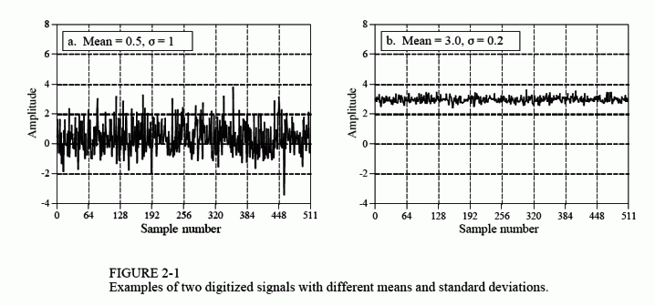
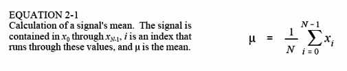
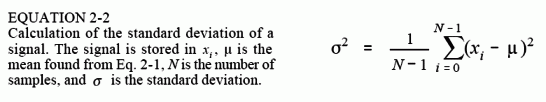
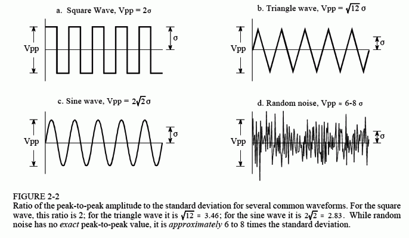
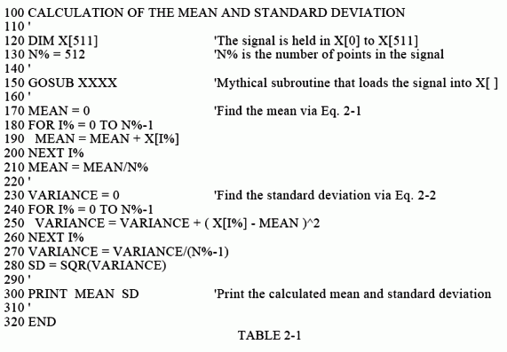
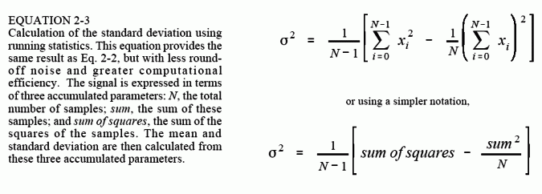
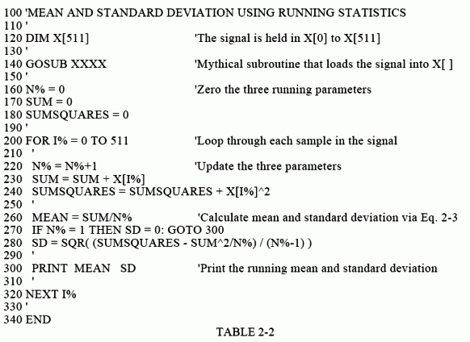

# Chapter 2: Statistics, Probability and Noise
> Thống kê, xác suất và tiếng ồn

Thống kê và xác suất được sử dụng trong Xử lý tín hiệu số để mô tả đặc điểm của tín hiệu và quá trình tạo ra chúng. Ví dụ, mục đích sử dụng chính của DSP là giảm nhiễu, nhiễu và các thành phần không mong muốn khác trong dữ liệu thu được. Đây có thể là một phần vốn có của tín hiệu được đo, phát sinh từ sự không hoàn hảo trong hệ thống thu thập dữ liệu hoặc được đưa vào như một sản phẩm phụ không thể tránh khỏi của một số hoạt động DSP. Thống kê và xác suất cho phép đo lường và phân loại các đặc điểm gây rối loạn này, bước đầu tiên trong việc phát triển các chiến lược nhằm loại bỏ các thành phần vi phạm. Chương này giới thiệu các khái niệm quan trọng nhất trong thống kê và xác suất, nhấn mạnh vào cách chúng áp dụng cho các tín hiệu thu được.

Các chủ đề trong phần này:

- __Signal and Graph Terminology__
- __Mean and Standard Deviation__
- __Signal vs. Underlying Process__
- __The Histogram, Pmf and Pdf__
- __The Normal Distribution__
- __Digital Noise Generation__
- __Precision and Accuracy__

## Signal and Graph Terminology
> Thuật ngữ tín hiệu và đồ thị

Tín hiệu là sự mô tả cách một tham số phụ thuộc vào tham số khác. Ví dụ, loại tín hiệu phổ biến nhất trong thiết bị điện tử tương tự là điện áp thay đổi theo thời gian. Vì cả hai tham số đều có thể giả định một phạm vi giá trị liên tục, nên chúng tôi sẽ gọi đây là tín hiệu liên tục. Để so sánh, việc truyền tín hiệu này qua bộ chuyển đổi tương tự sang số buộc mỗi tham số trong hai tham số phải được lượng tử hóa. Ví dụ: hãy tưởng tượng việc chuyển đổi được thực hiện với 12 bit ở tốc độ lấy mẫu là một kilohertz. Điện áp được giảm xuống còn 4096 mức nhị phân có thể có và thời gian chỉ được xác định ở mức tăng một phần nghìn giây. Tín hiệu được hình thành từ các tham số được lượng tử hóa theo cách này được gọi là tín hiệu rời rạc hoặc tín hiệu số hóa. Trong hầu hết các trường hợp, các tín hiệu liên tục tồn tại trong tự nhiên, trong khi các tín hiệu rời rạc tồn tại bên trong máy tính (mặc dù bạn có thể tìm thấy ngoại lệ cho cả hai trường hợp). Cũng có thể có các tín hiệu trong đó một tham số là liên tục và tham số kia là rời rạc. Vì các tín hiệu hỗn hợp này khá phổ biến nên chúng không có tên đặc biệt nào được đặt cho chúng và bản chất của hai tham số phải được nêu rõ ràng.

Hình 2-1 cho thấy hai tín hiệu rời rạc, chẳng hạn như có thể thu được bằng hệ thống thu thập dữ liệu số. Trục tung có thể biểu thị điện áp, cường độ ánh sáng, áp suất âm thanh hoặc vô số thông số khác. Vì chúng ta không biết nó đại diện cho cái gì trong trường hợp cụ thể này nên chúng ta sẽ gán cho nó nhãn chung: biên độ. Tham số này còn được gọi bằng một số tên khác: trục y, biến phụ thuộc, phạm vi và tọa độ.

Trục hoành biểu thị tham số khác của tín hiệu, có các tên như: trục x, biến độc lập, miền và hoành độ. Thời gian là thông số phổ biến nhất xuất hiện trên trục ngang của tín hiệu thu được; tuy nhiên, các tham số khác được sử dụng trong các ứng dụng cụ thể. Ví dụ, một nhà địa vật lý có thể thu được các phép đo mật độ đá ở những khoảng cách đều nhau dọc theo bề mặt trái đất. Để giữ mọi thứ tổng quát, chúng ta sẽ chỉ gắn nhãn cho trục ngang: số mẫu. Nếu đây là tín hiệu liên tục thì phải sử dụng nhãn khác, chẳng hạn như: thời gian, khoảng cách, x, v.v.

Hai tham số tạo thành tín hiệu thường không thể thay thế cho nhau. Tham số trên trục y (biến phụ thuộc) được gọi là hàm của tham số trên trục x (biến độc lập). Nói cách khác, biến độc lập mô tả cách thức hoặc thời điểm lấy từng mẫu, trong khi biến phụ thuộc là phép đo thực tế. Cho trước một giá trị cụ thể trên trục x, chúng ta luôn có thể tìm thấy giá trị tương ứng trên trục y, nhưng thường thì không thể tìm được giá trị ngược lại.

Đặc biệt chú ý đến từ: miền, một thuật ngữ được sử dụng rất rộng rãi trong DSP. Ví dụ, một tín hiệu sử dụng thời gian làm biến độc lập (tức là tham số trên trục hoành), được cho là nằm trong miền thời gian. Một tín hiệu phổ biến khác trong DSP sử dụng tần số làm biến độc lập, dẫn đến thuật ngữ miền tần số. Tương tự, các tín hiệu sử dụng khoảng cách làm tham số độc lập được cho là nằm trong miền không gian (khoảng cách là thước đo không gian). Loại tham số trên trục hoành là miền tín hiệu; nó thật đơn giản. Điều gì sẽ xảy ra nếu trục x được gắn nhãn bằng thứ gì đó rất chung chung, chẳng hạn như số mẫu? Các tác giả thường coi những tín hiệu này nằm trong miền thời gian. Điều này là do việc lấy mẫu trong những khoảng thời gian bằng nhau là cách phổ biến nhất để thu được tín hiệu và họ không có tên nào cụ thể hơn để gọi nó.

Mặc dù các tín hiệu trong Hình 2-1 là rời rạc nhưng chúng được hiển thị trong hình này dưới dạng các đường liên tục. Điều này là do có quá nhiều mẫu để có thể phân biệt được nếu chúng được hiển thị dưới dạng điểm đánh dấu riêng lẻ. Trong các biểu đồ mô tả các tín hiệu ngắn hơn, chẳng hạn như ít hơn 100 mẫu, các điểm đánh dấu riêng lẻ thường được hiển thị. Các đường liên tục có thể được vẽ hoặc không để nối các điểm đánh dấu, tùy thuộc vào cách tác giả muốn bạn xem dữ liệu. Ví dụ: một đường liên tục có thể ám chỉ điều gì đang xảy ra giữa các mẫu hoặc đơn giản là một công cụ trợ giúp giúp mắt người đọc theo dõi xu hướng của dữ liệu nhiễu. Vấn đề là kiểm tra nhãn của trục hoành để tìm xem bạn đang làm việc với tín hiệu rời rạc hay liên tục. Đừng dựa vào khả năng vẽ dấu chấm của họa sĩ minh họa.

Biến N được sử dụng rộng rãi trong DSP để biểu thị tổng số mẫu trong tín hiệu. Ví dụ: N = 512 cho các tín hiệu trong Hình 2-1.

<figure markdown="span">
    
    <figcaption></figcaption>
</figure>

Để giữ cho dữ liệu được tổ chức, mỗi mẫu được gán một số mẫu hoặc chỉ mục. Đây là những con số xuất hiện dọc theo trục ngang. Hai ký hiệu để gán số mẫu thường được sử dụng. Trong ký hiệu đầu tiên, các chỉ mục mẫu chạy từ 1 đến N (ví dụ: 1 đến 512). Trong ký hiệu thứ hai, các chỉ mục mẫu chạy từ 0 đến N`-`1 (ví dụ: 0 đến 511). Các nhà toán học thường sử dụng phương pháp thứ nhất (1 đến N), trong khi những người ở DSP thường sử dụng phương pháp thứ hai (0 đến N`-`1). Trong cuốn sách này, chúng ta sẽ sử dụng ký hiệu thứ hai. Đừng coi đây là một vấn đề tầm thường. Đôi khi nó sẽ khiến bạn bối rối trong sự nghiệp của mình. Hãy để ý nó!

## Mean and Standard Deviation
> Độ lệch trung bình và chuẩn [link](https://www.dspguide.com/ch2/2.htm)

Giá trị trung bình, được biểu thị bằng μ (chữ thường mu trong tiếng Hy Lạp), là thuật ngữ của nhà thống kê về giá trị trung bình của tín hiệu. Nó được tìm thấy đúng như bạn mong đợi: cộng tất cả các mẫu lại với nhau và chia cho N. Nó trông như thế này ở dạng toán học:

<figure markdown="span">
    
    <figcaption></figcaption>
</figure>

Nói cách khác, tính tổng các giá trị trong tín hiệu, xi, bằng cách cho chỉ số i chạy từ 0 đến N-1. Sau đó kết thúc phép tính bằng cách chia tổng cho N. Điều này giống với phương trình: $μ =(x0 + x1 + x2 + ... + xN-1)/N$. Nếu bạn chưa quen với việc sử dụng Σ (chữ hoa sigma trong tiếng Hy Lạp) để biểu thị phép tính tổng, hãy nghiên cứu các phương trình này một cách cẩn thận và so sánh chúng với chương trình máy tính trong Bảng 2-1. Các phép tính tổng kiểu này có rất nhiều trong DSP và bạn cần hiểu đầy đủ về ký hiệu này. Trong điện tử, giá trị trung bình thường được gọi là giá trị DC (dòng điện một chiều). Tương tự, AC (dòng điện xoay chiều) đề cập đến cách tín hiệu dao động xung quanh giá trị trung bình. Nếu tín hiệu là dạng sóng lặp đi lặp lại đơn giản, chẳng hạn như sóng hình sin hoặc sóng vuông, thì độ lệch của nó có thể được mô tả bằng biên độ từ đỉnh đến đỉnh của nó. Thật không may, hầu hết các tín hiệu thu được không hiển thị giá trị đỉnh đến đỉnh được xác định rõ ràng mà có tính chất ngẫu nhiên, chẳng hạn như các tín hiệu trong Hình 2-1. Một phương pháp tổng quát hơn phải được sử dụng trong những trường hợp này, được gọi là độ lệch chuẩn, ký hiệu là σ (chữ thường sigma trong tiếng Hy Lạp).

Là điểm bắt đầu, biểu thức $|xi-μ|$, mô tả mẫu thứ i lệch (khác) bao xa so với giá trị trung bình. Độ lệch trung bình của tín hiệu được tìm bằng cách tính tổng độ lệch của tất cả các mẫu riêng lẻ, sau đó chia cho số mẫu, N. Lưu ý rằng chúng ta lấy giá trị tuyệt đối của từng độ lệch trước khi tính tổng; nếu không thì số hạng dương và âm sẽ tính trung bình bằng 0. Độ lệch trung bình cung cấp một số duy nhất biểu thị khoảng cách điển hình giữa các mẫu so với giá trị trung bình. Mặc dù thuận tiện và đơn giản nhưng độ lệch trung bình hầu như không bao giờ được sử dụng trong thống kê. Điều này là do nó không phù hợp với nguyên lý vật lý về cách hoạt động của tín hiệu. Trong hầu hết các trường hợp, tham số quan trọng không phải là độ lệch so với giá trị trung bình mà là công suất biểu thị bằng độ lệch so với giá trị trung bình. Ví dụ, khi các tín hiệu nhiễu ngẫu nhiên kết hợp trong một mạch điện tử, nhiễu tổng hợp bằng công suất tổng hợp của các tín hiệu riêng lẻ chứ không phải biên độ tổng hợp của chúng.

Độ lệch chuẩn tương tự như độ lệch trung bình, ngoại trừ việc lấy trung bình được thực hiện bằng công suất thay vì biên độ. Điều này đạt được bằng cách bình phương từng độ lệch trước khi lấy giá trị trung bình (hãy nhớ, công suất ∝ điện áp2). Để kết thúc, căn bậc hai được lấy để bù cho bình phương ban đầu. Ở dạng phương trình, độ lệch chuẩn được tính:

<figure markdown="span">
    
    <figcaption></figcaption>
</figure>

Trong ký hiệu thay thế: $sigma = sqrt((x0 -μ)2 + (x1 -μ)2 + ... + (xN-1 -μ)2 / (N-1))$. Lưu ý rằng giá trị trung bình được thực hiện bằng cách chia cho N - 1 thay vì N. Đây là một đặc điểm tinh tế của phương trình sẽ được thảo luận trong phần tiếp theo. Thuật ngữ σ2 xuất hiện thường xuyên trong thống kê và được đặt tên là phương sai. Độ lệch chuẩn là thước đo mức độ dao động của tín hiệu so với giá trị trung bình. Phương sai thể hiện sức mạnh của sự biến động này. Một thuật ngữ khác bạn nên làm quen là giá trị rms (gốc-trung bình-bình phương), thường được sử dụng trong điện tử. Theo định nghĩa, độ lệch chuẩn chỉ đo phần AC của tín hiệu, trong khi giá trị rms đo cả thành phần AC và DC. Nếu tín hiệu không có thành phần DC thì giá trị rms của nó giống với độ lệch chuẩn của nó. Hình 2-2 cho thấy mối quan hệ giữa độ lệch chuẩn và giá trị đỉnh tới đỉnh của một số dạng sóng phổ biến.

<figure markdown="span">
    
    <figcaption></figcaption>
</figure>

Bảng 2-1 liệt kê quy trình máy tính để tính giá trị trung bình và độ lệch chuẩn bằng cách sử dụng các phương trình. 2-1 và 2-2. Các chương trình trong cuốn sách này nhằm mục đích truyền tải các thuật toán theo cách đơn giản nhất; tất cả các yếu tố khác được coi là thứ yếu. Kỹ thuật lập trình tốt sẽ bị bỏ qua nếu nó làm cho logic chương trình rõ ràng hơn. Ví dụ: sử dụng phiên bản đơn giản của BASIC, bao gồm số dòng, cấu trúc điều khiển duy nhất được phép là vòng lặp FOR-NEXT, không có câu lệnh I/O, v.v. Hãy coi các chương trình này như một cách khác để hiểu các phương trình được sử dụng

<figure markdown="span">
    
    <figcaption></figcaption>
</figure>

trong DSP. Nếu bạn không thể nắm bắt được một cái, có thể cái kia sẽ giúp ích. Trong BASIC, ký tự % ở cuối tên biến cho biết đó là số nguyên. Tất cả các biến khác là dấu phẩy động. Chương 4 thảo luận chi tiết về các loại biến này.

Phương pháp tính giá trị trung bình và độ lệch chuẩn này phù hợp cho nhiều ứng dụng; tuy nhiên, nó có hai hạn chế. Đầu tiên, nếu giá trị trung bình lớn hơn nhiều so với độ lệch chuẩn, phương trình. 2-2 liên quan đến việc trừ hai số có giá trị rất gần nhau. Điều này có thể dẫn đến sai số làm tròn quá mức trong các phép tính, một chủ đề được thảo luận chi tiết hơn trong Chương 4. Thứ hai, người ta thường tính toán lại giá trị trung bình và độ lệch chuẩn khi lấy mẫu mới và thêm vào tín hiệu. Chúng ta sẽ gọi kiểu tính toán này là: chạy số liệu thống kê. Trong khi phương pháp của phương trình. 2-1 và 2-2 có thể được sử dụng để chạy số liệu thống kê, nó yêu cầu tất cả các mẫu phải được tham gia vào mỗi phép tính mới. Đây là cách sử dụng sức mạnh tính toán và bộ nhớ rất kém hiệu quả.

Giải pháp cho những vấn đề này có thể được tìm thấy bằng cách vận dụng các phương trình. 2-1 và 2-2 để cung cấp một phương trình khác để tính độ lệch chuẩn:

<figure markdown="span">
    
    <figcaption></figcaption>
</figure>

Trong khi di chuyển qua tín hiệu, bảng kiểm đếm đang chạy được lưu giữ gồm ba tham số: (1) số lượng mẫu đã được xử lý, (2) tổng của các mẫu này và (3) tổng bình phương của các mẫu (nghĩa là bình phương giá trị của từng mẫu và cộng kết quả vào giá trị tích lũy). Sau khi xử lý số lượng mẫu bất kỳ, giá trị trung bình và độ lệch chuẩn có thể được tính toán một cách hiệu quả chỉ bằng cách sử dụng giá trị hiện tại của ba tham số. Bảng 2-2 cho thấy một chương trình báo cáo giá trị trung bình và độ lệch chuẩn theo cách này khi mỗi mẫu mới được tính đến. Đây là phương pháp được sử dụng trong máy tính cầm tay để tìm số liệu thống kê của một dãy số. Mỗi khi bạn nhập một số và nhấn phím Σ (tổng), ba tham số sẽ được cập nhật. Sau đó, giá trị trung bình và độ lệch chuẩn có thể được tìm thấy bất cứ khi nào bạn muốn mà không cần phải tính toán lại toàn bộ chuỗi.

<figure markdown="span">
    
    <figcaption></figcaption>
</figure>

Trước khi kết thúc cuộc thảo luận về giá trị trung bình và độ lệch chuẩn, hai thuật ngữ khác cần được đề cập. Trong một số trường hợp, giá trị trung bình mô tả những gì đang được đo, trong khi độ lệch chuẩn thể hiện tiếng ồn và các nhiễu khác. Trong những trường hợp này, bản thân độ lệch chuẩn không quan trọng mà chỉ so với giá trị trung bình. Điều này dẫn đến thuật ngữ: tỷ lệ tín hiệu trên nhiễu (SNR), bằng giá trị trung bình chia cho độ lệch chuẩn. Một thuật ngữ khác cũng được sử dụng, hệ số biến thiên (CV). Điều này được định nghĩa là độ lệch chuẩn chia cho giá trị trung bình, nhân với 100 phần trăm. Ví dụ: một tín hiệu (hoặc nhóm giá trị đo khác) có CV là 2% thì có SNR là 50. Dữ liệu tốt hơn có nghĩa là giá trị SNR cao hơn và giá trị CV thấp hơn.