# Chapter 2: Statistics, Probability and Noise
> Thống kê, xác suất và tiếng ồn

Thống kê và xác suất được sử dụng trong Xử lý tín hiệu số để mô tả đặc điểm của tín hiệu và quá trình tạo ra chúng. Ví dụ, mục đích sử dụng chính của DSP là giảm nhiễu, nhiễu và các thành phần không mong muốn khác trong dữ liệu thu được. Đây có thể là một phần vốn có của tín hiệu được đo, phát sinh từ sự không hoàn hảo trong hệ thống thu thập dữ liệu hoặc được đưa vào như một sản phẩm phụ không thể tránh khỏi của một số hoạt động DSP. Thống kê và xác suất cho phép đo lường và phân loại các đặc điểm gây rối loạn này, bước đầu tiên trong việc phát triển các chiến lược nhằm loại bỏ các thành phần vi phạm. Chương này giới thiệu các khái niệm quan trọng nhất trong thống kê và xác suất, nhấn mạnh vào cách chúng áp dụng cho các tín hiệu thu được.

Các chủ đề trong phần này:

- __Signal and Graph Terminology__
- __Mean and Standard Deviation__
- __Signal vs. Underlying Process__
- __The Histogram, Pmf and Pdf__
- __The Normal Distribution__
- __Digital Noise Generation__
- __Precision and Accuracy__

## Signal and Graph Terminology
> Thuật ngữ tín hiệu và đồ thị

Tín hiệu là sự mô tả cách một tham số phụ thuộc vào tham số khác. Ví dụ, loại tín hiệu phổ biến nhất trong thiết bị điện tử tương tự là điện áp thay đổi theo thời gian. Vì cả hai tham số đều có thể giả định một phạm vi giá trị liên tục, nên chúng tôi sẽ gọi đây là tín hiệu liên tục. Để so sánh, việc truyền tín hiệu này qua bộ chuyển đổi tương tự sang số buộc mỗi tham số trong hai tham số phải được lượng tử hóa. Ví dụ: hãy tưởng tượng việc chuyển đổi được thực hiện với 12 bit ở tốc độ lấy mẫu là một kilohertz. Điện áp được giảm xuống còn 4096 mức nhị phân có thể có và thời gian chỉ được xác định ở mức tăng một phần nghìn giây. Tín hiệu được hình thành từ các tham số được lượng tử hóa theo cách này được gọi là tín hiệu rời rạc hoặc tín hiệu số hóa. Trong hầu hết các trường hợp, các tín hiệu liên tục tồn tại trong tự nhiên, trong khi các tín hiệu rời rạc tồn tại bên trong máy tính (mặc dù bạn có thể tìm thấy ngoại lệ cho cả hai trường hợp). Cũng có thể có các tín hiệu trong đó một tham số là liên tục và tham số kia là rời rạc. Vì các tín hiệu hỗn hợp này khá phổ biến nên chúng không có tên đặc biệt nào được đặt cho chúng và bản chất của hai tham số phải được nêu rõ ràng.

Hình 2-1 cho thấy hai tín hiệu rời rạc, chẳng hạn như có thể thu được bằng hệ thống thu thập dữ liệu số. Trục tung có thể biểu thị điện áp, cường độ ánh sáng, áp suất âm thanh hoặc vô số thông số khác. Vì chúng ta không biết nó đại diện cho cái gì trong trường hợp cụ thể này nên chúng ta sẽ gán cho nó nhãn chung: biên độ. Tham số này còn được gọi bằng một số tên khác: trục y, biến phụ thuộc, phạm vi và tọa độ.

Trục hoành biểu thị tham số khác của tín hiệu, có các tên như: trục x, biến độc lập, miền và hoành độ. Thời gian là thông số phổ biến nhất xuất hiện trên trục ngang của tín hiệu thu được; tuy nhiên, các tham số khác được sử dụng trong các ứng dụng cụ thể. Ví dụ, một nhà địa vật lý có thể thu được các phép đo mật độ đá ở những khoảng cách đều nhau dọc theo bề mặt trái đất. Để giữ mọi thứ tổng quát, chúng ta sẽ chỉ gắn nhãn cho trục ngang: số mẫu. Nếu đây là tín hiệu liên tục thì phải sử dụng nhãn khác, chẳng hạn như: thời gian, khoảng cách, x, v.v.

Hai tham số tạo thành tín hiệu thường không thể thay thế cho nhau. Tham số trên trục y (biến phụ thuộc) được gọi là hàm của tham số trên trục x (biến độc lập). Nói cách khác, biến độc lập mô tả cách thức hoặc thời điểm lấy từng mẫu, trong khi biến phụ thuộc là phép đo thực tế. Cho trước một giá trị cụ thể trên trục x, chúng ta luôn có thể tìm thấy giá trị tương ứng trên trục y, nhưng thường thì không thể tìm được giá trị ngược lại.

Đặc biệt chú ý đến từ: miền, một thuật ngữ được sử dụng rất rộng rãi trong DSP. Ví dụ, một tín hiệu sử dụng thời gian làm biến độc lập (tức là tham số trên trục hoành), được cho là nằm trong miền thời gian. Một tín hiệu phổ biến khác trong DSP sử dụng tần số làm biến độc lập, dẫn đến thuật ngữ miền tần số. Tương tự, các tín hiệu sử dụng khoảng cách làm tham số độc lập được cho là nằm trong miền không gian (khoảng cách là thước đo không gian). Loại tham số trên trục hoành là miền tín hiệu; nó thật đơn giản. Điều gì sẽ xảy ra nếu trục x được gắn nhãn bằng thứ gì đó rất chung chung, chẳng hạn như số mẫu? Các tác giả thường coi những tín hiệu này nằm trong miền thời gian. Điều này là do việc lấy mẫu trong những khoảng thời gian bằng nhau là cách phổ biến nhất để thu được tín hiệu và họ không có tên nào cụ thể hơn để gọi nó.

Mặc dù các tín hiệu trong Hình 2-1 là rời rạc nhưng chúng được hiển thị trong hình này dưới dạng các đường liên tục. Điều này là do có quá nhiều mẫu để có thể phân biệt được nếu chúng được hiển thị dưới dạng điểm đánh dấu riêng lẻ. Trong các biểu đồ mô tả các tín hiệu ngắn hơn, chẳng hạn như ít hơn 100 mẫu, các điểm đánh dấu riêng lẻ thường được hiển thị. Các đường liên tục có thể được vẽ hoặc không để nối các điểm đánh dấu, tùy thuộc vào cách tác giả muốn bạn xem dữ liệu. Ví dụ: một đường liên tục có thể ám chỉ điều gì đang xảy ra giữa các mẫu hoặc đơn giản là một công cụ trợ giúp giúp mắt người đọc theo dõi xu hướng của dữ liệu nhiễu. Vấn đề là kiểm tra nhãn của trục hoành để tìm xem bạn đang làm việc với tín hiệu rời rạc hay liên tục. Đừng dựa vào khả năng vẽ dấu chấm của họa sĩ minh họa.

Biến N được sử dụng rộng rãi trong DSP để biểu thị tổng số mẫu trong tín hiệu. Ví dụ: N = 512 cho các tín hiệu trong Hình 2-1.

<figure markdown="span">
    
    <figcaption></figcaption>
</figure>

Để giữ cho dữ liệu được tổ chức, mỗi mẫu được gán một số mẫu hoặc chỉ mục. Đây là những con số xuất hiện dọc theo trục ngang. Hai ký hiệu để gán số mẫu thường được sử dụng. Trong ký hiệu đầu tiên, các chỉ mục mẫu chạy từ 1 đến N (ví dụ: 1 đến 512). Trong ký hiệu thứ hai, các chỉ mục mẫu chạy từ $0$ đến $N-1$ (ví dụ: 0 đến 511). Các nhà toán học thường sử dụng phương pháp thứ nhất $(1 \rarr N)$, trong khi những người ở DSP thường sử dụng phương pháp thứ hai $(0 \rarr N-1)$. Trong cuốn sách này, chúng ta sẽ sử dụng ký hiệu thứ hai. Đừng coi đây là một vấn đề tầm thường. Đôi khi nó sẽ khiến bạn bối rối trong sự nghiệp của mình. Hãy để ý nó!

## Mean and Standard Deviation
> Độ lệch trung bình và chuẩn [link](https://www.dspguide.com/ch2/2.htm)

Giá trị trung bình, được biểu thị bằng μ (chữ thường mu trong tiếng Hy Lạp), là thuật ngữ của nhà thống kê về giá trị trung bình của tín hiệu. Nó được tìm thấy đúng như bạn mong đợi: cộng tất cả các mẫu lại với nhau và chia cho N. Nó trông như thế này ở dạng toán học:

<figure markdown="span">
    
    <figcaption></figcaption>
</figure>

Nói cách khác, tính tổng các giá trị trong tín hiệu, xi, bằng cách cho chỉ số i chạy từ 0 đến N-1. Sau đó kết thúc phép tính bằng cách chia tổng cho N. Điều này giống với phương trình: $μ =(x0 + x1 + x2 + ... + xN-1)/N$. Nếu bạn chưa quen với việc sử dụng Σ (chữ hoa sigma trong tiếng Hy Lạp) để biểu thị phép tính tổng, hãy nghiên cứu các phương trình này một cách cẩn thận và so sánh chúng với chương trình máy tính trong Bảng 2-1. Các phép tính tổng kiểu này có rất nhiều trong DSP và bạn cần hiểu đầy đủ về ký hiệu này. Trong điện tử, giá trị trung bình thường được gọi là giá trị DC (dòng điện một chiều). Tương tự, AC (dòng điện xoay chiều) đề cập đến cách tín hiệu dao động xung quanh giá trị trung bình. Nếu tín hiệu là dạng sóng lặp đi lặp lại đơn giản, chẳng hạn như sóng hình sin hoặc sóng vuông, thì độ lệch của nó có thể được mô tả bằng biên độ từ đỉnh đến đỉnh của nó. Thật không may, hầu hết các tín hiệu thu được không hiển thị giá trị đỉnh đến đỉnh được xác định rõ ràng mà có tính chất ngẫu nhiên, chẳng hạn như các tín hiệu trong Hình 2-1. Một phương pháp tổng quát hơn phải được sử dụng trong những trường hợp này, được gọi là độ lệch chuẩn, ký hiệu là σ (chữ thường sigma trong tiếng Hy Lạp).

Là điểm bắt đầu, biểu thức $|xi-μ|$, mô tả mẫu thứ i lệch (khác) bao xa so với giá trị trung bình. Độ lệch trung bình của tín hiệu được tìm bằng cách tính tổng độ lệch của tất cả các mẫu riêng lẻ, sau đó chia cho số mẫu, N. Lưu ý rằng chúng ta lấy giá trị tuyệt đối của từng độ lệch trước khi tính tổng; nếu không thì số hạng dương và âm sẽ tính trung bình bằng 0. Độ lệch trung bình cung cấp một số duy nhất biểu thị khoảng cách điển hình giữa các mẫu so với giá trị trung bình. Mặc dù thuận tiện và đơn giản nhưng độ lệch trung bình hầu như không bao giờ được sử dụng trong thống kê. Điều này là do nó không phù hợp với nguyên lý vật lý về cách hoạt động của tín hiệu. Trong hầu hết các trường hợp, tham số quan trọng không phải là độ lệch so với giá trị trung bình mà là công suất biểu thị bằng độ lệch so với giá trị trung bình. Ví dụ, khi các tín hiệu nhiễu ngẫu nhiên kết hợp trong một mạch điện tử, nhiễu tổng hợp bằng công suất tổng hợp của các tín hiệu riêng lẻ chứ không phải biên độ tổng hợp của chúng.

Độ lệch chuẩn tương tự như độ lệch trung bình, ngoại trừ việc lấy trung bình được thực hiện bằng công suất thay vì biên độ. Điều này đạt được bằng cách bình phương từng độ lệch trước khi lấy giá trị trung bình (hãy nhớ, công suất ∝ điện áp2). Để kết thúc, căn bậc hai được lấy để bù cho bình phương ban đầu. Ở dạng phương trình, độ lệch chuẩn được tính:

<figure markdown="span">
    
    <figcaption></figcaption>
</figure>

Trong ký hiệu thay thế: $sigma = sqrt((x0 -μ)2 + (x1 -μ)2 + ... + (xN-1 -μ)2 / (N-1))$. Lưu ý rằng giá trị trung bình được thực hiện bằng cách chia cho N - 1 thay vì N. Đây là một đặc điểm tinh tế của phương trình sẽ được thảo luận trong phần tiếp theo. Thuật ngữ σ2 xuất hiện thường xuyên trong thống kê và được đặt tên là phương sai. Độ lệch chuẩn là thước đo mức độ dao động của tín hiệu so với giá trị trung bình. Phương sai thể hiện sức mạnh của sự biến động này. Một thuật ngữ khác bạn nên làm quen là giá trị rms (gốc-trung bình-bình phương), thường được sử dụng trong điện tử. Theo định nghĩa, độ lệch chuẩn chỉ đo phần AC của tín hiệu, trong khi giá trị rms đo cả thành phần AC và DC. Nếu tín hiệu không có thành phần DC thì giá trị rms của nó giống với độ lệch chuẩn của nó. Hình 2-2 cho thấy mối quan hệ giữa độ lệch chuẩn và giá trị đỉnh tới đỉnh của một số dạng sóng phổ biến.

<figure markdown="span">
    
    <figcaption></figcaption>
</figure>

Bảng 2-1 liệt kê quy trình máy tính để tính giá trị trung bình và độ lệch chuẩn bằng cách sử dụng các phương trình. 2-1 và 2-2. Các chương trình trong cuốn sách này nhằm mục đích truyền tải các thuật toán theo cách đơn giản nhất; tất cả các yếu tố khác được coi là thứ yếu. Kỹ thuật lập trình tốt sẽ bị bỏ qua nếu nó làm cho logic chương trình rõ ràng hơn. Ví dụ: sử dụng phiên bản đơn giản của BASIC, bao gồm số dòng, cấu trúc điều khiển duy nhất được phép là vòng lặp FOR-NEXT, không có câu lệnh I/O, v.v. Hãy coi các chương trình này như một cách khác để hiểu các phương trình được sử dụng

<figure markdown="span">
    
    <figcaption></figcaption>
</figure>

trong DSP. Nếu bạn không thể nắm bắt được một cái, có thể cái kia sẽ giúp ích. Trong BASIC, ký tự % ở cuối tên biến cho biết đó là số nguyên. Tất cả các biến khác là dấu phẩy động.
<mark>Chương 4 thảo luận chi tiết về các loại biến này.</mark>

Phương pháp tính giá trị trung bình và độ lệch chuẩn này phù hợp cho nhiều ứng dụng; tuy nhiên, nó có hai hạn chế. Đầu tiên, nếu giá trị trung bình lớn hơn nhiều so với độ lệch chuẩn, phương trình. 2-2 liên quan đến việc trừ hai số có giá trị rất gần nhau. Điều này có thể dẫn đến sai số làm tròn quá mức trong các phép tính, một chủ đề được thảo luận chi tiết hơn trong Chương 4. Thứ hai, người ta thường tính toán lại giá trị trung bình và độ lệch chuẩn khi lấy mẫu mới và thêm vào tín hiệu. Chúng ta sẽ gọi kiểu tính toán này là: chạy số liệu thống kê. Trong khi phương pháp của phương trình. 2-1 và 2-2 có thể được sử dụng để chạy số liệu thống kê, nó yêu cầu tất cả các mẫu phải được tham gia vào mỗi phép tính mới. Đây là cách sử dụng sức mạnh tính toán và bộ nhớ rất kém hiệu quả.

Giải pháp cho những vấn đề này có thể được tìm thấy bằng cách vận dụng các phương trình. 2-1 và 2-2 để cung cấp một phương trình khác để tính độ lệch chuẩn:

<figure markdown="span">
    
    <figcaption></figcaption>
</figure>

Trong khi di chuyển qua tín hiệu, bảng kiểm đếm đang chạy được lưu giữ gồm ba tham số: (1) số lượng mẫu đã được xử lý, (2) tổng của các mẫu này và (3) tổng bình phương của các mẫu (nghĩa là bình phương giá trị của từng mẫu và cộng kết quả vào giá trị tích lũy). Sau khi xử lý số lượng mẫu bất kỳ, giá trị trung bình và độ lệch chuẩn có thể được tính toán một cách hiệu quả chỉ bằng cách sử dụng giá trị hiện tại của ba tham số. Bảng 2-2 cho thấy một chương trình báo cáo giá trị trung bình và độ lệch chuẩn theo cách này khi mỗi mẫu mới được tính đến. Đây là phương pháp được sử dụng trong máy tính cầm tay để tìm số liệu thống kê của một dãy số. Mỗi khi bạn nhập một số và nhấn phím Σ (tổng), ba tham số sẽ được cập nhật. Sau đó, giá trị trung bình và độ lệch chuẩn có thể được tìm thấy bất cứ khi nào bạn muốn mà không cần phải tính toán lại toàn bộ chuỗi.

<figure markdown="span">
    
    <figcaption></figcaption>
</figure>

Trước khi kết thúc cuộc thảo luận về giá trị trung bình và độ lệch chuẩn, hai thuật ngữ khác cần được đề cập. Trong một số trường hợp, giá trị trung bình mô tả những gì đang được đo, trong khi độ lệch chuẩn thể hiện tiếng ồn và các nhiễu khác. Trong những trường hợp này, bản thân độ lệch chuẩn không quan trọng mà chỉ so với giá trị trung bình. Điều này dẫn đến thuật ngữ: tỷ lệ tín hiệu trên nhiễu (SNR), bằng giá trị trung bình chia cho độ lệch chuẩn. Một thuật ngữ khác cũng được sử dụng, hệ số biến thiên (CV). Điều này được định nghĩa là độ lệch chuẩn chia cho giá trị trung bình, nhân với 100 phần trăm. Ví dụ: một tín hiệu (hoặc nhóm giá trị đo khác) có CV là 2% thì có SNR là 50. Dữ liệu tốt hơn có nghĩa là giá trị SNR cao hơn và giá trị CV thấp hơn.

## Signal vs. Underlying Process
> [Signal vs. Underlying Process](https://www.dspguide.com/ch2/3.htm)

Thống kê là khoa học giải thích dữ liệu số, chẳng hạn như tín hiệu thu được. Để so sánh, xác suất được sử dụng trong DSP để hiểu các quá trình tạo ra tín hiệu. Mặc dù chúng có liên quan chặt chẽ với nhau nhưng sự khác biệt giữa tín hiệu thu được và quy trình cơ bản là chìa khóa của nhiều kỹ thuật DSP.

Ví dụ: hãy tưởng tượng việc tạo tín hiệu 1000 điểm bằng cách tung đồng xu 1000 lần. Nếu đồng xu được lật là mặt ngửa thì mẫu tương ứng sẽ có giá trị là một. Ở mặt sấp, mẫu được đặt thành 0. Quá trình tạo ra tín hiệu này có giá trị trung bình chính xác là 0,5, được xác định bởi xác suất tương đối của từng kết quả có thể xảy ra: 50% ngửa, 50% sấp. Tuy nhiên, tín hiệu 1000 điểm thực tế khó có thể có giá trị trung bình chính xác là 0,5. Cơ hội ngẫu nhiên sẽ làm cho số lượng số 1 và số 0 hơi khác nhau mỗi khi tín hiệu được tạo ra. Xác suất của quá trình cơ bản là không đổi, nhưng số liệu thống kê của tín hiệu thu được sẽ thay đổi mỗi lần thử nghiệm được lặp lại. Sự bất thường ngẫu nhiên được tìm thấy trong dữ liệu thực tế này được gọi bằng các tên như: biến thiên thống kê, biến động thống kê và nhiễu thống kê.

Điều này thể hiện một chút vấn đề nan giải. Khi bạn nhìn thấy các thuật ngữ: giá trị trung bình và độ lệch chuẩn, làm sao bạn biết liệu tác giả đang đề cập đến số liệu thống kê của tín hiệu thực tế hay xác suất của quá trình cơ bản đã tạo ra tín hiệu đó? Thật không may, cách duy nhất bạn có thể biết là dựa vào ngữ cảnh. Điều này không đúng với tất cả các thuật ngữ được sử dụng trong thống kê và xác suất. Ví dụ: biểu đồ và hàm khối lượng xác suất (được thảo luận trong phần tiếp theo) là các khái niệm phù hợp được đặt tên riêng.

Bây giờ, quay lại phương trình. 2-2, tính toán độ lệch chuẩn. Như đã đề cập trước đó, phương trình này chia cho N-1 khi tính trung bình của các bình phương sai lệch, thay vì chỉ đơn giản chia cho N. Để hiểu tại sao lại như vậy, hãy tưởng tượng rằng bạn muốn tìm giá trị trung bình và độ lệch chuẩn của một số quá trình tạo ra tín hiệu. Để đạt được mục đích này, bạn thu được tín hiệu gồm N mẫu từ quy trình và tính giá trị trung bình của tín hiệu thông qua biểu thức. 2.1. Sau đó, bạn có thể sử dụng giá trị này làm ước tính giá trị trung bình của quy trình cơ bản; tuy nhiên, bạn biết sẽ có lỗi do nhiễu thống kê. Cụ thể, đối với các tín hiệu ngẫu nhiên, sai số điển hình giữa giá trị trung bình của N điểm và giá trị trung bình của quy trình cơ bản được tính bằng:

<figure markdown="span">
    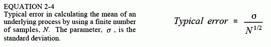
    <figcaption></figcaption>
</figure>

Nếu N nhỏ thì nhiễu thống kê trong giá trị trung bình tính toán sẽ rất lớn. Nói cách khác, bạn không có quyền truy cập vào đủ dữ liệu để mô tả chính xác quy trình. Giá trị của N càng lớn thì sai số dự kiến ​​sẽ càng nhỏ. Một cột mốc quan trọng trong lý thuyết xác suất, Định luật mạnh về số lớn, đảm bảo rằng sai số sẽ bằng 0 khi N tiến đến vô cùng.

Trong bước tiếp theo, chúng tôi muốn tính độ lệch chuẩn của tín hiệu thu được và sử dụng nó làm ước tính độ lệch chuẩn của quy trình cơ bản. Đây là vấn đề. Trước khi bạn có thể tính độ lệch chuẩn bằng phương trình. 2-2, bạn cần phải biết giá trị trung bình, μ. Tuy nhiên, bạn không biết giá trị trung bình của quá trình cơ bản, chỉ biết giá trị trung bình của tín hiệu điểm N, có lỗi do nhiễu thống kê. Lỗi này có xu hướng làm giảm giá trị tính toán của độ lệch chuẩn. Để bù đắp cho điều này, N được thay thế bằng N-1. Nếu N lớn thì sự khác biệt không thành vấn đề. Nếu N nhỏ, sự thay thế này cung cấp ước tính chính xác hơn về độ lệch chuẩn của quy trình cơ bản. Nói cách khác, phương trình. 2-2 là ước tính độ lệch chuẩn của quy trình cơ bản. Nếu chúng ta chia cho N trong phương trình, nó sẽ cung cấp độ lệch chuẩn của tín hiệu thu được.

<figure markdown="span">
    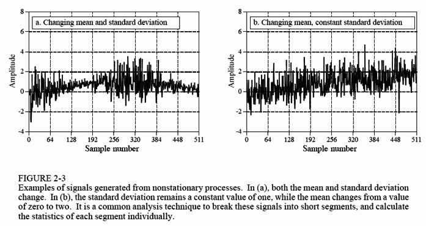
    <figcaption></figcaption>
</figure>

Để minh họa cho những ý tưởng này, hãy xem các tín hiệu trong Hình 2-3 và hỏi: các biến thể trong các tín hiệu này có phải là kết quả của nhiễu thống kê hay quá trình cơ bản đang thay đổi? Có lẽ không khó để thuyết phục bản thân rằng những thay đổi này quá lớn để có thể xảy ra ngẫu nhiên và phải liên quan đến quy trình cơ bản. Các quá trình thay đổi đặc tính của chúng theo cách này được gọi là không cố định. Để so sánh, các tín hiệu được trình bày trước đây trong Hình 2-1 được tạo ra từ một quy trình đứng yên và các biến thể hoàn toàn là do nhiễu thống kê. Hình 2-3b minh họa một vấn đề phổ biến với các tín hiệu không cố định: giá trị trung bình thay đổi chậm cản trở việc tính toán độ lệch chuẩn. Trong ví dụ này, độ lệch chuẩn của tín hiệu trong một khoảng thời gian ngắn là một. Tuy nhiên, độ lệch chuẩn của toàn bộ tín hiệu là 1,16. Lỗi này gần như có thể được loại bỏ bằng cách chia tín hiệu thành các phần ngắn và tính toán số liệu thống kê cho từng phần riêng lẻ. Nếu cần, độ lệch chuẩn cho từng phần có thể được tính trung bình để tạo ra một giá trị duy nhất.

## The Histogram, Pmf and Pdf
> [The Histogram, Pmf and Pdf](https://www.dspguide.com/ch2/4.htm)

Giả sử chúng ta gắn bộ chuyển đổi tương tự sang số 8 bit vào máy tính và thu được 256.000 mẫu tín hiệu. Ví dụ: Hình 2-4a hiển thị 128 mẫu có thể là một phần của tập dữ liệu này. Giá trị của mỗi mẫu sẽ là một trong 256 khả năng, từ 0 đến 255. Biểu đồ hiển thị số lượng mẫu có trong tín hiệu có từng giá trị có thể này. Hình (b) hiển thị biểu đồ của 128 mẫu trong (a). Ví dụ: có 2 mẫu có giá trị 110, 8 mẫu có giá trị 131, 0 mẫu có giá trị 170, v.v. Chúng ta sẽ biểu diễn biểu đồ bằng Hi, trong đó i là chỉ số chạy từ 0 đến M-1 và M là số giá trị có thể có mà mỗi mẫu có thể đảm nhận. Ví dụ: H50 là số mẫu có giá trị 50. Hình (c) hiển thị biểu đồ của tín hiệu sử dụng tập dữ liệu đầy đủ, tất cả 256k điểm. Có thể thấy, số lượng mẫu càng lớn thì bề ngoài càng mượt mà. Cũng giống như giá trị trung bình, độ nhiễu thống kê (độ nhám) của biểu đồ tỷ lệ nghịch với căn bậc hai của số lượng mẫu được sử dụng.

<figure markdown="span">
    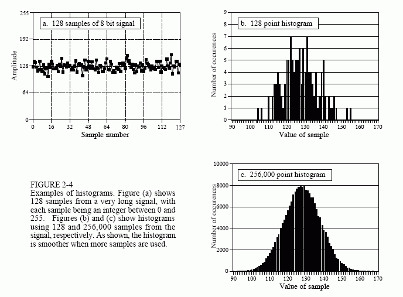
    <figcaption></figcaption>
</figure>

Theo cách xác định, tổng của tất cả các giá trị trong biểu đồ phải bằng số điểm trong tín hiệu:

<figure markdown="span">
    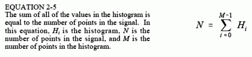
    <figcaption></figcaption>
</figure>

Biểu đồ có thể được sử dụng để tính toán một cách hiệu quả giá trị trung bình và độ lệch chuẩn của các tập dữ liệu rất lớn. Điều này đặc biệt quan trọng đối với hình ảnh, có thể chứa hàng triệu mẫu. Biểu đồ nhóm các mẫu có cùng giá trị lại với nhau. Điều này cho phép tính toán số liệu thống kê bằng cách làm việc với một vài nhóm, thay vì một số lượng lớn các mẫu riêng lẻ. Sử dụng phương pháp này, giá trị trung bình và độ lệch chuẩn được tính từ biểu đồ theo các phương trình:

<figure markdown="span">
    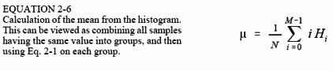
    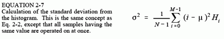
    <figcaption></figcaption>
</figure>

Bảng 2-3 chứa chương trình tính toán biểu đồ, giá trị trung bình và độ lệch chuẩn bằng cách sử dụng các phương trình này. Việc tính toán biểu đồ rất nhanh vì nó chỉ yêu cầu lập chỉ mục và tăng dần. Để so sánh, việc tính giá trị trung bình và độ lệch chuẩn đòi hỏi các phép tính cộng và nhân tốn nhiều thời gian. Chiến lược của thuật toán này là chỉ sử dụng các thao tác chậm này trên một số ít trong biểu đồ chứ không phải nhiều mẫu trong tín hiệu. Điều này làm cho thuật toán nhanh hơn nhiều so với các phương pháp được mô tả trước đó. Hãy nghĩ đến hệ số mười đối với các tín hiệu rất dài với các phép tính được thực hiện trên máy tính có mục đích chung.

Khái niệm tín hiệu thu được là phiên bản nhiễu của quy trình cơ bản là rất quan trọng; quan trọng đến mức một số khái niệm được đặt tên khác nhau. Biểu đồ là những gì được hình thành từ tín hiệu thu được. Đường cong tương ứng của quá trình cơ bản được gọi là hàm khối lượng xác suất (pmf). Biểu đồ luôn được tính toán bằng cách sử dụng số lượng mẫu hữu hạn, trong khi pmf là thứ sẽ thu được với số lượng mẫu vô hạn. PMf có thể được ước tính (suy ra) từ biểu đồ hoặc nó có thể được suy ra bằng một số kỹ thuật toán học, chẳng hạn như trong ví dụ lật đồng xu.

Hình 2-5 cho thấy một ví dụ về pmf và một trong các biểu đồ có thể liên kết với nó. Chìa khóa để hiểu những khái niệm này nằm ở đơn vị của trục tung. Như đã mô tả trước đây, trục tung của biểu đồ là số lần xuất hiện một giá trị cụ thể trong tín hiệu. Trục dọc của pmf chứa thông tin tương tự, ngoại trừ được biểu thị trên cơ sở phân số. Nói cách khác, mỗi giá trị trong biểu đồ được chia cho tổng số mẫu để xấp xỉ pmf. Điều này có nghĩa là mỗi giá trị trong pmf phải nằm trong khoảng từ 0 đến 1 và tổng của tất cả các giá trị trong pmf sẽ bằng 1.

PMf rất quan trọng vì nó mô tả xác suất mà một giá trị nhất định sẽ được tạo ra. Ví dụ, hãy tưởng tượng một tín hiệu được tạo ra bởi quá trình được mô tả trong Hình 2-5b, chẳng hạn như được hiển thị trước đó trong Hình 2-4a. Xác suất để một mẫu được lấy từ tín hiệu này sẽ có giá trị 120 là bao nhiêu? Hình 2-5b cung cấp câu trả lời là 0,03, hoặc khoảng 1 cơ hội trong 34. Xác suất để một mẫu được chọn ngẫu nhiên sẽ có giá trị lớn hơn 150 là bao nhiêu? Cộng các giá trị trong pmf cho: 151, 152, 153,⋅⋅⋅, 255, ta sẽ có câu trả lời là 0,0122 hoặc khoảng 1 cơ hội trong 82. Do đó, tín hiệu sẽ có giá trị trung bình vượt quá 150 cho mỗi 82 điểm. Xác suất để một mẫu bất kỳ nằm trong khoảng từ 0 đến 255 là bao nhiêu? Tổng tất cả các giá trị trong biểu đồ sẽ tạo ra xác suất là 1,00, điều này chắc chắn sẽ xảy ra.

<figure markdown="span">
    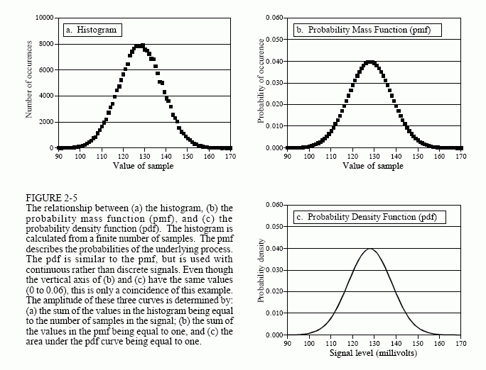
    <figcaption>Figure 2-5</figcaption>
</figure>

Biểu đồ và pmf chỉ có thể được sử dụng với dữ liệu rời rạc, chẳng hạn như tín hiệu số hóa nằm trong máy tính. Một khái niệm tương tự áp dụng cho các tín hiệu liên tục, chẳng hạn như điện áp xuất hiện trong thiết bị điện tử tương tự. Hàm mật độ xác suất (pdf), còn được gọi là hàm phân phối xác suất, là hàm đối với các tín hiệu liên tục giống như hàm khối xác suất đối với các tín hiệu rời rạc. Ví dụ, hãy tưởng tượng một tín hiệu tương tự đi qua bộ chuyển đổi tương tự sang số, dẫn đến tín hiệu số hóa như Hình 2-4a. Để đơn giản, chúng ta sẽ giả sử rằng các điện áp trong khoảng từ 0 đến 255 mV sẽ được số hóa thành các số kỹ thuật số trong khoảng từ 0 đến 255. PMf của tín hiệu số này được hiển thị bằng các điểm đánh dấu trong Hình 2-5b. Tương tự, pdf của tín hiệu tương tự được hiển thị bằng đường liên tục trong (c), cho biết tín hiệu có thể nhận một phạm vi giá trị liên tục, chẳng hạn như điện áp trong mạch điện tử.

Trục tung của pdf được tính bằng đơn vị mật độ xác suất, thay vì chỉ là xác suất. Ví dụ: pdf 0,03 ở 120,5 không có nghĩa là điện áp 120,5 mV sẽ xảy ra trong 3% thời gian. Trên thực tế, xác suất để tín hiệu liên tục đạt chính xác 120,5 mV là vô cùng nhỏ. Điều này là do có vô số giá trị có thể có mà tín hiệu cần để chia thời gian của nó cho: 120,49997, 120,49998, 120,49999, v.v. Khả năng tín hiệu xảy ra chính xác là 120,50000⋅⋅⋅ thực sự là rất xa!

Để tính xác suất, mật độ xác suất được nhân với một phạm vi giá trị. Ví dụ: xác suất tín hiệu, tại bất kỳ thời điểm nào, sẽ nằm trong khoảng từ giá trị 120 đến 121 là: (121 - 120) x 0,03 = 0,03. Xác suất để tín hiệu nằm trong khoảng từ 120,4 đến 120,5 là: (120,5 - 120,4) x 0,03 = 0,003, v.v. Nếu pdf không phải là hằng số trong phạm vi quan tâm thì phép nhân sẽ trở thành tích phân của pdf trên phạm vi đó. Nói cách khác, vùng bên dưới pdf được giới hạn bởi các giá trị đã chỉ định. Vì giá trị của tín hiệu phải luôn bằng một giá trị nào đó nên tổng diện tích dưới đường cong pdf, tích phân từ -∞ đến +∞, sẽ luôn bằng 1. Điều này tương tự với tổng của tất cả các giá trị pmf bằng một và tổng của tất cả các giá trị biểu đồ bằng N.

<figure markdown="span">
    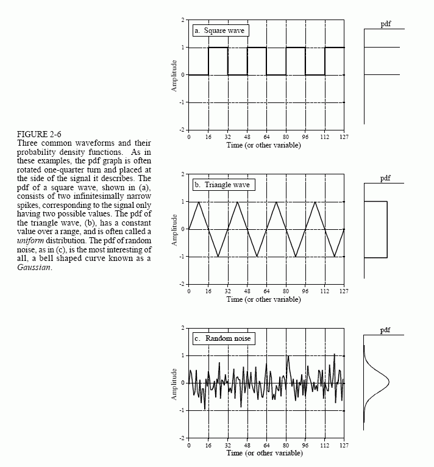
    <figcaption>Figure 2-5</figcaption>
</figure>

Biểu đồ, pmf và pdf là những khái niệm rất giống nhau. Các nhà toán học luôn giữ chúng thẳng thắn, nhưng bạn sẽ thường xuyên thấy chúng được sử dụng thay thế cho nhau (và do đó, không chính xác) bởi nhiều nhà khoa học và kỹ sư. Hình 2-6 cho thấy ba dạng sóng liên tục và các dạng pdf của chúng. Nếu đây là các tín hiệu rời rạc, được biểu thị bằng cách thay đổi ghi nhãn trục hoành thành "số mẫu", thì pmfs sẽ được sử dụng.

Một vấn đề xảy ra khi tính toán biểu đồ khi số mức mà mỗi mẫu có thể đảm nhận lớn hơn nhiều so với số lượng mẫu trong tín hiệu. Điều này luôn đúng với các tín hiệu được biểu thị bằng ký hiệu dấu phẩy động, trong đó mỗi mẫu được lưu trữ dưới dạng giá trị phân số. Ví dụ: biểu diễn số nguyên có thể yêu cầu giá trị mẫu là 3 hoặc 4, trong khi dấu phẩy động cho phép hàng triệu giá trị phân số có thể có trong khoảng từ 3 đến 4. Cách tiếp cận được mô tả trước đây để tính biểu đồ bao gồm việc đếm số lượng mẫu có từng mức lượng tử hóa có thể có. Điều này là không thể với dữ liệu dấu phẩy động vì có hàng tỷ cấp độ có thể phải được tính đến. Tệ hơn nữa, gần như tất cả các cấp độ có thể có này sẽ không có mẫu tương ứng với chúng. Ví dụ: hãy tưởng tượng một tín hiệu 10.000 mẫu, với mỗi mẫu có một tỷ giá trị có thể. Biểu đồ thông thường sẽ bao gồm một tỷ điểm dữ liệu, với tất cả trừ khoảng 10.000 trong số chúng có giá trị bằng 0.

Giải pháp cho những vấn đề này là một kỹ thuật gọi là tạo thùng. Điều này được thực hiện bằng cách chọn tùy ý độ dài của biểu đồ thành một số thuận tiện, chẳng hạn như 1000 điểm, thường được gọi là bin. Giá trị của mỗi thùng biểu thị tổng số mẫu trong tín hiệu có giá trị trong một phạm vi nhất định. Ví dụ: hãy tưởng tượng một tín hiệu dấu phẩy động chứa các giá trị từ 0,0 đến 10,0 và biểu đồ có 1000 thùng. Thùng 0 trong biểu đồ là số mẫu trong tín hiệu có giá trị từ 0 đến 0,01, thùng 1 là số mẫu có giá trị từ 0,01 đến 0,02, v.v., cho đến thùng 999 chứa số mẫu có giá trị từ 9,99 đến 10,0. Bảng 2-4 trình bày một chương trình tính toán biểu đồ binned theo cách này.

<figure markdown="span">
    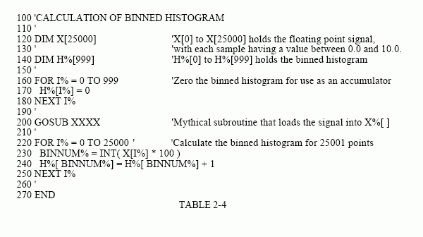
    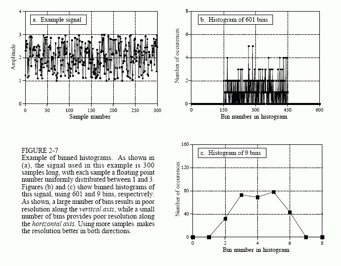
    <figcaption></figcaption>
</figure>

Nên sử dụng bao nhiêu thùng? Đây là sự dung hòa giữa hai vấn đề. Như được hiển thị trong Hình 2-7, quá nhiều thùng khiến việc ước tính biên độ của pmf cơ bản trở nên khó khăn. Điều này là do chỉ có một vài mẫu rơi vào mỗi thùng, khiến độ nhiễu thống kê rất cao. Ở một thái cực khác, quá ít thùng gây khó khăn cho việc ước tính pmf cơ bản theo hướng ngang. Nói cách khác, số lượng thùng kiểm soát sự cân bằng giữa độ phân giải dọc theo trục y và độ phân giải dọc theo trục x.

## Phân phối bình thường
> [The Normal Distribution](https://www.dspguide.com/ch2/5.htm)

Tín hiệu được hình thành từ các quá trình ngẫu nhiên thường có dạng pdf hình chuông. Đây được gọi là phân phối chuẩn, phân phối Gauss hoặc Gaussian, theo tên nhà toán học vĩ đại người Đức, Karl Friedrich Gauss (1777-1855). Lý do tại sao đường cong này xuất hiện thường xuyên trong tự nhiên sẽ được thảo luận ngay sau đây cùng với việc tạo ra nhiễu kỹ thuật số. Hình dạng cơ bản của đường cong được tạo ra từ số mũ bình phương âm:

$$
y(x)=e^{-x^2}
$$

<figure markdown="span">
    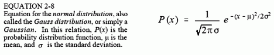
    <figcaption></figcaption>
</figure>

Đường cong thô này có thể được chuyển đổi thành Gaussian hoàn chỉnh bằng cách thêm giá trị trung bình có thể điều chỉnh, ?, và độ lệch chuẩn, σ. Ngoài ra, phương trình phải được chuẩn hóa sao cho tổng diện tích dưới đường cong bằng 1, một yêu cầu của mọi hàm phân bố xác suất. Điều này dẫn đến dạng chung của phân phối chuẩn, một trong những mối quan hệ quan trọng nhất trong thống kê và xác suất:

Hình 2-8 cho thấy một số ví dụ về đường cong Gaussian với các phương tiện và độ lệch chuẩn khác nhau. Giá trị trung bình căn giữa đường cong trên một giá trị cụ thể, trong khi độ lệch chuẩn kiểm soát độ rộng của hình chuông.

<figure markdown="span">
    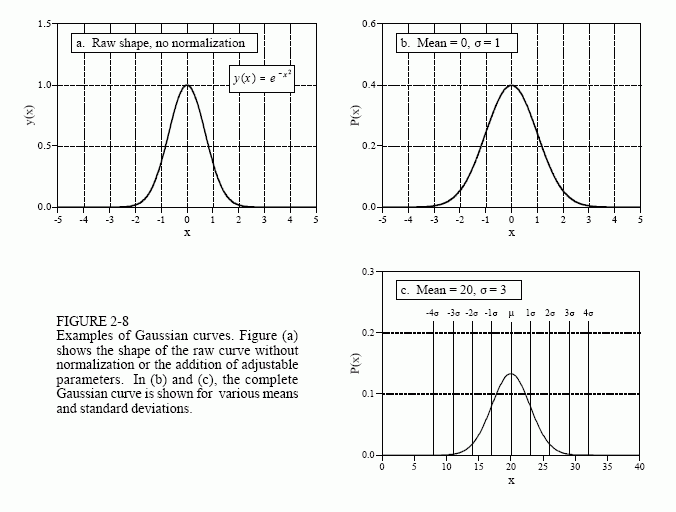
    <figcaption></figcaption>
</figure>

Một đặc điểm thú vị của Gaussian là các đuôi giảm xuống 0 rất nhanh, nhanh hơn nhiều so với các hàm thông thường khác như phân rã số mũ hoặc 1/x. Ví dụ: ở độ lệch chuẩn hai, bốn và sáu so với giá trị trung bình, giá trị của đường cong Gaussian đã giảm xuống lần lượt là khoảng 1/19, 1/7563 và 1/166.666.666. Đây là lý do tại sao các tín hiệu được phân phối thông thường, như minh họa trong Hình 2-6c, dường như có giá trị xấp xỉ từ đỉnh đến đỉnh. Về nguyên tắc, các tín hiệu loại này có thể trải qua những dao động có biên độ không giới hạn. Trong thực tế, sự sụt giảm mạnh của Gaussian pdf cho thấy những điểm cực trị này hầu như không bao giờ xảy ra. Điều này dẫn đến dạng sóng có hình dạng tương đối giới hạn với biên độ đỉnh tới đỉnh biểu kiến ​​khoảng 6-8σ.

Như đã trình bày trước đó, tích phân của pdf được sử dụng để tìm xác suất tín hiệu sẽ nằm trong một phạm vi giá trị nhất định. Điều này làm cho tích phân của pdf đủ quan trọng để nó được đặt tên riêng, hàm phân phối tích lũy (cdf). Một vấn đề đặc biệt khó chịu với Gaussian là nó không thể được tích hợp bằng các phương pháp cơ bản. Để giải quyết vấn đề này, tích phân của Gaussian có thể được tính bằng tích phân số. Điều này liên quan đến việc lấy mẫu đường cong Gaussian liên tục rất tinh vi, chẳng hạn, vài triệu điểm trong khoảng từ -10σ đến +10σ. Các mẫu trong tín hiệu rời rạc này sau đó được thêm vào để mô phỏng sự tích hợp. Đường cong rời rạc tạo ra từ sự tích hợp mô phỏng này sau đó được lưu trữ trong một bảng để sử dụng trong việc tính toán xác suất.

CDf của phân phối chuẩn được hiển thị trong Hình 2-9, với các giá trị số được liệt kê trong Bảng 2-5. Vì đường cong này được sử dụng rất thường xuyên trong xác suất nên nó có ký hiệu riêng: Φ(x) (chữ hoa Hy Lạp phi). Ví dụ: Φ(-2) có giá trị 0,0228. Điều này chỉ ra rằng có xác suất 2,28% rằng giá trị của tín hiệu sẽ nằm trong khoảng -∞ và hai độ lệch chuẩn dưới giá trị trung bình, tại bất kỳ thời điểm được chọn ngẫu nhiên nào. Tương tự, giá trị: Φ(1) = 0,8413, có nghĩa là có 84,13% khả năng giá trị của tín hiệu, tại thời điểm được chọn ngẫu nhiên, sẽ nằm trong khoảng -∞ và một độ lệch chuẩn trên giá trị trung bình. Để tính xác suất tín hiệu sẽ nằm giữa hai giá trị, cần phải trừ các số thích hợp tìm thấy trong bảng Φ(x). Ví dụ: xác suất để giá trị của tín hiệu, tại một thời điểm được chọn ngẫu nhiên nào đó, sẽ nằm giữa hai độ lệch chuẩn dưới giá trị trung bình và một độ lệch chuẩn trên giá trị trung bình, được cho bởi: Φ(1) - Φ(-2) = 0,8185 hoặc 81,85%

Sử dụng phương pháp này, các mẫu được lấy từ tín hiệu được phân phối bình thường sẽ nằm trong khoảng ± 1σ so với giá trị trung bình trong khoảng 68% thời gian. Chúng sẽ ở trong khoảng ?2σ khoảng 95% thời gian và trong khoảng ?3σ khoảng 99,75% thời gian. Xác suất để tín hiệu có độ lệch lớn hơn 10 độ lệch chuẩn so với giá trị trung bình là rất nhỏ, người ta cho rằng nó chỉ xảy ra trong vài micro giây kể từ khi vũ trụ bắt đầu hình thành, khoảng 10 tỷ năm!

<figure markdown="span">
    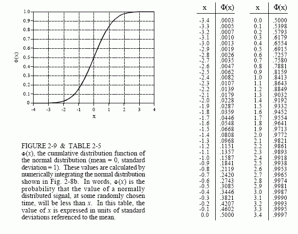
    <figcaption></figcaption>
</figure>

Phương trình 2-8 cũng có thể được sử dụng để biểu diễn hàm khối lượng xác suất của các tín hiệu rời rạc có phân bố chuẩn. Trong trường hợp này, x bị giới hạn ở một trong các mức lượng tử hóa mà tín hiệu có thể đảm nhận, chẳng hạn như một trong 4096 giá trị nhị phân thoát ra khỏi bộ chuyển đổi tương tự sang số 12 bit. Bỏ qua số hạng 1/ √2πσ, nó chỉ được dùng để làm cho tổng diện tích dưới đường cong pdf bằng 1. Thay vào đó, bạn phải bao gồm bất kỳ thuật ngữ nào cần thiết để làm cho tổng của tất cả các giá trị trong pmf bằng một. Trong hầu hết các trường hợp, điều này được thực hiện bằng cách tạo đường cong mà không cần lo lắng về việc chuẩn hóa, tính tổng tất cả các giá trị không chuẩn hóa và sau đó chia tất cả các giá trị cho tổng.

## Tạo tiếng ồn kỹ thuật số
> [Digital Noise Generation](https://www.dspguide.com/ch2/6.htm)

Nhiễu ngẫu nhiên là một chủ đề quan trọng trong cả điện tử và DSP. Ví dụ, nó giới hạn mức độ nhỏ của tín hiệu mà một thiết bị có thể đo được, khoảng cách mà hệ thống vô tuyến có thể liên lạc và lượng bức xạ cần thiết để tạo ra hình ảnh tia X. Một nhu cầu chung trong DSP là tạo ra các tín hiệu giống với nhiều loại nhiễu ngẫu nhiên khác nhau. Điều này là cần thiết để kiểm tra hiệu suất của các thuật toán phải hoạt động khi có tiếng ồn.

Trọng tâm của việc tạo nhiễu kỹ thuật số là bộ tạo số ngẫu nhiên. Hầu hết các ngôn ngữ lập trình đều có chức năng này như một chức năng tiêu chuẩn. Câu lệnh BASIC: X = RND, tải biến X với một số ngẫu nhiên mới mỗi lần gặp lệnh. Mỗi số ngẫu nhiên có một giá trị từ 0 đến 1, với xác suất nằm ở bất kỳ vị trí nào giữa hai thái cực này là như nhau. Hình 2-10a cho thấy tín hiệu được hình thành bằng cách lấy 128 mẫu từ loại bộ tạo số ngẫu nhiên này. Giá trị trung bình của quá trình cơ bản tạo ra tín hiệu này là 0,5, độ lệch chuẩn là 1/√12 = 0,29 và sự phân bố đồng đều giữa 0 và 1.

Các thuật toán cần được kiểm tra bằng cách sử dụng cùng loại dữ liệu mà chúng sẽ gặp trong hoạt động thực tế. Điều này tạo ra nhu cầu tạo ra nhiễu kỹ thuật số bằng pdf Gaussian. Có hai phương pháp để tạo ra các tín hiệu như vậy bằng cách sử dụng bộ tạo số ngẫu nhiên. Hình 2-10 minh họa phương pháp đầu tiên. Hình (b) cho thấy tín hiệu thu được bằng cách cộng hai số ngẫu nhiên để tạo thành mỗi mẫu, tức là X = RND+RND. Vì mỗi số ngẫu nhiên có thể chạy từ 0 đến 1 nên tổng có thể chạy từ 0 đến 2. Giá trị trung bình bây giờ là một và độ lệch chuẩn là 1/√6 (hãy nhớ rằng, khi các tín hiệu ngẫu nhiên độc lập được thêm vào, phương sai cũng tăng thêm). Như được hiển thị, pdf đã thay đổi từ phân phối đồng đều sang phân phối hình tam giác. Nghĩa là, tín hiệu dành nhiều thời gian hơn xung quanh giá trị 1, với ít thời gian hơn ở gần 0 hoặc 2.

Hình (c) đưa ý tưởng này tiến thêm một bước bằng cách thêm 12 số ngẫu nhiên để tạo ra mỗi mẫu. Giá trị trung bình bây giờ là sáu và độ lệch chuẩn là một. Điều quan trọng nhất là pdf gần như đã trở thành một Gaussian. Quy trình này có thể được sử dụng để tạo tín hiệu nhiễu có phân bố chuẩn với giá trị trung bình và độ lệch chuẩn tùy ý. Đối với mỗi mẫu trong tín hiệu: (1) cộng mười hai số ngẫu nhiên, (2) trừ sáu để có giá trị trung bình bằng 0, (3) nhân với độ lệch chuẩn mong muốn và (4) cộng giá trị trung bình mong muốn.

Cơ sở toán học của thuật toán này nằm trong Định lý giới hạn trung tâm, một trong những khái niệm quan trọng nhất trong xác suất. Ở dạng đơn giản nhất, Định lý giới hạn trung tâm phát biểu rằng tổng các số ngẫu nhiên sẽ có phân phối chuẩn khi ngày càng nhiều số ngẫu nhiên được cộng lại với nhau. Định lý giới hạn trung tâm không yêu cầu các số ngẫu nhiên riêng lẻ phải từ bất kỳ phân phối cụ thể nào hoặc thậm chí các số ngẫu nhiên phải từ cùng một phân phối. Định lý giới hạn trung tâm đưa ra lý do tại sao các tín hiệu phân bố chuẩn lại được nhìn thấy rộng rãi trong tự nhiên. Bất cứ khi nào có nhiều lực ngẫu nhiên khác nhau tương tác, pdf thu được sẽ trở thành Gaussian.

Trong phương pháp thứ hai để tạo các số ngẫu nhiên có phân phối chuẩn, trình tạo số ngẫu nhiên được gọi hai lần để thu được R1 và R2. Khi đó có thể tìm thấy số ngẫu nhiên có phân phối chuẩn X:

<figure markdown="span">
    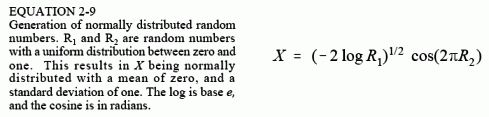
    <figcaption></figcaption>
</figure>

Cũng giống như trước đây, phương pháp này có thể tạo ra các tín hiệu ngẫu nhiên có phân phối chuẩn với giá trị trung bình và độ lệch chuẩn tùy ý. Lấy từng số được tạo bởi phương trình này, nhân nó với độ lệch chuẩn mong muốn và cộng giá trị trung bình mong muốn.

<figure markdown="span">
    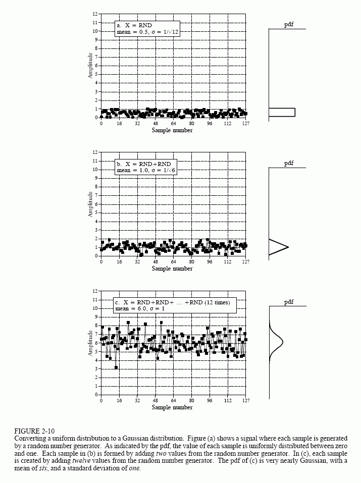
    <figcaption></figcaption>
</figure>

Trình tạo số ngẫu nhiên hoạt động bằng cách bắt đầu bằng một hạt giống, một số từ 0 đến 1. Khi trình tạo số ngẫu nhiên được gọi, hạt giống được chuyển qua một thuật toán cố định, dẫn đến một số mới nằm trong khoảng từ 0 đến 1. Số mới này được báo cáo là số ngẫu nhiên và sau đó được lưu trữ nội bộ để sử dụng làm hạt giống vào lần tiếp theo khi bộ tạo số ngẫu nhiên được gọi. Thuật toán biến hạt giống thành số ngẫu nhiên mới thường có dạng:

<figure markdown="span">
    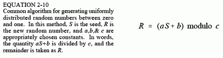
    <figcaption></figcaption>
</figure>

Bằng cách này, một chuỗi số ngẫu nhiên liên tục có thể được tạo ra, tất cả đều bắt đầu từ cùng một hạt giống. Điều này cho phép một chương trình được chạy nhiều lần bằng cách sử dụng chính xác các chuỗi số ngẫu nhiên giống nhau. Nếu bạn muốn chuỗi số ngẫu nhiên thay đổi, hầu hết các ngôn ngữ đều có quy định về gieo hạt lại trình tạo số ngẫu nhiên, cho phép bạn chọn số đầu tiên được sử dụng làm hạt giống. Một kỹ thuật phổ biến là sử dụng thời gian (được biểu thị bằng đồng hồ của hệ thống) làm hạt giống, do đó cung cấp một trình tự mới mỗi khi chương trình được chạy.

Từ quan điểm toán học thuần túy, các số được tạo theo cách này không thể hoàn toàn ngẫu nhiên vì mỗi số được xác định hoàn toàn bởi số trước đó. Thuật ngữ giả ngẫu nhiên thường được sử dụng để mô tả tình huống này. Tuy nhiên, đây không phải là điều bạn nên quan tâm. Các chuỗi được tạo bởi các trình tạo số ngẫu nhiên có tính ngẫu nhiên về mặt thống kê ở mức độ cực kỳ cao. Rất khó có khả năng bạn sẽ gặp phải tình huống chúng không đầy đủ.

## Độ chính xác và độ chính xác
> [Precision and Accuracy](https://www.dspguide.com/ch2/7.htm)

Độ chính xác và độ chính xác là những thuật ngữ được sử dụng để mô tả các hệ thống và phương pháp đo lường, ước tính hoặc dự đoán. Trong tất cả các trường hợp này, có một số tham số bạn muốn biết giá trị của nó. Đây được gọi là giá trị thực, hay đơn giản là sự thật. Phương pháp này cung cấp một giá trị đo được mà bạn muốn càng gần với giá trị thực càng tốt. Độ chính xác và độ chính xác là những cách mô tả lỗi có thể tồn tại giữa hai giá trị này.

Thật không may, độ chính xác và độ chính xác được sử dụng thay thế cho nhau trong các cài đặt phi kỹ thuật. Trong thực tế, từ điển định nghĩa chúng bằng cách đề cập đến nhau! Mặc dù vậy, khoa học và kỹ thuật có những định nghĩa rất cụ thể cho từng lĩnh vực. Bạn nên chú ý sử dụng các thuật ngữ một cách chính xác và lặng lẽ bao dung khi người khác sử dụng chúng không chính xác.

Ví dụ, hãy xem xét một nhà hải dương học đo độ sâu của nước bằng hệ thống sonar. Những chùm âm thanh ngắn được truyền từ con tàu, phản xạ từ đáy đại dương và được thu lại trên bề mặt dưới dạng tiếng vang. Sóng âm truyền đi với vận tốc tương đối ổn định trong nước, cho phép xác định độ sâu từ thời gian trôi qua giữa xung truyền và xung nhận. Giống như tất cả các phép đo thực nghiệm, tồn tại một lượng sai số nhất định giữa giá trị đo được và giá trị thực. Phép đo cụ thể này có thể bị ảnh hưởng bởi nhiều yếu tố: tiếng ồn ngẫu nhiên trong thiết bị điện tử, sóng trên bề mặt đại dương, sự phát triển của thực vật dưới đáy đại dương, sự thay đổi nhiệt độ nước khiến vận tốc âm thanh thay đổi, v.v.

Để nghiên cứu những hiệu ứng này, nhà hải dương học thực hiện nhiều lần đo liên tiếp tại một địa điểm được biết là sâu chính xác 1000 mét (giá trị thực). Các phép đo này sau đó được sắp xếp theo biểu đồ hiển thị trong Hình 2-11. Như mong đợi từ Định lý giới hạn trung tâm, dữ liệu thu được thường được phân phối. Giá trị trung bình xuất hiện ở trung tâm của phân bố và thể hiện ước tính tốt nhất về độ sâu dựa trên tất cả dữ liệu đo được. Độ lệch chuẩn xác định độ rộng của phân bố, mô tả mức độ biến thiên xảy ra giữa các phép đo liên tiếp.

Tình huống này dẫn đến hai loại lỗi chung mà hệ thống có thể gặp phải. Đầu tiên, giá trị trung bình có thể bị dịch chuyển khỏi giá trị thực. Lượng dịch chuyển này được gọi là độ chính xác của phép đo. Thứ hai, các phép đo riêng lẻ có thể không phù hợp với nhau, được biểu thị bằng độ rộng của phân bố. Đây được gọi là độ chính xác của phép đo và được biểu thị bằng cách trích dẫn độ lệch chuẩn, tỷ lệ tín hiệu trên tạp âm hoặc CV.

Hãy xem xét một phép đo có độ chính xác tốt nhưng độ chính xác kém; biểu đồ được tập trung vào giá trị thực nhưng rất rộng. Mặc dù các phép đo là chính xác theo nhóm, nhưng mỗi lần đọc riêng lẻ là thước đo kém cho giá trị thực. Tình trạng này được cho là có độ lặp lại kém; các phép đo được thực hiện liên tiếp không phù hợp lắm. Độ chính xác kém là kết quả của các lỗi ngẫu nhiên. Đây là tên được đặt cho các lỗi thay đổi mỗi lần lặp lại phép đo. Tính trung bình của một số phép đo sẽ luôn cải thiện độ chính xác. Nói tóm lại, độ chính xác là thước đo tiếng ồn ngẫu nhiên.

<figure markdown="span">
    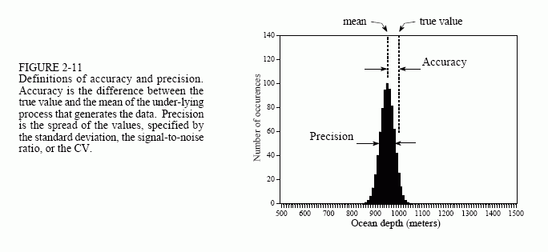
    <figcaption></figcaption>
</figure>

Bây giờ, hãy tưởng tượng một phép đo rất chính xác nhưng có độ chính xác kém. Điều này làm cho biểu đồ rất mảnh nhưng không tập trung vào giá trị thực. Các lần đọc liên tiếp có giá trị gần nhau; tuy nhiên chúng đều mắc lỗi lớn. Độ chính xác kém là do lỗi hệ thống. Đây là những lỗi lặp lại theo cùng một cách giống hệt nhau mỗi lần tiến hành phép đo. Độ chính xác thường phụ thuộc vào cách bạn hiệu chỉnh hệ thống. Ví dụ: trong phép đo độ sâu đại dương, tham số được đo trực tiếp là thời gian trôi qua. Giá trị này được chuyển đổi thành độ sâu bằng quy trình hiệu chuẩn liên quan đến mili giây và mét. Điều này có thể đơn giản như nhân với một vận tốc cố định, hoặc phức tạp như hàng tá hiệu chỉnh bậc hai. Tính trung bình các phép đo riêng lẻ không làm gì để cải thiện độ chính xác. Nói tóm lại, độ chính xác là thước đo hiệu chuẩn.

Trong thực tế, có nhiều cách mà độ chính xác và độ chính xác có thể đan xen với nhau. Ví dụ, hãy tưởng tượng việc xây dựng một bộ khuếch đại điện tử từ điện trở 1%. Dung sai này cho biết giá trị của mỗi điện trở sẽ nằm trong khoảng 1% giá trị đã nêu trong một loạt các điều kiện, chẳng hạn như nhiệt độ, độ ẩm, tuổi tác, v.v. Sai số này trong điện trở sẽ tạo ra sai số tương ứng về mức tăng của bộ khuếch đại. Lỗi này có phải là vấn đề về độ chính xác hoặc độ chính xác không?

Câu trả lời phụ thuộc vào cách bạn thực hiện các phép đo. Ví dụ: giả sử bạn chế tạo một bộ khuếch đại và kiểm tra nó nhiều lần trong vài phút. Sai số đạt được không đổi sau mỗi lần kiểm tra và bạn kết luận vấn đề là ở độ chính xác. Để so sánh, giả sử bạn chế tạo một nghìn bộ khuếch đại. Mức tăng từ thiết bị này sang thiết bị khác sẽ dao động ngẫu nhiên và vấn đề dường như là vấn đề về độ chính xác. Tương tự như vậy, bất kỳ bộ khuếch đại nào trong số này cũng sẽ hiển thị sự dao động khuếch đại khi phản ứng với nhiệt độ và những thay đổi môi trường khác. Một lần nữa, vấn đề sẽ được gọi là độ chính xác.

Khi quyết định nên gọi vấn đề bằng cái tên nào, hãy tự hỏi mình hai câu hỏi. Đầu tiên: Liệu việc lấy trung bình các số đọc liên tiếp có mang lại kết quả đo tốt hơn không? Nếu có, hãy gọi độ chính xác của lỗi; nếu không, hãy gọi nó là độ chính xác. Thứ hai: Hiệu chuẩn có sửa được lỗi không? Nếu có, hãy gọi đó là độ chính xác; nếu không, hãy gọi nó là độ chính xác. Điều này có thể cần phải suy nghĩ, đặc biệt liên quan đến cách thiết bị sẽ được hiệu chỉnh và tần suất thực hiện.