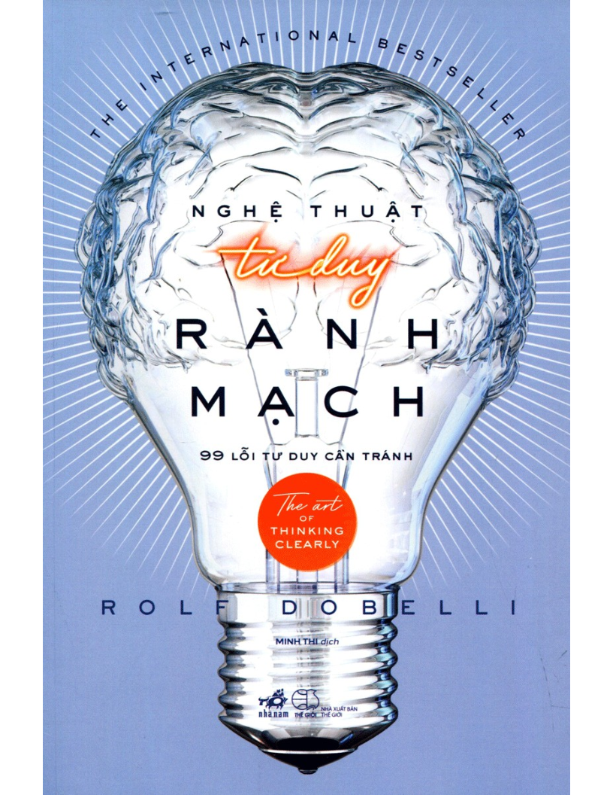

<figure markdown="span">
    
    <figcaption></figcaption>
</figure>

# Lời Mở Đầu

Mùa thu năm 2004, một ông trùm truyền thông ở châu Âu mời tôi đến Munich tham dự sự kiện được miêu tả là một “cuộc trao đổi thân mật của giới trí thức”. Tôi thì chưa bao giờ tự coi bản thân là “trí thức” - tôi từng theo học kinh doanh, chuyên ngành này thực ra còn khiến tôi trái ngược với một trí thức - thế nhưng tôi cũng đã viết được hai cuốn tiểu thuyết, và tôi đoán rằng điều đó khiến mình được xem như đủ tư cách khách mời.

Nassim Nicholas Taleb cũng có mặt ở đó. Thời điểm ấy, ông là một thương gia Phố Wall chưa có tiếng tăm, một người đam mê triết học. Người ta giới thiệu tôi là một chuyên gia về thời kỳ Khai sáng của Scotland và Anh quốc, đặc biệt chuyên sâu về triết lý của David Hume. Hẳn nhiên, tôi đã bị nhớ nhầm với ai đó. Dù rất đỗi ngạc nhiên, tôi vẫn nở nụ cười gượng gạo với quan khách trong phòng, và cứ thế đáp lễ họ bằng sự im lặng như minh chứng cho sự tinh thông triết học của mình. Ngay lập tức, Taleb kéo một chiếc ghế trống và vỗ tay vào đó. Tôi liền ngồi xuống. Sau vài trao đổi qua loa về Hume, may mà cuộc trò chuyện chuyển sang đề tài Phố Wall. Cả hai đều kinh ngạc trước những sai lầm có hệ thống trong quá trình ra quyết định của các CEO và lãnh đạo doanh nghiệp -không ngoại trừ cả hai chúng tôi. Chúng tôi tán gẫu về thực tế rằng, ngẫm lại những sự việc không ngờ tới hóa ra lại có khả năng xảy ra cao hơn nhiều những sự việc được định sẵn, rồi cùng cười trước những lý do khiến các nhà đầu tư không chịu từ bỏ cổ phiếu của họ khi chúng mất giá đến mức thấp hơn cả giá mua.

Sau sự kiện ấy, Taleb gửi cho tôi vài trang bản thảo quý báu của ông, những trang mà tôi đã nhận xét và góp vài lời phê bình. Những trang sách đó sau này đã trở thành một phần của tác phẩm bán chạy khắp toàn cầu của ông, Thiên nga đen. Cuốn sách đã đưa Taleb gia nhập hàng ngũ các trí thức tinh hoa. Cũng trong khoảng thời gian này, đam mê viết lách trong tôi lớn dần lên, tôi bắt đầu đọc ngấu nghiến những cuốn sách và bài viết của các nhà khoa học xã hội và khoa học nhận thức về các đề tài như “suy nghiệm và thành kiến”, rồi tôi còn tăng cường trao đổi email với rất nhiều nhà nghiên cứu cũng như đến thăm phòng thí nghiệm của họ. Tới năm 2009, tôi nhận ra rằng, ngoài công việc của một tiểu thuyết gia, tôi còn trở thành một nhà nghiên cứu tâm lý học nhận thức và xã hội học.

Việc không thể suy nghĩ thấu suốt, hay điều mà các chuyên gia gọi là một “lỗi nhận thức”, là sự đi chệch có hệ thống khỏi logic - chệch khỏi cách cư xử và tư duy tối ưu hợp tình hợp lý. Khi dùng từ “có hệ thống”, tôi muốn nói đó không chỉ là những sai lầm thi thoảng mắc phải trong xét đoán, mà là những sai lầm đều đặn, những rào cản đối với logic mà chúng ta vấp phải hết lần này đến lần khác, những kiểu tư duy lặp đi lặp lại từ thế hệ này sang thế hệ khác và kéo dài nhiều thế kỷ. Chẳng hạn như, chúng ta thường đánh giá quá cao sự hiểu biết của chính mình chứ chẳng mấy khi đánh giá thấp nó. Tương tự, nguy cơ đánh mất một thứ gì đó khiến chúng ta bị kích động hơn nhiều so với khả năng kiếm được thứ tương tự. Khi ở bên cạnh những người khác, chúng ta thường có xu hướng điều chỉnh cách cư xử của mình cho phù hợp với cách cư xử của họ, chứ không phải ngược lại. Những câu chuyện ngắn khiến chúng ta bỏ qua phân bố thống kê (tỷ lệ cơ bản) ẩn phía sau, chứ không phải ngược lại. Sai lầm chúng ta mắc phải vì cứ mải miết đeo đuổi cùng một kiểu tư duy cũ cứ chất chồng lên nhau ở một góc riêng dễ đoán giống như quần áo bẩn vậy, trong khi góc bên kia thì vẫn được giữ khá sạch sẽ (nghĩa là chúng chất đống trong “góc tự tin thái quá”, chứ không phải “góc thiếu tự tin”).

Để tránh ném khối tài sản tôi đã tích lũy được trong suốt sự nghiệp cầm bút vào những canh bạc vô bổ, tôi bắt đầu lập ra một danh sách các lỗi nhận thức mang tính hệ thống ấy, bổ sung các ghi chú và những câu chuyện cá nhân làm minh họa - mà không hề có ý định sẽ xuất bản chúng. Ban đầu tôi chỉ định lập ra danh sách này cho riêng mình. Trong đó, một số lỗi tư duy đã được biết đến hàng thế kỷ nay, còn số khác chỉ được phát hiện trong vài năm qua. Một số lỗi được đặt cho hẳn hai đến ba cái tên, và tôi lựa chọn những cái tên được sử dụng rộng rãi nhất. Chẳng bao lâu tôi nhận ra công việc biên soạn những cái bẫy tư duy đó không chỉ hữu ích cho việc đưa ra quyết định đầu tư, mà còn cho việc kinh doanh cũng như xử lý các vấn đề cá nhân. Từ khi soạn ra danh sách này tôi đã cảm thấy bình tĩnh và điềm đạm hơn. Tôi bắt đầu nhận ra những sai lầm của bản thân sớm hơn và có thể né tránh chúng trước khi xảy ra tổn thất khó cứu vãn. Thế là, lần đầu tiên trong đời, tôi có khả năng nhận biết khi nào thì những người khác có thể bị chi phối bởi chính những sai lầm mang tính hệ thống kia. Với một danh sách như thế, giờ đây tôi đã có thể cưỡng lại sức hút của chúng - và thậm chí còn giành lợi thế trong các cuộc giao dịch. Tôi đã có các thư mục, các thuật ngữ và những cách lý giải để xua đi bóng ma của sự phi lý. Từ thời Benjamin Franklin làm thí nghiệm thả diều, sấm chớp không hề xuất hiện với tần suất ít đi, hay giảm cường độ hoặc bớt ồn ào hơn - nhưng chúng đã trở nên bớt đáng lo ngại. Đây chính xác là điều giờ đây tôi cảm nhận về sự phi lý trí của chính mình.

Không bao lâu sau thì bạn bè biết đến bản danh sách của tôi và tỏ ra quan tâm. Kết quả là một chuyên mục trên các tuần báo ở Đức, Hà Lan và Thụy Sĩ ra đời, cùng với đó là vô số những buổi thuyết trình (chủ yếu là trước các bác sĩ, giới đầu tư, thành viên ban quản trị, các CEO và quan chức nhà nước), rồi cuối cùng là cuốn sách này.

Xin hãy nhớ cho ba điều khi bạn đọc những trang sách sắp tới: thứ nhất, bản danh sách các lỗi ngụy biện trong cuốn sách này chưa phải là hoàn thiện. Chắc chắn người ta sẽ còn phát hiện ra những lỗi khác nữa. Thứ hai, phần lớn các lỗi này có liên quan đến nhau. Điều này vốn dĩ không có gì đáng ngạc nhiên. Xét cho cùng thì mọi phân khu của bộ não đều được liên kết với nhau. Những phóng chiếu thần kinh dịch chuyển từ phân khu này sang phân khu khác của bộ não; không có khu vực nào hoạt động độc lập cả. Thứ ba, nghề nghiệp chính của tôi là tiểu thuyết gia và doanh nhân, chứ không phải là một nhà khoa học xã hội; tôi không có phòng thí nghiệm riêng để thử nghiệm các lỗi nhận thức, và tôi cũng không có một nhóm nghiên cứu để cử đi tìm kiếm các lỗi hành vi. Trong lúc viết cuốn sách này, tôi giống như một dịch giả có nhiệm vụ chuyển ngữ và tổng hợp những gì mình đã đọc và học được - để diễn giải chúng thành những từ ngữ mà người khác có thể hiểu. Tôi vô cùng kính phục các nhà nghiên cứu trong những thập niên gần đây đã phát hiện ra những lỗi nhận thức và lỗi hành vi ấy. Thành công của cuốn sách này về cơ bản là một sự tri ân đối với công tác nghiên cứu của họ. Tôi hàm ơn họ rất nhiều.

Đây không phải là một cuốn sách kim chỉ nam. Bạn sẽ không tìm thấy “bảy bước để đạt được cuộc sống không sai lầm” ở đây. Những lỗi nhận thức in sâu trong tiềm thức chúng ta đến mức không thể nào rũ bỏ chúng hoàn toàn. Chỉ có ý chí siêu nhiên mới có thể triệt tiêu chúng, nhưng đó thậm chí không phải là một mục tiêu đáng hướng tới. Bởi không phải tất cả những lỗi nhận thức đều nguy hại, và một số trong đó thậm chí còn cần thiết để giúp ta sống tốt. Mặc dù cuốn sách này không cung cấp chìa khóa mang đến hạnh phúc, nhưng chí ít nó cũng đảm bảo cho bạn có thể đương đầu với quá nhiều bất hạnh bạn vẫn tự gây ra cho mình.

Nguyện vọng của tôi vốn dĩ khá giản dị: nếu chúng ta có thể học được cách nhận ra và tránh khỏi những sai lầm lớn nhất trong tư duy - trong đời sống riêng, trong công việc, hay trong quản lý nhà nước - chúng ta có thể tận hưởng sự thịnh vượng vượt bậc. Chúng ta sẽ không cần thêm những mưu ma chước quỷ, những ý tưởng mới, những công cụ không cần thiết, hay sự nỗ lực đến quên mình - tất cả những gì chúng ta cần chỉ là bớt phi lý trí đi mà thôi.